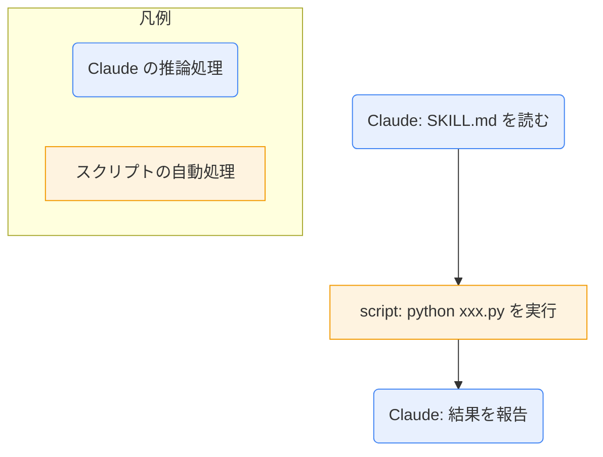

# skill-explain

スキルの SKILL.md と関連ファイルを読み、解説ノートを `90_system/skill-docs/<スキル名>.md` に作る。Vault ルートで作業する。設計は `10_projects/Claudeのスキル作成/skill-explain SPEC.md`。

## 対象の探し方
- Vault: `.claude/skills/*/SKILL.md`
- ユーザー: `%USERPROFILE%\.claude\skills\*\SKILL.md`
- プラグイン: `%USERPROFILE%\.claude\plugins\installed_plugins.json` の各 `installPath` 配下の `skills\*\SKILL.md`

見つからない・読めないものは「未確認」と書く。推測で補わない。Vault 外は読み取りだけで、書き換えない。

## 手順
1. 対象を決める。スキル名の指定があればそれを探す。なければ、見つけたスキルを `AskUserQuestion` の選択式で聞く（1回4件まで。多いときは置き場所別に分けて聞く）。
2. 対象の SKILL.md を読む。本文が参照するスクリプト・テンプレート・設計ノートがあれば、それも読む。
3. 解説ノートを下の書式で作る。読んだ範囲だけを書く。
4. 保存先 `90_system/skill-docs/<スキル名>.md`（フォルダがなければ作る）に書く。
   - 同名ファイルがあるときは、既存の中身を読み、新旧の差分を日本語で示して、上書きしてよいか確認する。承認があるまで書かない。
5. 保存したら、パスと要点を1〜2行で報告する。

## 解説ノートの書式
```
---
type: doc
status: draft
created: YYYY-MM-DD
---
# <スキル名>

## ひとことで
## 何ができるか
## 使い方
（呼び出し方・例・何が起きるか。利用者向け）
## ロジック
（Mermaid。下記ルール）
## 保守者向け
（使うファイル・書き込み先・制約・注意点・場所）
```

## Mermaid のルール
- Claude の推論処理（読む・判断する・質問する・文章を組み立てる）と、スクリプトの自動処理（決まった手順で動く部分）を、図で見分けられるようにする。
- 推論処理は丸角 `(...)`、スクリプト処理は四角 `[...]` にし、`classDef` で色も分ける。凡例を必ず付ける。
- スクリプトを使わないスキルは、「スクリプトなし（すべて Claude の推論処理）」と明記する。

例:
````

````

## 注意
- 起動は明示されたときだけ。
- 自動同期・改善提案・スキルの修正はしない（解説だけ）。
- 秘密情報（トークン、キー）をノートに書かない。
