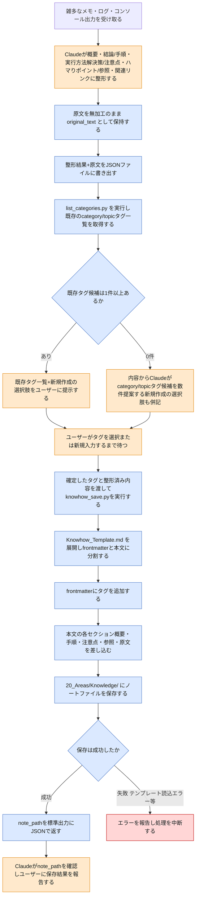

# knowhow-add スキルのフロー

この図は、このVaultを使う人間が、スキルの動作が想定通りか確認するための文書である。

雑多なメモ・ログ・コンソール出力等を、Claudeが「概要・手順・注意点」の構造に整形し、カテゴリタグをユーザーに確認した上でナレッジノートとして保存するスキル。原文は加工せず`original_text`として保持する。

> **凡例**: 🔵 Python処理（決定的・機械的） / 🟠 Claude判断・ユーザー確認 / 🔴 エラー・中断 / ⚪ 未実装（今後追加予定の処理）

## 補足

- カテゴリタグは`<category>/<topic>`形式の階層タグ1本のみで分類する（旧`category`frontmatterプロパティは廃止済み）。
- `list_categories.py`は`20_Areas/Knowledge/`と`20_Areas/WebClips/`配下のノートを走査し、`/`をちょうど1つ含むタグだけを重複排除・ソートして返す機械的な集計処理であり、判断は行わない。
- カテゴリタグの確定はClaudeが単独で自動決定してはならない。既存候補が0件の場合でも自由入力だけに丸投げしない。Claudeが候補を提案した上で、ユーザーの明示的な選択・入力を待つ（詳細は`.claude/skills/vault/references/category-tagging.md`）。
- ノート保存時、`title`から`vault_lib.sanitize_filename`でファイル名を生成し、同名ファイルが既に存在する場合は`vault_lib.unique_path`で衝突を回避する。
- 保存失敗時（テンプレートファイルが見つからない等）の具体的なリカバリ手順はソースコード上未規定であり、本図では「エラー報告・中断」までを示すにとどめる。

## 関連ドキュメント

- [knowhow-add/SKILL.md](../.claude/skills/vault/skills/knowhow-add/SKILL.md): 本フローの一次情報
- [knowhow_save.py](../.claude/skills/vault/scripts/knowhow_save.py): 実装本体（ノート保存処理）
- [list_categories.py](../.claude/skills/vault/scripts/list_categories.py): 既存カテゴリタグ一覧の取得処理
- [category-tagging.md](../.claude/skills/vault/references/category-tagging.md): カテゴリタグ運用ルール

---
最終更新: 2026-09-23
