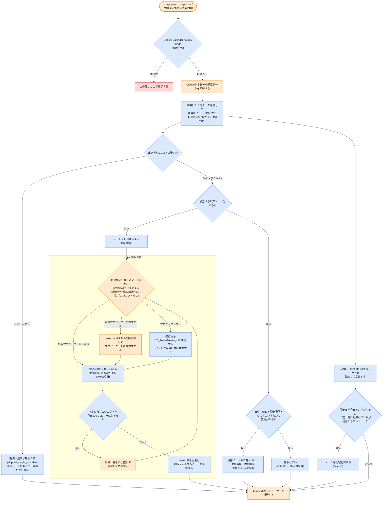

# meeting-setup スキルのフロー

`meeting-setup`スキルがカレンダー予定と議事録ノートを同期し、その場でproject割当まで確認する一連の処理を図示する。対象読者はこのVaultを使う人間で、`/meeting-setup`や`today-open`/`today-close`実行時に何が起きているかを確認する用途を想定する。

> ⚠️ 開催確認は`today-close`スキルの新規ロジックへ、議事録からのタスク化は`meeting-followup`スキルへそれぞれ移管されたため、本図には含まない。

> **凡例**: 🔵 Python処理（決定的・機械的） / 🟠 Claude判断・ユーザー確認 / 🔴 エラー・中断 / ⚪ 未実装（今後追加予定の処理）

## 補足

- **カレンダー同期**: `/meeting-setup`実行時、または`today-open`/`today-close`スキルから自動的に呼び出された時に必ず動く。Google Calendar/M365 MCP未接続なら実行せず終了する。
- 出席者2人以上の予定は、該当する既存ノートの有無で分岐する。既存ノートが無ければ新規作成する(`created`)。既存ノートがあれば日時・URL・開催場所・参加者のいずれかの変更有無をさらに確認し、変更があれば更新する(`updated`)が、変更が無ければ何もしない（`meeting_sync.py`の結果集計にも一切含まれず、報告対象外になる）。
- 出席者が1人以下に減った予定は、既存ノートが無い場合のみ`skipped_single_attendee`として無視する。既存ノートがある場合の分岐は本図には設けない。実際にはこのケースは会議体自体がカレンダーから削除される形で発生するため、下記の物理削除判定（開催日が今日で対応イベントが見当たらないノート）に自然に吸収される。
- 開催日が今日で、かつ今日取得したevents一覧に対応する`calendar_event_id`が無いノートは、カレンダー側でキャンセルされたとみなし物理削除する(`deleted`)。この判定は出席者数とは無関係の独立ロジックである。
- 単発予定は日時・URL・開催場所・参加者の4項目すべてを差分チェックし、いずれかが変わっていれば`updated`として更新する（`_process_single_event`に実装済み）。定例予定は同じoccurrenceの再同期時、開催場所を差分チェック無しで毎回上書きし（`_resync_occurrence_block`）、参加者は新しい回への遷移時（新規occurrenceブロック作成時）のみ設定される。本図の`cal_changed`/`cal_update`ノードは主に単発予定の挙動を表す。
- **project割当確認**: カレンダー同期の結果`created`となった各ノート（新規作成のみ、`updated`は対象外）について、その場で「既存プロジェクトから選ぶ」「新規プロジェクトを作成する(project-addスキル呼び出し)」「プロジェクトなし」の3択を提示する。以前は同期処理と切り離した別ステップだったが、今回の刷新で1つの流れに統合した。既存ノートの更新（`updated`）はproject欄に一切触れないため、この確認フローには進まない。
- 「プロジェクトなし」を選んだ場合、ノートの保存先は`20_Areas/Meetings/`にする(フォルダが無ければ作成する)。
- 指定したプロジェクトが`10_Projects/<名前>/`として実在しない場合は`project_not_found`エラーになるため、候補一覧を出し直して再選択を依頼する。
- カレンダー同期〜project割当確認はいずれも`today-open`/`today-close`スキルから自動的に呼び出される。呼ばれた場合も`/meeting-setup`単独実行時と同じ対話フローをそのままユーザーに提示してよい。
- Google Calendar MCP未接続やAPI呼び出し失敗時は本スキルの処理をそこで打ち切り、呼び出し元（`today-open`/`today-close`）本来の処理はブロックしない。
- **開催確認は`today-close`スキルの新規ロジックが担う**（本図には含まない。詳細は[`today-close-flow.md`](today-close-flow.md)）。`attendance`（`1_scheduled`/`2_done`/`3_skip`）の更新は基本的にユーザーが手動でノートを編集する運用に変わり、meeting-setupスキル自身は確認を促さない。
- **議事録からのタスク化は`meeting-followup`スキルが担う**（本図には含まない。詳細は[`meeting-followup-flow.md`](meeting-followup-flow.md)）。
- `meeting_sync.py`の`--set-project`はクォート無し`[[Name]]`形式を受け取る仕様であり（`task_save.py`の`--project`と統一済み）、プロジェクトなしの場合は空文字列`""`を渡す。
- `meeting_sync.py`自体が`no_project`として報告するのは、`fuzzy_project_match`による自動推定に失敗した新規作成ノートのみである。本図が示す「新規作成された各ノートについてproject割当を確認する」という統合フローは、`meeting_sync.py`側のコード変更ではなく、`meeting-setup`スキル（Claude）側のオーケストレーションとして実現されている。Claudeが`created`一覧の全ノート（自動推定できたノートも含む）についてReadツールでfrontmatterの`project`値を確認した上で3択をまとめて提示する（`meeting-setup/SKILL.md`の実行フロー手順4を参照）。`updated`（既存ノート更新）はこの確認フローの対象外のままである。
- 現行の`meeting_sync.py`には、既存ノート対応の予定が出席者1人以下になった場合に`attendance`を`3_skip`にする分岐(`cancelled`バケツ)がまだ残っているが、本図では出席者減少時の分岐を「既存ノートが無い場合のみ」に単純化しており、この分岐は表現していない。

## 関連ドキュメント

- [`.claude/skills/vault/skills/meeting-setup/SKILL.md`](../.claude/skills/vault/skills/meeting-setup/SKILL.md): meeting-setupスキルの実行フロー一次情報
- [`today-close-flow.md`](today-close-flow.md): 開催確認ロジックの移管先
- [`meeting-followup-flow.md`](meeting-followup-flow.md): 議事録からのタスク化の移管先
- [`.claude/skills/vault/references/meeting-series-update.md`](../.claude/skills/vault/references/meeting-series-update.md): 定例予定のoccurrence_id判定ロジック
- [`.claude/skills/vault/references/project-matching.md`](../.claude/skills/vault/references/project-matching.md): project自動紐付けルール
- [`.claude/skills/vault/scripts/meeting_sync.py`](../.claude/skills/vault/scripts/meeting_sync.py): 実装本体

---
最終更新: 2026-09-23
