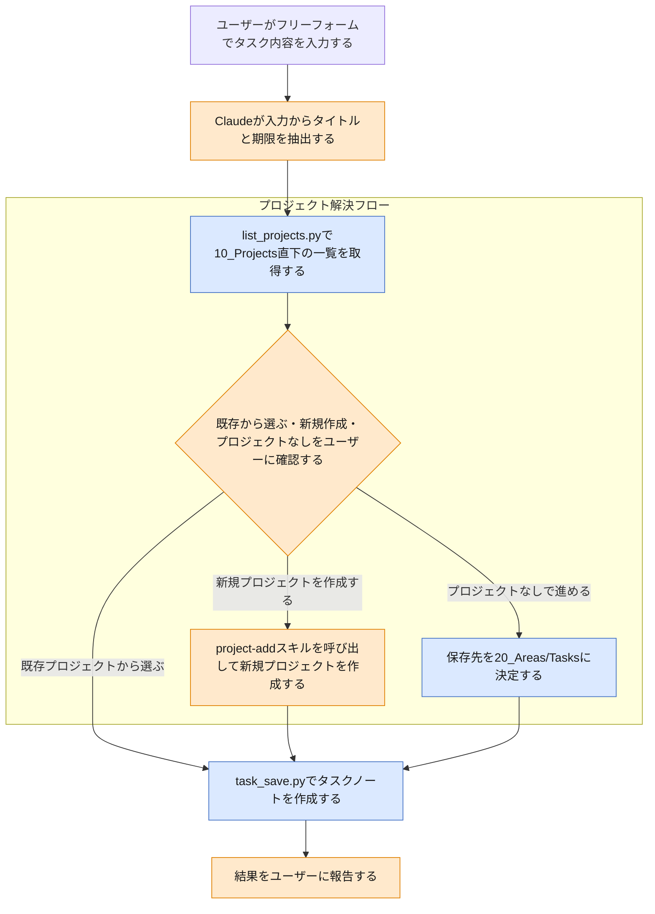

# task-add スキルのフロー

この図は、このVaultを使う人間が、スキルの動作が想定通りか確認するための文書である。

`task-add`は、既存の`task`スキルからフリーフォーム入力パターン（(b)）を分割して新設するスキルである。ユーザーの発話・CLI入力から単発のタスクを抽出し、プロジェクトへの紐づけをユーザーに確認したうえでタスクノートを作成する。

> **凡例**: 🔵 Python処理（決定的・機械的） / 🟠 Claude判断・ユーザー確認 / 🔴 エラー・中断 / ⚪ 未実装（今後追加予定の処理）

## 補足

- タイトル・期限の抽出はClaude自身が発話から行う。決定的処理ではないため`task_extract.py`は使わない（分割元の`task`スキルの(b)パターンを踏襲）。
- 議事録経由ではないため、`task_save.py`実行時に`--source`は付与しない（付与する場合は議事録ノートへのwikilinkが必要だが、`task-add`では対象外）。
- プロジェクト解決フローは`meeting-followup`・`meeting-setup`のタスク化パターンとも共通の設計であり、同一の描き方をする。
- 「プロジェクトなしで進める」を選んだ場合、保存先フォルダは`20_Areas/Tasks/`に決定される。既存プロジェクトを選んだ場合・新規作成した場合は`10_Projects/<名前>/Tasks/`になる。
- `task_save.py`の`--project`は任意（省略時`None`）であり、省略時は保存先が`20_Areas/Tasks/`になる（`task-add`が「プロジェクトなしで進める」を選べるのはこの実装による）。既存プロジェクトを指定した場合・新規作成した場合は`10_Projects/<名前>/Tasks/`になる。
- `task_save.py`は作成時に`created_date`のみを自動セットし、`start_date`は空欄のまま作成する（`status`はテンプレートの既定値`1_todo`のまま）。`start_date`は、ユーザーが後からデイリーノートに埋め込まれたBaseビューから指定する想定であり（`today-close`スキルによる自動入力は行わない）、作成日当日中に指定しなかった場合は[`today-close-flow.md`](today-close-flow.md)のタスク日付見直しチェックにより検出され、処理が中断されてユーザーへの見直しが促される。

## 関連ドキュメント

- [task-add/SKILL.md](../.claude/skills/vault/skills/task-add/SKILL.md): 本フローの一次情報
- [meeting-followup/SKILL.md](../.claude/skills/vault/skills/meeting-followup/SKILL.md): 同じく`task`スキルから分割された、議事録タスク化を担うスキル
- [task_save.py](../.claude/skills/vault/scripts/task_save.py): タスクノート保存の実装本体
- [list_projects.py](../.claude/skills/vault/scripts/list_projects.py): プロジェクト一覧取得処理

---
最終更新: 2026-09-23
