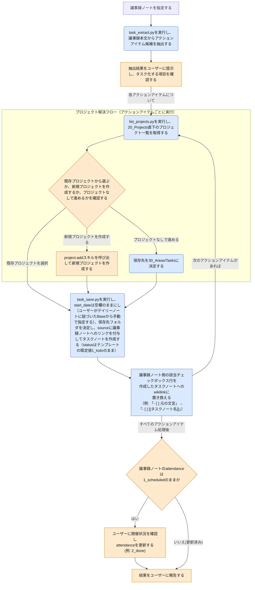

# meeting-followup スキルのフロー

この図は、このVaultを使う人間が、スキルの動作が想定通りか確認するための文書である。

`meeting-followup`は、単なる「アクションアイテムのタスク化」スキルではなく、**会議後の議事録整理**を行うスキルである。その中心的な処理としてアクションアイテムの抽出・タスク化があり、全アイテムの処理が終わった最後に議事録ノートの`attendance`プロパティも更新する。`task`スキルから切り出した新設スキルであり、議事録ノートを指定すると、アクションアイテムを抽出してユーザーに確認した上で、プロジェクトに紐づけてタスクノートを作成し、最後に開催状況を確認して締めくくる。

> **凡例**: 🔵 Python処理（決定的・機械的） / 🟠 Claude判断・ユーザー確認 / 🔴 エラー・中断 / ⚪ 未実装（今後追加予定の処理）

## 補足

- 議事録ノート指定・抽出結果の確認・プロジェクト選択の3択提示は、いずれも自動確定せず必ずユーザーに確認する（Claude判断）。
- アクションアイテムの抽出（`task_extract.py`）は正規表現による決定的処理であり、LLM判断は介在しない。
- 「プロジェクト解決フロー」は`task-add`（フリーフォーム入力パターン）・`meeting-setup`スキルのタスク化パターンとも共通の構造であり、同一の描き方を採用している。
- 新規プロジェクト作成を選んだ場合は`project-add`スキルを呼び出す（別スキルへの委譲）。
- プロジェクトなしで進める場合、保存先は`30_Areas/Tasks/`に固定される。
- `task_save.py`の`--project`は任意（省略時`None`）であり、省略時は`30_Areas/Tasks/`に保存される。「プロジェクトなし」は正式な選択肢として扱われる。
- `--project`に渡す値はプレーン名・`[[Name]]`形式のどちらでもよく、`task_save.py`が`vault_lib.normalize_project_link`で正規化してから`project`フロントマターへ`[[Name]]`形式で書き込む（既に`[[Name]]`形式なら二重ラップしない）。
- `task_save.py`はタスク作成時に`created_date`のみをセットし、`start_date`は空のまま作成する（ユーザーが後からデイリーノートに埋め込まれたBaseビューから指定する想定であり、`today-close`スキルによる自動入力は行わない）。作成日当日中に`start_date`を指定しなかった場合は、[`today-close-flow.md`](today-close-flow.md)のタスク日付見直しチェックにより検出され、処理が中断されてユーザーへの見直しが促される。
- 保存先はプロジェクトありの場合`20_Projects/<名前>/Tasks/`、プロジェクトなしの場合`30_Areas/Tasks/`になる。
- `--source`には議事録ノートへのwikilinkを付与する（既存の`task_save.py`の`--source`引数と同じ役割）。
- アクションアイテムが複数ある場合、各アイテムごとに「プロジェクト解決フロー」から`task_save.py`実行・議事録側リンク置換までを繰り返す。
- タスクノート作成後、`meeting_sync.py --link-task`を実行し、議事録ノート側の該当チェックボックス行（`task_extract.py`が抽出した元のテキストと一致する行）を、そのタスクノートへのwikilinkに完全置換する（例:「- [ ] 元の文言」→「- [ ] [[タスクノート名]]」）。チェックボックスは未チェックのまま維持され、元の文言は失われる。同一テキストの行が複数存在する場合は`--item-index`（0始まり、出現順）で一意に指定する。
- 全アクションアイテムの処理が終わったら、議事録ノートの`attendance`が`1_scheduled`のままであれば、ユーザーに開催状況を確認し`meeting_sync.py --set-attendance`で更新する（自動確定はせず必ずユーザーに確認する、Claude判断）。既に更新済み（`2_done`/`3_skip`）であれば何もしない。これにより、`meeting-followup`で議事録を処理した場合は`attendance`の更新漏れが起きにくくなる。[`today-close-flow.md`](today-close-flow.md)の一括確認ロジックは、`meeting-followup`で処理されなかった議事録（アクションアイテムが無い等）に対する保険として引き続き機能する。

## 関連ドキュメント

- [meeting-followup/SKILL.md](../.claude/skills/vault/skills/meeting-followup/SKILL.md): 本フローの一次情報
- [task-add/SKILL.md](../.claude/skills/vault/skills/task-add/SKILL.md): 同じく`task`スキルから分割された、フリーフォーム入力タスク化を担うスキル
- [project-add/SKILL.md](../.claude/skills/vault/skills/project-add/SKILL.md): 新規プロジェクト作成時に呼び出すproject-addスキル
- [task_extract.py](../.claude/skills/vault/scripts/task_extract.py): アクションアイテム抽出の実装
- [task_save.py](../.claude/skills/vault/scripts/task_save.py): タスクノート保存の実装本体

---
最終更新: 2026-09-23
