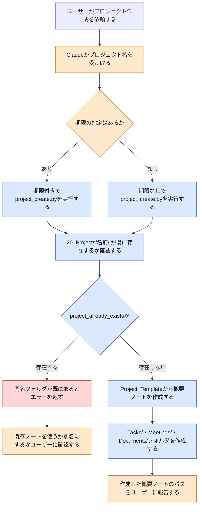

# project-add スキルのフロー

`project-add`スキルは、プロジェクト名を受け取り、概要ノートと`Tasks/`・`Meetings/`・`Documents/`の3フォルダを一括作成する。同名プロジェクトが既に存在する場合は何も変更せず、ユーザーに確認を求める。本ドキュメントは、この一連の処理が想定通りに動くかを人間が確認するためのものである。

> **凡例**: 🔵 Python処理（決定的・機械的） / 🟠 Claude判断・ユーザー確認 / 🔴 エラー・中断 / ⚪ 未実装（今後追加予定の処理）

## 補足

- **期限の指定はあるか**: ユーザーが期限を伝えていれば`--due-date`付きで`project_create.py`を実行する。伝えていなければ期限なしで実行する。
- **`project_already_exists`か**: `20_Projects/<名前>/`ディレクトリが実行時点で既に存在するかどうかで判定する。スクリプトは自動採番せず、存在する場合は何も作成・変更しない。
- **既存ノートを使うか別名にするか**: `project_already_exists`エラー時にClaudeがユーザーへ確認する。スクリプト側は判断しない。
- 今回の刷新後、`task-add`/`meeting-followup`スキルからも呼び出されるようになるが、呼び出し元が増えるだけで、project-add自身のフロー（本図の内容）は変わらない。

## 関連ドキュメント

- [project-add/SKILL.md](../.claude/skills/vault/skills/project-add/SKILL.md): 本フローの一次情報
- [project_create.py](../.claude/skills/vault/scripts/project_create.py): 実装本体

---
最終更新: 2026-09-23
