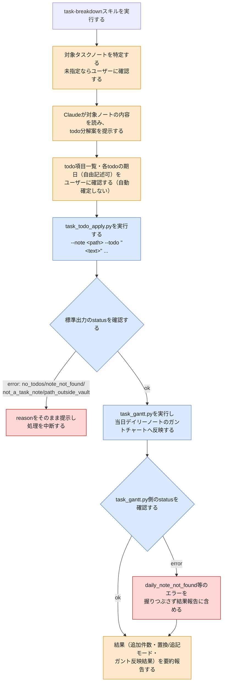

# task-breakdown スキルのフロー

`task-breakdown`は、既存のタスクノート1件の内容をtodo項目へ分解し、対象ノートの`## 📌 進捗メモ`セクションへ追記した上で、当日デイリーノートのガントチャートへも反映するスキルである。新規タスクの作成は行わない（それは`task-add`の範疇）。この図は、このVaultを使う人間が、スキルの動作が想定通りか確認するための文書である。

> **凡例**: 🔵 Python処理（決定的・機械的） / 🟠 Claude判断・ユーザー確認 / 🔴 エラー・中断

## 補足

- 対象は既存のtaskノート1件のみ。新規タスクの作成は`task-add`の範疇であり、本スキルでは扱わない。
- todo分解案（項目一覧・期日）はClaudeが提示するが、確定は必ずユーザー確認を経る（自動確定しない）。
- `task_todo_apply.py`の追記/置換モード判定:
  - `## 📌 進捗メモ`セクションが空、または本文の無いプレースホルダー行（`- [ ] `のみ）のみで構成される場合は`replace`（丸ごと置換）。
  - 実質的な記載が既にあれば`append`（末尾追記）。
- 追記時は重複排除する。追加対象のtodoテキストと完全一致する未完了（`- [ ] `）ラベルが既存セクションに既にあれば、そのtodoは追加しない。標準出力の`added`は重複排除後の実際の追加件数。
- エラー理由:
  - `no_todos`: `--todo`が1件も指定されない。
  - `note_not_found`: 対象ノートが存在しない。
  - `not_a_task_note`: `type`が`task`でない。
  - `path_outside_vault`: `--note`がvault_root外を指す。
- 成功（`status: "ok"`）時は続けて`task_gantt.py`を実行し、当日デイリーノートのガントチャートへ反映する。`task_gantt.py`側が`daily_note_not_found`等のエラーを返しても握りつぶさず、結果報告に含める。
- `## 📌 進捗メモ`見出しセクションの読み書き（`PROGRESS_HEADING_PATTERN`・`get_heading_section`・`set_heading_section`・`extract_checkboxes`）は`task_gantt.py`と共有する規約であり、詳細は[`references/conventions.md`](../.claude/skills/vault/references/conventions.md)を参照。

## 関連ドキュメント

- [task-breakdown/SKILL.md](../.claude/skills/vault/skills/task-breakdown/SKILL.md): 本フローの一次情報
- [task_todo_apply.py](../.claude/skills/vault/scripts/task_todo_apply.py): 実装本体
- [task-gantt-flow.md](task-gantt-flow.md): 後続実行される`task_gantt.py`のフロー（todoのmilestone描画を含む）
- [conventions.md](../.claude/skills/vault/references/conventions.md): 進捗メモ見出しセクション操作規約

---
最終更新: 2026-09-25
