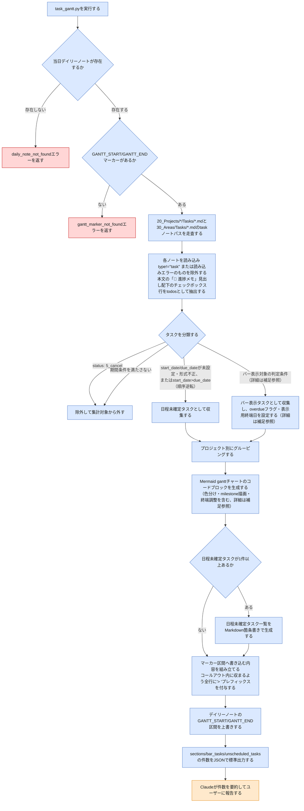

# task-gantt スキルのフロー

`task-gantt`は、Vault横断で`type: task`のノート全件を集計し、プロジェクト別のMermaid ganttチャートを当日デイリーノートに書き込むスキルである。CLI引数なしで`task_gantt.py`を実行するだけの決定的処理であり、他スキルにあるようなプロジェクト解決フロー・ユーザー確認分岐は無い。最後にClaudeが結果件数を要約報告する処理のみ判断を伴う。この図は、このVaultを使う人間が、スキルの動作が想定通りか確認するための文書である。

> **凡例**: 🔵 Python処理（決定的・機械的） / 🟠 Claude判断・ユーザー確認 / 🔴 エラー・中断

## 補足

- 対象タスクは`type: task`のノート全件（project紐付けの有無を問わない）。`status: "5_cancel"`は常に除外する。
- 期間フィルタ: 次のいずれかを満たすタスクがバー表示対象。
    - `today <= due_date <= today+90日`
    - `due_date < today` かつ `status`が`("4_done", "5_cancel")`以外
    - `due_date`が90日枠を超えていても、`start_date`が90日枠内（下限なし、既に開始済み＝過去日でも可）かつ`status`が`4_done`/`5_cancel`以外（★最終タスクを除く）
- 3つ目の条件で含まれたタスクは、バーの表示終端を実際の`due_date`ではなく90日枠の終端で打ち切り、ラベルに実際の期限を「(期限: YYYY-MM-DD)」の形式で注記する。overdue（赤色表示）判定は引き続き実際の`due_date`基準で変わらない。`status: "4_done"`のバーには`done`タグが付くが、上記フィルタ上は「未完了」扱いされないため、`due_date`が過去のdoneタスクは結果的に自然消滅する（ローリングto-doガント）。
- `start_date`・`due_date`のいずれかが未設定・形式不正、または両方設定済みでも`start_date`が`due_date`より後（順序逆転）のタスクは、この期間フィルタを適用せず常に「日程未確定タスク」として列挙する。
- `project`フロントマター値は`vault_lib.extract_project_name`で正規化してからsection名に使う（`[[Name]]`形式で手入力されていてもプレーン表記と統合される）。実在するプロジェクトフォルダを指しているかの検証は行わない。
- タスク間の依存関係表現はv1では扱わない（対応するfrontmatterフィールドが存在しないため）。
- ステータス色分け: バーには`status`とoverdue（`due_date < today`かつ`status`が`4_done`/`5_cancel`以外）の組でMermaid ganttのタグを付与する。`status: "4_done"`は常に`done`。それ以外でoverdueなら`crit`。非overdueは`status: "2_doing"`が`crit, active`、`status: "3_pending"`が`active`、`status: "1_todo"`・未知の値はタグ無し。さらに、次の2条件のいずれかを満たす場合も、`due_date`基準のoverdueとは別に`crit`になる（`_classify_task`の分類ロジックは変わらず色のみの変更。`status`が`4_done`/`5_cancel`のいずれでもない場合に限る）。
  - `status: "1_todo"`かつ`start_date`が今日以前（開始日超過、`_is_late_start`）
  - `due_date`が今日ちょうど（期限当日、`_is_due_today`）。`_is_overdue`自体は「期限日が今日より前」のままの意味を保ち、期限当日はここで別途OR結合される。
- todoのmilestone表示: taskノート本文の`## 📌 進捗メモ`見出し配下のチェックボックス行（`- [ ] `/`- [x] `）をtodoとして抽出し、対応するバーの直下に`milestone`タグの行として描画する（日付は親タスクの`start_date`、期間`0d`）。完了チェックボックスには`done`タグも付与する。本文が無い空のプレースホルダー行はtodoとして抽出しない。親タスクの`status`が`"4_done"`の場合は、todoのmilestone行を一切出力しない（バー行自体は`done`タグ付きで従来通り表示する）。todoの文言に`【YYYY-MM-DD】`形式の期日表記を含めた場合、ラベルの一部としてそのままmilestone行のラベルに反映される（コード側でのパース・検証は行わない）。
- ★で囲まれた最終タスクのmilestone表示: タイトル（ファイル名）が`★`で始まり`★`で終わる（`★`1文字のみは対象外）タスクは、プロジェクトの「最終タスク（イベント）」として扱われ、通常のバー行の代わりに`milestone`タグのみの行で表示する。日付は`due_date`基準（期間`0d`）。色はstatusのみで決まり、`status: "4_done"`なら`done, milestone`、それ以外は`crit, milestone`（overdueかどうかは問わない）。★最終タスクは`start_date`基準の新条件（3つ目の条件）の対象外であり、`due_date`基準の期間フィルタ（1つ目・2つ目の条件）でのみバー表示対象かどうかが判定される点は変更しない。★タスク自身のtodoのmilestone行は上記の通常ロジックのままそのまま出力される。
- マーカー区間へ書き込む内容は、Obsidianの折りたたみ可能なコールアウト内に収まるよう全行に`> `プレフィックス（空行は`>`のみ）を付与してから書き込む。
- `80_Templates/Daily_Template.md`側でGANTT_START/GANTT_ENDマーカーは`> [!INFO]+ 📊 タスクガントチャート`という独立したコールアウト内に配置されており、「要スケジュール確認タスク（14日以内）」コールアウトとは別のコールアウトである。
- 実行のたびにマーカー区間を上書きする（差分更新ではない）。
- daily_note_not_foundエラー時は`today-open`スキルを先に実行するよう案内する。gantt_marker_not_foundエラー時は`80_Templates/Daily_Template.md`のマーカーを当該ノートへ手動で追記するよう案内する（自動追加は行わない）。いずれもファイルへの書き込みは一切行われない。

## 関連ドキュメント

- [task-gantt/SKILL.md](../.claude/skills/vault/skills/task-gantt/SKILL.md): 本フローの一次情報
- [task_gantt.py](../.claude/skills/vault/scripts/task_gantt.py): 実装本体
- [vault_lib.py](../.claude/skills/vault/scripts/vault_lib.py): `has_marker_block`・`extract_project_name`等の共有関数

---
最終更新: 2026-09-26
