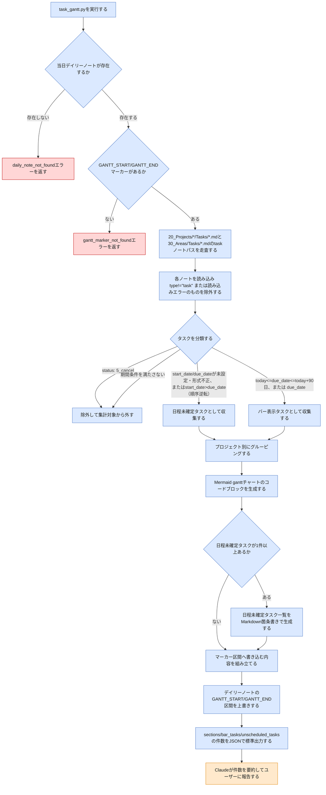

# task-gantt スキルのフロー

`task-gantt`は、Vault横断で`type: task`のノート全件を集計し、プロジェクト別のMermaid ganttチャートを当日デイリーノートに書き込むスキルである。CLI引数なしで`task_gantt.py`を実行するだけの決定的処理であり、他スキルにあるようなプロジェクト解決フロー・ユーザー確認分岐は無い。最後にClaudeが結果件数を要約報告する処理のみ判断を伴う。この図は、このVaultを使う人間が、スキルの動作が想定通りか確認するための文書である。

> **凡例**: 🔵 Python処理（決定的・機械的） / 🟠 Claude判断・ユーザー確認 / 🔴 エラー・中断

## 補足

- 対象タスクは`type: task`のノート全件（project紐付けの有無を問わない）。`status: "5_cancel"`は常に除外する。
- 期間フィルタ: `(today <= due_date <= today+90日)`または`(due_date < today かつ status not in ("4_done", "5_cancel"))`を満たすタスクのみがバー表示対象。`status: "4_done"`のバーには`done`タグが付くが、上記フィルタ上は「未完了」扱いされないため、`due_date`が過去のdoneタスクは結果的に自然消滅する（ローリングto-doガント）。
- `start_date`・`due_date`のいずれかが未設定・形式不正、または両方設定済みでも`start_date`が`due_date`より後（順序逆転）のタスクは、この期間フィルタを適用せず常に「日程未確定タスク」として列挙する。
- `project`フロントマター値は`vault_lib.extract_project_name`で正規化してからsection名に使う（`[[Name]]`形式で手入力されていてもプレーン表記と統合される）。実在するプロジェクトフォルダを指しているかの検証は行わない。
- タスク間の依存関係表現はv1では扱わない（対応するfrontmatterフィールドが存在しないため）。
- 実行のたびにマーカー区間を上書きする（差分更新ではない）。
- daily_note_not_foundエラー時は`today-open`スキルを先に実行するよう案内する。gantt_marker_not_foundエラー時は`80_Templates/Daily_Template.md`のマーカーを当該ノートへ手動で追記するよう案内する（自動追加は行わない）。いずれもファイルへの書き込みは一切行われない。

## 関連ドキュメント

- [task-gantt/SKILL.md](../.claude/skills/vault/skills/task-gantt/SKILL.md): 本フローの一次情報
- [task_gantt.py](../.claude/skills/vault/scripts/task_gantt.py): 実装本体
- [vault_lib.py](../.claude/skills/vault/scripts/vault_lib.py): `has_marker_block`・`extract_project_name`等の共有関数

---
最終更新: 2026-09-24
