# today-close スキルのフロー

1日の作業終了時に、当日ブランチの変更をデイリーノートへ反映してコミットし、`main`へ統合するまでの処理を自動化する。`today-close`は単なる「1日の変更をコミットするスキル」ではなく、**タスク・議事録の締め忘れがないかを確認し、締め忘れていればユーザーに見直しを促すスキル**である。議事録`attendance`未更新ノートの一覧提示・確認、およびタスクの日付・ステータスの見直し促進を含む、実装済みの処理フローである。

> **凡例**: 🔵 Python処理（決定的・機械的） / 🟠 Claude判断・ユーザー確認 / 🔴 エラー・中断

```mermaid
flowchart TD
    A[today-closeスキルを実行する] --> B[会議予定の開催状況を確認する<br/>meeting-setupスキルの実行フローを呼び出す]
    B --> B1["meeting_sync.pyの既存出力<br/>(needs_attendance_check)を確認する"]
    B1 --> B2{開催日が本日より前（当日は含まない）かつ<br/>attendanceが1_scheduledのまま<br/>未更新のノートが<br/>needs_attendance_checkに含まれるか}
    B2 -- 該当ノートあり --> B3["該当ノート一覧を提示し<br/>出席状況を確認する<br/>（要ユーザー確認）"]
    B3 --> B4["ユーザーの回答に応じて<br/>meeting_sync.py --set-attendanceで<br/>該当ノートのattendanceを更新する"]
    B2 -- 該当ノートなし --> B5
    B4 --> B5
    B5{"attendance確定済みだが未消化の<br/>アクションアイテムが残る議事録が<br/>needs_task_checkに含まれるか"}
    B5 -- あり --> B6["該当議事録一覧を提示し、<br/>meeting-followupスキルの実行を促す<br/>（処理は中断せず続行する）"]
    B5 -- なし --> C
    B6 --> C
    C{現在のブランチは<br/>YYYY-MM-DD形式か}
    C -- いいえ --> C1[エラー: not_on_daily_branch<br/>当日ブランチへ切り替えて再実行するよう案内する]
    C -- はい --> D["Vault内の全タスクノートを<br/>確認する"]
    D --> E{"次のいずれかに該当する<br/>タスクがあるか<br/>①created_dateが本日かつstart_date未設定<br/>②start_dateが本日かつstatusが1_todo<br/>③due_dateが本日かつstatusが4_done/5_cancel以外"}
    E -- あり --> E1["該当タスク一覧を提示する"]
    E1 --> E2["Baseビューから日付・ステータスを<br/>見直すよう促し、処理を中断する<br/>修正後は再度today-closeスキルを<br/>実行するよう案内する"]
    E -- なし --> G[当日ブランチを作成してから更新された<br/>ノートの一覧を収集する]
    G --> H[更新ノートをtype別<br/>project/meeting/task/knowhow/webclip/otherに<br/>グルーピングする]
    H --> I[当日デイリーノートの<br/>更新ノート一覧ブロックを書き換える]
    I --> J{未コミットの変更があるか}
    J -- あり --> K[変更をコミットする]
    J -- なし --> L
    K --> L{mainと当日ブランチのHEADが<br/>既に一致しているか}
    L -- 一致 --> L1[既にclose済みとしてユーザーに伝える<br/>追加作業は不要]
    L -- 不一致 --> M[mainへ git merge --ff-only で<br/>マージする]
    M -- 失敗 --> M1[エラー: merge_failed<br/>詳細を提示しユーザーに解決方針を確認する<br/>自動解決はしない]
    M -- 成功 --> N[当日ブランチを git branch -d で削除する]
    N --> O{originリモートが設定されているか}
    O -- あり --> P[origin/mainへのpushを試みる<br/>失敗しても許容する]
    O -- なし --> Q[結果をユーザーに要約して報告する]
    P --> Q

    class B claude
    class B1 claude
    class B2 claude
    class B3 claude
    class B4 python
    class B5 claude
    class B6 claude
    class C python
    class C1 error
    class D python
    class E python
    class E1 error
    class E2 error
    class G python
    class H python
    class I python
    class J python
    class K python
    class L python
    class L1 claude
    class M python
    class M1 error
    class N python
    class O python
    class P python
    class Q claude

    classDef python fill:#dbe9ff,stroke:#4472c4,color:#1a1a1a;
    classDef claude fill:#ffe9cc,stroke:#e08000,color:#1a1a1a;
    classDef error fill:#ffd6d6,stroke:#c00000,color:#1a1a1a;
```

## 補足

- **not_on_daily_branch**: 現在のブランチ名が`YYYY-MM-DD`形式でない場合のエラー。当日ブランチへ切り替えてから再実行する。
- **merge_failed**: `git merge --ff-only`が失敗した場合（`main`が当日ブランチの分岐後に進んでいる等）。`--no-ff`やrebaseによる自動解決は行わず、詳細をそのまま提示してユーザーに解決方針を確認する。
- **already_closed**: `main`と当日ブランチのHEADが既に一致している場合、追加の作業なしで終了する。
- 未コミットの変更が無い場合はコミット処理をスキップする。
- 会議予定確認（meeting-setupスキル呼び出し）がGoogle Calendar MCP未接続等で失敗しても、today-close本来の処理（コミット・マージ・ブランチ削除）は継続する。
- pushの失敗は致命的エラーとしない。originリモートが無い場合はpush自体をスキップし、pushが失敗した場合も許容する。
- タスクの日付・ステータス見直しチェックは、次の3条件のいずれかに該当するタスクを対象とする。
  1. `created_date`が本日かつ`start_date`が未設定（新規作成したがいつ着手するか決めていないタスク）
  2. `start_date`が本日かつ`status`が`1_todo`（今日着手する予定だったが、終業時点で未着手のままのタスク）
  3. `due_date`が本日かつ`status`が`4_done`/`5_cancel`以外（今日が期限だが、終業時点で完了・キャンセルになっていないタスク）
- 1つでも該当タスクがあれば、一覧を提示した上で**処理を中断する**（コミット・マージ等の後続処理には進まない）。
- ユーザーはBaseビューから該当タスクの日付・ステータスを修正し、再度`today-close`スキルを実行する。
- このチェックはユーザーへの確認を挟まず自動で該当タスクを検出するが、検出後の修正自体はユーザーがBaseビューから行う（today-closeスキル側で日付を自動で書き換えることはしない）。
- 議事録`attendance`未更新ノートの検出ロジック自体は`meeting_sync.py`の`_scan_stale_and_pending`に既に実装済みで、`needs_attendance_check`として結果に含まれる（`needs_task_check`も同様に実装済み）。
- today-closeスキルが新規に担うのは、この既存の検出結果を消費して該当ノート一覧をユーザーに提示し、確認を得た上で`meeting_sync.py --set-attendance`（既存の実行モード）で反映するオーケストレーション部分のみである。
- この一括確認は、`meeting-setup`スキルから「開催確認」パターンが削除され`attendance`を基本ユーザーが手動更新する運用に変更されたことに伴う、更新忘れ防止のための代替措置である。
- attendance確認はタスクの日付見直しと異なり、today-closeスキルの会話内でその場でユーザーに確認し反映する（処理を中断してBase修正を待つ形にはしない）。
- タスクの日付見直しチェックが機能するために必要な`task_save.py`側の改修は完了済みである（`task_save.py`はタスク作成時に`created_date`のみをセットし、`start_date`は空欄のまま作成する）。
- `needs_task_check`（attendance確定済みだが未消化のアクションアイテムが残る議事録）は、これまで旧`meeting`スキルのタスク化フローが消費していたが、タスク化が`meeting-followup`スキルへ独立したことで、消費先が無いまま埋もれる恐れがあった。そのため`today-close`にもこの一覧提示を追加する。
- ただし`needs_task_check`は日付を問わず全件対象の恒常的なリマインダーであり（`meeting-setup`のSKILL.md記載の仕様通り）、タスクの日付見直しチェックとは異なり**処理を中断しない**。一覧提示後も後続のコミット・マージ処理はそのまま続行する。

## 関連ドキュメント

- [today-close/SKILL.md](../.claude/skills/vault/skills/today-close/SKILL.md): 本フローの一次情報
- [close_day.py](../.claude/skills/vault/scripts/close_day.py): 実装本体

---
最終更新: 2026-09-24
