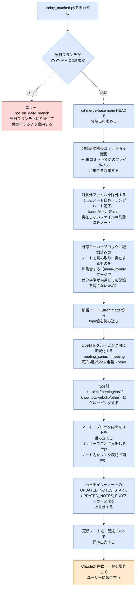

# today-touched スキルのフロー

日中いつでも「本日作成・更新したノート」一覧を再生成するスキルである。当日ブランチ上の`git diff`（`main`との分岐点以降のコミット済み変更＋未コミット変更）をベースに更新ノートを検出し、当日デイリーノートの`UPDATED_NOTES_START`/`UPDATED_NOTES_END`マーカーブロックに反映する。CLI引数なしで実行される決定的処理であり、ユーザー確認分岐は無い。同スキルの実行フローは、`today-close`スキル内でも自動的に呼び出される（手順1〜3のmeeting-setup実行後、`close_day.py`実行前）。この図は、このVaultを使う人間が、スキルの動作が想定通りか確認するための文書である。

> **凡例**: 🔵 Python処理（決定的・機械的） / 🟠 Claude判断・ユーザー確認 / 🔴 エラー・中断

## 補足

- **当日ブランチ判定**: 現在のブランチ名が`YYYY-MM-DD`形式（例: `2026-09-25`）であることを確認する。形式が異なる場合は`not_on_daily_branch`エラーを返す。
- **変更ノート検出**: `git merge-base main HEAD`で`main`ブランチとの分岐点を求め、分岐点以降のコミット済み変更パスと未コミット変更パスの和集合から対象ノートを抽出する。リネーム操作は変更後のパスを採用する。
- **除外規則**: 当日デイリーノート自身（`10_Daily/YYYY-MM-DD.md`）、`80_Templates/`配下、`.claude/`配下、非`.md`ファイル、実在しないファイル（削除されたノート）をすべて対象外とする。
- **既存記録との和集合**（`_merge_with_existing_entries`）: `today-close`実行後にさらに同日中の更新が必要になり、日中に`close`（`main`へのff-onlyマージ）が複数回挟まる場合、`main`が当日ブランチに追いつくたびに差分基準（`merge-base(main, HEAD)`）が前進する。そのため、直近の差分だけを見ると、それより前に記録済みだった更新ノートが一覧から消えて見える。これを防ぐため、新しい差分結果は「今回の差分」だけで置き換えず、既存のマーカーブロックから`- [[stem]]`形式で記録済みのノート名を読み取り、Vault内でファイル名から実ファイルを解決（`_resolve_stem_path`。Obsidianの`[[stem]]`リンクがVault内一意性を前提とすることを利用）した上で、実在するものだけを和集合してから書き込む。
- **type正規化**: `meeting_series`は`meeting`へ統合される。既知のtype値は`project`/`meeting`/`task`/`knowhow`/`webclip`の5種。これら以外またはtype値が未定義のノートは`other`へ分類される。削除済みノートは前段の除外規則で既に取り除かれているため、type読込・グルーピングの対象にはならない。
- **グルーピング順序**: type別グルーピングの表示順序は固定（project → meeting → task → knowhow → webclip → other）。グループ内のノート順序は、ファイル名（stem）のアルファベット順。
- **マーカーブロック**: 当日デイリーノートの`UPDATED_NOTES_START`/`UPDATED_NOTES_END`マーカーで囲まれた区間へ、**グループが存在しない場合は「（本日の更新ノートなし）」と表示される**。複数グループが存在する場合は、グループごとに`**project**`のような見出しを付け、その下に`- [[ノート名]]`形式のリンク列挙を行う。グループ間は空行で区切られる。
- **冪等スクリプト**: 実行のたびに当日ブランチ上の`git diff`（`main`との分岐点以降の全変更）と既存マーカーブロックの記録を和集合して一覧を再計算する。`main`が途中でff-onlyマージにより前進しない限り、実行回数・実行タイミングに依存した副作用は無い。
- **エラーハンドリング**: `not_on_daily_branch`エラー時は何もファイルへ書き込まれない。ただし`today-close`スキル内でこのエラーが発生した場合でも、スキル側で処理を巻き戻さず、`close_day.py`側の同種チェックに委ねてそのまま後続処理へ進む。
- **today-closeスキルからの呼び出し**: `today-close`スキルのフロー内で、手順1〜3（meeting-setup実行・meeting_sync確認）の後かつ手順5の`close_day.py`実行直前に自動的に呼び出される。この位置に置かれるのは、meeting-setupで生じたノートの新規作成・frontmatter変更も含め、コミット直前の状態で更新ノート一覧を最新化するため。`today_touched.py`は`close_day.py`とimport/subprocess関係を持たない完全に独立したスクリプトであり、毎回全体を再計算する。

## 関連ドキュメント

- [today-touched/SKILL.md](../.claude/skills/vault/skills/today-touched/SKILL.md): 本フローの一次情報
- [today_touched.py](../.claude/skills/vault/scripts/today_touched.py): 実装本体
- [vault_lib.py](../.claude/skills/vault/scripts/vault_lib.py): `split_frontmatter`・`get_fm_value`・`set_marker_block`等の共有関数

---
最終更新: 2026-09-26
