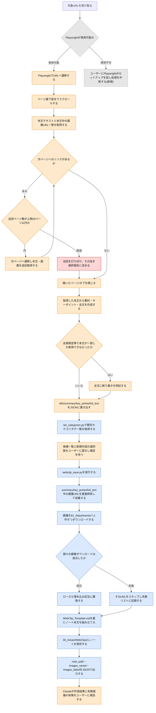

# webclip-add スキルのフロー

指定URLのWebページをPlaywrightで取得する。取得した内容をもとにClaudeが要約・カテゴリ確認を行う。その結果を受けて`webclip_save.py`がノート化・画像保存を行う一連の流れを示す。人間がこのスキルの挙動を確認する用途のドキュメント。

> **凡例**: 🔵 Python処理（決定的・機械的） / 🟠 Claude判断・ユーザー確認 / 🔴 エラー・中断 / ⚪ 未実装（今後追加予定の処理）

## 補足

- URL取得手段はPlaywright（実ブラウザ経由）に固定されており、他手段へのフォールバックは行わない。ページ遷移・スクロール・本文取得・次ページ遷移・タブを閉じるまでの一連のブラウザ操作は、Claudeが実ブラウザ経由のMCPツール（Playwright）を直接操作して行うものであり、Pythonスクリプトの決定的処理ではない。
- ページ巡回には安全弁として上限20ページが設けられており、超過時は打ち切って最終報告でその旨を伝える。
- カテゴリタグは`list_categories.py`が既存タグ候補を機械的に収集するだけで、採用可否・新規作成の判断はユーザー確認を経てClaudeが確定する（自動決定はしない）。
- `webclip_save.py`実行以降（画像URLの重複排除・ダウンロード・ローカル埋め込みへの置換・ノート本文の組み立て・保存・結果出力）はすべて同スクリプト内の決定的処理である。画像ダウンロードは1件ずつ独立して行われ、個別の失敗はスキップされる。ダウンロードに失敗した画像は`full_text`中の埋め込み記法ごと取り除かれ、ノート作成自体は継続する。
- 会員限定等の理由で本文の一部しか取得できなかった場合、ノート作成前に必ず断り書きを本文に明記する。
- URL受け取り直後のPlaywright使用可否確認(新規)は、Playwright未セットアップ時に無案内で失敗することを防ぐために追加したロジックである。

## 関連ドキュメント

- [webclip-add/SKILL.md](../.claude/skills/vault/skills/webclip-add/SKILL.md): 本フローの一次情報
- [webclip_save.py](../.claude/skills/vault/scripts/webclip_save.py): 実装本体（ノート化・画像保存処理）
- [list_categories.py](../.claude/skills/vault/scripts/list_categories.py): 既存カテゴリタグ一覧の取得処理

---
最終更新: 2026-09-23
