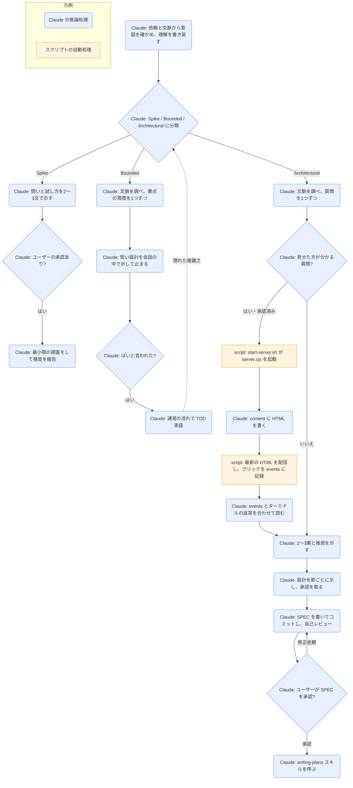

# brainstorming

## ひとことで
実装の前に、対話で意図・要件・設計を固めるスキル（プラグイン superpowers）。設計の承認が取れるまで、実装に入らない。

## 何ができるか
- 依頼を3つの道に分類し、分類を声に出して伝える（ユーザーが上書きできる）。
  - Spike: 「できるか」を確かめる調べもの。答えが成果で、作ったものは使い捨て扱い。
  - Bounded: このリポジトリに既にある流れへの小さな変更（フラグ1つ、小さなエンドポイント、1ファイルの修正）。
  - Architectural: 新規プロジェクト、新しいサブシステム、構造やインターフェースを変える変更。
- 迷ったら重い方の道を選ぶ。途中で隠れた複雑さが見つかったら道を上げる（下げることはない）。
- 最初に意図（何のため・誰のため・成功の条件）を確かめ、理解を短く書き戻して訂正を受ける。言われたことと仮定を分けて書く。
- 道ごとの承認ゲート（HARD-GATE）を守る。承認前は読み取りだけの調査しかしない。
  - Spike: 問いと試し方の承認。
  - Bounded: 会話の中の短い設計の承認。
  - Architectural: 書いた SPEC の承認、そのあと実装計画のレビューと実行方法の選択。
- Architectural では、質問 → 2〜3案の比較と推奨 → 節ごとの設計提示と承認 → SPEC の作成とコミット → 自己レビュー → ユーザーのレビュー → `writing-plans` スキルへ引き継ぐ。
- 必要なときだけ「ビジュアルコンパニオン」（ブラウザでモックアップ・図・選択肢を見せる機能）を提案して使う。

## 使い方
- 呼び出し: description に「創造的な作業（機能の作成、コンポーネントの構築、機能追加、振る舞いの変更）の前に必ず使う」とあり、自動で起動する前提のスキル。`/superpowers:brainstorming` での明示呼び出しの形は SKILL.md に記載がなく未確認。
- 例: 「この機能を足したい」と頼むと、Claude が「これは bounded に見えるので、SPEC ではなく短い設計をここで出します」のように分類を宣言してから質問を始める。
- 質問は1回に1つ。できるだけ選択式。
- 道ごとの終わり方:
  - Spike: 推奨としての調査結果を報告して終わる。
  - Bounded: 設計に「はい」と言われたら、通常の開発の流れ（TDD）で実装に入る。計画文書は作らない。
  - Architectural: SPEC を `docs/superpowers/specs/YYYY-MM-DD-<topic>-design.md` に書いてコミットし、レビューを頼む。承認後に `writing-plans` を呼ぶ。ほかの実装スキルは呼ばない。
- ビジュアルコンパニオン:
  - 最初から提案しない。「見せた方が分かる」質問が初めて出たときに、その提案だけを1通のメッセージで出す。
  - 承認すると、ローカルのサーバーが立ち、ブラウザに画面が出る。選択肢をクリックすると、その操作が Claude に伝わる。返答はターミナルに書く（ターミナルの文章が主で、クリックは補助）。
  - 受け入れたあとも、質問ごとにブラウザかターミナルかを選ぶ。要件・概念の選択・トレードオフはターミナル。
  - URL には `?key=...` の鍵が付く。鍵なしの URL では開けない。

## ロジック
本体はすべて Claude の推論処理。ビジュアルコンパニオンを使うときだけ、スクリプト（`start-server.sh` → `server.cjs`、終了時は `stop-server.sh`）が動く。

## 保守者向け
- 場所: `%USERPROFILE%\.claude\plugins\cache\claude-plugins-official\superpowers\6.4.1\skills\brainstorming\`（プラグイン superpowers 6.4.1。マーケットプレイスは claude-plugins-official）
- ファイル:
  - `SKILL.md`: 本体。英語で書かれている。
  - `visual-companion.md`: ビジュアルコンパニオンの手順書（コンパニオンの承認後に読む）。
  - `scripts/start-server.sh`: サーバーの起動（bash）。`--project-dir` `--host` `--url-host` `--idle-timeout-minutes` `--open` `--foreground` `--background`。
  - `scripts/server.cjs`: Node.js の HTTP / WebSocket サーバー（外部の依存なし）。`content` の最新の `.html` を配信し、断片なら `frame-template.html` で包む。`helper.js` を差し込む。
  - `scripts/helper.js`: ブラウザ側。クリックを WebSocket で送り、再接続と「Companion paused」の表示を行う。
  - `scripts/frame-template.html`: 画面の枠と CSS。
  - `scripts/stop-server.sh`: サーバーの停止。PID が自分のサーバーだと確かめてから止める。
  - `spec-document-reviewer-prompt.md`: SPEC をレビューするサブエージェント用のプロンプトの雛形。SKILL.md からもほかのスキルからも参照されておらず（プラグインの `skills/` 内を検索して確認）、使われ方は未確認。
- 書き込み先:
  - SPEC: プロジェクトの `docs/superpowers/specs/YYYY-MM-DD-<topic>-design.md`（ユーザーの指定があればそちら）。git にコミットする。
  - コンパニオン（`--project-dir` あり）: `<project>/.superpowers/brainstorm/<セッションID>/content/`（画面）と `state/`（`events`、`server-info`、`server.log`、`server.pid`、`server-stopped`）。ポートと鍵を `.superpowers/brainstorm/.last-port` と `.last-token` に保存し、再起動で同じ URL を使う。`.superpowers/` を `.gitignore` に足すようユーザーに促す。
  - コンパニオン（`--project-dir` なし）: `/tmp/brainstorm-<セッションID>/`。停止時に削除される。
- 制約:
  - 承認ゲートの前は、読み取りだけの調査しかしない。1つの承認を、後の段階の承認として扱わない。
  - Architectural のあとに呼ぶのは `writing-plans` だけ。
  - SPEC の文章に `elements-of-style:writing-clearly-and-concisely` スキルを「あれば」使う。このスキルの有無と内容は未確認。
  - `writing-plans` スキルの中身は読んでおらず未確認。
- コンパニオンの注意:
  - 動かすには bash と Node.js が要る。
  - Windows（Git Bash）では自動でフォアグラウンドになり、ツールの呼び出しが止まる。Bash ツールの `run_in_background: true` で起動し、次のターンで `state/server-info` から URL を読む（`visual-companion.md` による）。
  - Windows では親プロセスの監視を切り、無操作のタイムアウト（既定 4時間）だけで止まる。
  - 待ち受けは既定で `127.0.0.1`。鍵（`?key=`）とクッキーで認証する。
  - 画面のロゴは、既定で primeradiant.com から読み込まれ、superpowers のバージョンが送られる（README の「Visual companion telemetry」）。環境変数 `SUPERPOWERS_DISABLE_TELEMETRY`、`DISABLE_TELEMETRY`、`CLAUDE_CODE_DISABLE_NONESSENTIAL_TRAFFIC` のどれかを真にすると読み込まない。
- プラグイン全体: `hooks/hooks.json` の SessionStart フック（startup / clear / compact）が、`using-superpowers` スキルの全文をセッションの文脈に入れる。`using-superpowers` の中身は読んでおらず未確認。
- Vault との関係: 自動で起動する前提のため、Vault の `grilling` / `grilling-html` やユーザーの CLAUDE.md の「SPEC の作成を提案する」ルールと場面が重なりうる。どちらを優先するかの定めは見当たらず未確認。
- プラグイン領域にあるので、Vault の Git では追跡されない。プラグインの更新で中身が変わる。
