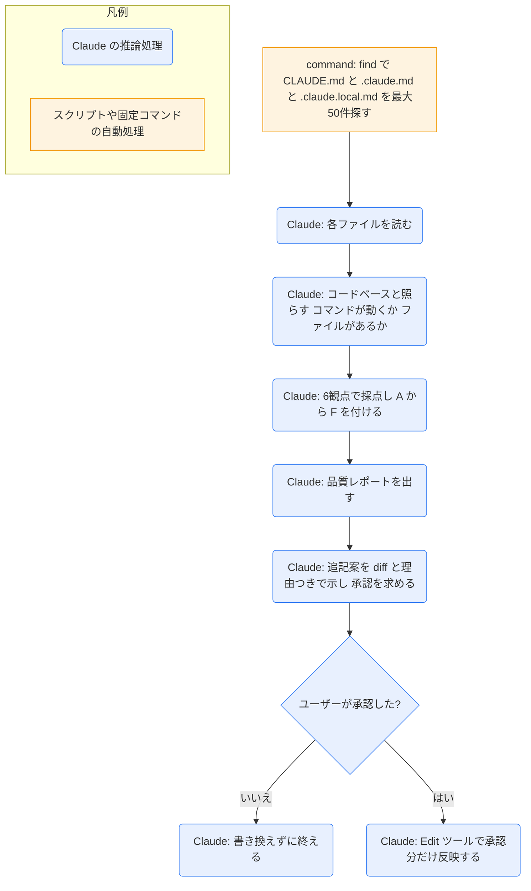

# claude-md-improver

## ひとことで
リポジトリの CLAUDE.md を探して採点し、品質レポートを出したうえで、承認を得て的を絞った追記をするスキル。

## 何ができるか
- リポジトリ内の `CLAUDE.md`・`.claude.md`・`.claude.local.md` を探す（最大50件）。
- 各ファイルを6つの観点で100点満点に採点し、A〜F の評価を付ける。
  - コマンド・作業手順（20点）
  - 構成の分かりやすさ（20点）
  - 分かりにくい決まりごと・落とし穴（15点）
  - 簡潔さ（15点）
  - 現状との一致（15点）
  - 実行できる具体性（15点）
- 実際のコードベースと照らし合わせる（書かれたコマンドが動くか、参照しているファイルがあるか）。
- 品質レポート（概要、ファイルごとの点数表、問題点、追加の推奨）を、更新の前に必ず出す。
- 追記案を diff の形で、対象ファイルと「なぜ役立つか」を添えて示す。承認されたら Edit ツールで反映する。既存の構成は崩さない。
- 追記するもの・しないものの基準を持つ。
  - 足す: 見つけたコマンド、落とし穴、モジュールの関係、うまくいったテストの方法、設定の癖。
  - 足さない: コードを見れば分かること、一般論、一度きりの修正、長い説明。
- 利用者へのヒントも伝える（`#` キーでセッション中に学びを CLAUDE.md へ入れる、個人の設定は `.claude.local.md`、全体の既定は `~/.claude/CLAUDE.md` など）。

## 使い方
- 呼び出し: 「CLAUDE.md を監査して」「CLAUDE.md が最新か確認して」などと頼むと、description に合えば Claude が使う。明示するときは `/claude-md-management:claude-md-improver`（プラグインのスキルは `プラグイン名:スキル名` の形。Claude Code の Skill ツールの説明による）。
- 起きること:
  1. Claude が CLAUDE.md を探して読み、採点する。
  2. 品質レポートを出す。
  3. 追記案を diff で見せ、反映してよいかを聞く。
  4. 承認された分だけ書き換える。
- 同じプラグインに、別のコマンド `/revise-claude-md` がある。こちらは「今のセッションで分かったこと」を CLAUDE.md に足すためのもの（README と `commands\revise-claude-md.md` による）。このスキルは「コードベースの現状と CLAUDE.md を合わせる」定期的な手入れ向け。

## ロジック
スクリプトファイルはない。決まった手順で動くのは、最初の検索コマンド（`find`）だけなので、図ではそこを四角にした。ほかはすべて Claude の推論処理。

## 保守者向け
- 場所: `%USERPROFILE%\.claude\plugins\cache\claude-plugins-official\claude-md-management\1.0.0\skills\claude-md-improver\SKILL.md`
  - プラグイン: `claude-md-management@claude-plugins-official`（バージョン `1.0.0`）。`installed_plugins.json` に user スコープで登録されている。有効かどうかは未確認。
- 参照ファイル（同じスキルフォルダの `references\`）:
  - `quality-criteria.md`: 6観点の採点基準（点数ごとの目安）、評価の手順、危険信号（動かないコマンド、消えたファイルへの参照、テンプレートのままの記述、終わらない TODO、複数の CLAUDE.md の重複など）。
  - `templates.md`: 推奨セクション（Commands・Architecture・Key Files・Code Style・Environment・Testing・Gotchas・Workflow）と、最小・充実・パッケージ・モノレポ用のひな形。
  - `update-guidelines.md`: 足すもの・足さないものの例、diff の書き方、反映前のチェックリスト。
- 使うツール: frontmatter に `tools: Read, Glob, Grep, Bash, Edit` とある（Claude Code が `allowed-tools` と同じように扱うかは未確認）。
- 書き込み先: 見つけた CLAUDE.md 系のファイル。承認後に Edit ツールで書く。
- 制約: レポートを先に出し、承認なしでは書き換えない。
- 注意:
  - SKILL.md と参照ファイルは英語で書かれている。
  - プラグイン領域（Vault 外）なので、Vault の Git では追跡されない。プラグインの更新で中身が変わることがある。
  - 検索コマンドは POSIX の `find .` で、作業フォルダの下だけを探す。`~/.claude/CLAUDE.md` は表に載っているが、このコマンドでは見つからない。
  - この Vault で使う場合: 検索の対象は `CLAUDE.md` などの名前のファイルだけで、`@` で読み込んでいる `PERSONAL.md`・`80_context/_rules.md`・`80_context/_index.md` は対象に入らない。`_rules.md` と `_index.md` は棚卸しで自動生成されるので、直接書き換えても上書きされる（Vault の CLAUDE.md による）。また Vault の CLAUDE.md は配布用 Git の対象で、個人の要素は `PERSONAL.md` に書く決まりがある。
  - `#` キーのショートカットなど、利用者へのヒントの内容が今の Claude Code でも正しいかは未確認。
