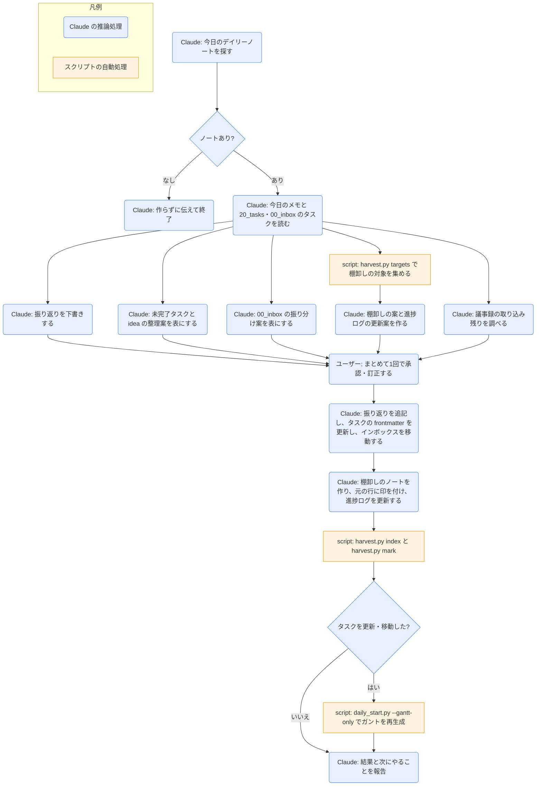

# daily-end

## ひとことで
1日の締めのスキル。振り返りの下書き、未完了タスクと idea の整理案、インボックスの振り分け案、知識の棚卸し（`knowledge-harvest`）の案をまとめて出し、1回の承認で、ノートとタスクを更新する。議事録の取り込み残りも知らせる。

## 何ができるか
- 完了したタスク、今日の経緯、「今日のメモ」から、振り返り（できたこと・気づき・学び・明日へ）を下書きする。根拠がない項目は「未記入」とする。
- 進めるタスク（`todo` / `in_progress` / `waiting` / `requested`）ごとに、整理案（翌日へ・状態の変更・現状維持）を、推奨と理由つきで表にする。
  - 状態の変更先: `in_progress`、`waiting`（保留。`memo` に理由）、`requested`（依頼中。`memo` に相手と内容）、`shelved`（塩漬け）、`cancelled`（中止）
  - タスクは削除しない（中止は `cancelled`）。
- `idea` のタスクごとに、`todo` にする（`start` / `due` の案。指定がなければ当日）・`idea` のまま・`shelved`・`cancelled` のどれかを推奨する。作成から日が浅いものは「`idea` のまま」でよい。
- `00_inbox/` の直下（`.gitkeep` 以外）を1件ずつ振り分ける案を出す。
  - タスク: `project` を決めて `20_tasks/` へ移す。タイトルから目的が読み取れないものは、名前の変更案を出す。
  - grilling-html のセッション・ダウンロードした資料: プロジェクトに属せば `10_projects/<名前>/`、属さなければ `50_documents/` へ移す。
  - 会議の文字起こし（`.docx` / `.vtt`）・会議のメモ: 移さず、`meeting-import` で議事録にすることを提案する。
  - そのほかのノート: 内容に応じて移動先を推奨し、テンプレートにないプロパティがあれば補う案も示す。
- `knowledge-harvest` の手順で、今日のメモと、前回の棚卸し以降に更新したタスクの経緯から、知識と Claude のインプット（`80_context/`）の案を作る。
- 議事録の取り込み残り（`00_inbox/` の文字起こし・会議のメモ、今日の議事録でアクションアイテムが空、または印のない行があるもの）を報告する。
- 承認後に、振り返りの追記、タスクの frontmatter の更新、インボックスの移動、棚卸し（ノートの作成・印付け・索引の再生成・棚卸しの日時の記録）を行う。タスクを更新・移動したときは、ガントも更新する。

## 使い方
- 呼び出し: 「1日を終える」「振り返りを書いて」「今日を締めて」と言うか、`/daily-end`。
- 起きること:
  1. 今日のデイリーノート（`60_daily/YYYY-MM-DD.md`）がなければ、作らずに伝えて終了する（作成は `daily-start`）。
  2. 振り返りの下書き、未完了タスクの整理案、idea の見直し案、インボックスの振り分け案、棚卸しの案が、まとめて提示される。議事録の取り込み残りも報告される。
  3. 1回の承認（訂正があれば反映）で、承認されたものが実行される。
  4. 結果として、書いたこと・更新・移動したこと・棚卸しで作ったノート（付けたタグ。新規のタグは明記）・取り込み残り・次にやることが報告される。
- 移動先に同名のものがあれば、上書きせずに伝えられる。迷うものは選択肢つきで聞かれ、決まらないものはインボックスに残る。
- Git の操作はしない（ノートは Git で管理していない）。

## ロジック
ほぼすべて Claude の推論処理。棚卸しの対象集め・索引の再生成・日時の記録は `knowledge-harvest` のスクリプト（`harvest.py`）、ガントの再生成は `daily-start` のスクリプト（`daily_start.py --gantt-only`）を使う。

## 保守者向け
- 場所: `.claude/skills/daily-end/SKILL.md`
- 読む: `60_daily/<今日>.md`、`20_tasks/` と `00_inbox/` の直下のタスク（frontmatter の `status` `due` `start` `completed` `memo` と、本文の「経緯」）、`00_inbox/` の直下のファイル・フォルダ、`70_meetings/` の今日の議事録
- 書く: `60_daily/<今日>.md` の `## 振り返り`（既存の記述があれば追記。上書きしない）、承認されたタスクの frontmatter、承認されたインボックスの移動とプロパティの補完、棚卸しのノート（詳しくは `knowledge-harvest` の解説ノート）
- 実行するコマンド（`allowed-tools` に登録済み）:
  - 棚卸し: `python "${CLAUDE_SKILL_DIR}/../knowledge-harvest/harvest.py" targets`、承認後に `index` → `mark`（`knowledge-harvest` の手順1・6。何も残さなかった場合も `index` と `mark` は実行する）
  - ガント（タスクを更新・移動したときだけ、そのまま1回）: `python "${CLAUDE_SKILL_DIR}/../daily-start/daily_start.py" --gantt-only`（`gantt-update` スキルと同じコマンド）
- 制約:
  - 承認があるまで、ノートの作成・編集・移動も、タスクの更新もしない。承認は1回にまとめる（`knowledge-harvest` の確認もこの承認に含める）。
  - `status: done` にするときは `completed` も必ず入れる（デイリーのダッシュボードが参照するため）。
  - タスクは削除しない（中止は `cancelled`）。
  - ガントのマーカー（`<!-- gantt:start -->` 〜 `<!-- gantt:end -->`）とその間は編集しない。
  - 今日のメモと経緯の行は消さず、行末に印（` → [[ノート名]]`）を付けるだけにする。過去のデイリーのメモは対象にしない。
- 注意: 実際に実行して動作を確かめてはいない（未検証）。
