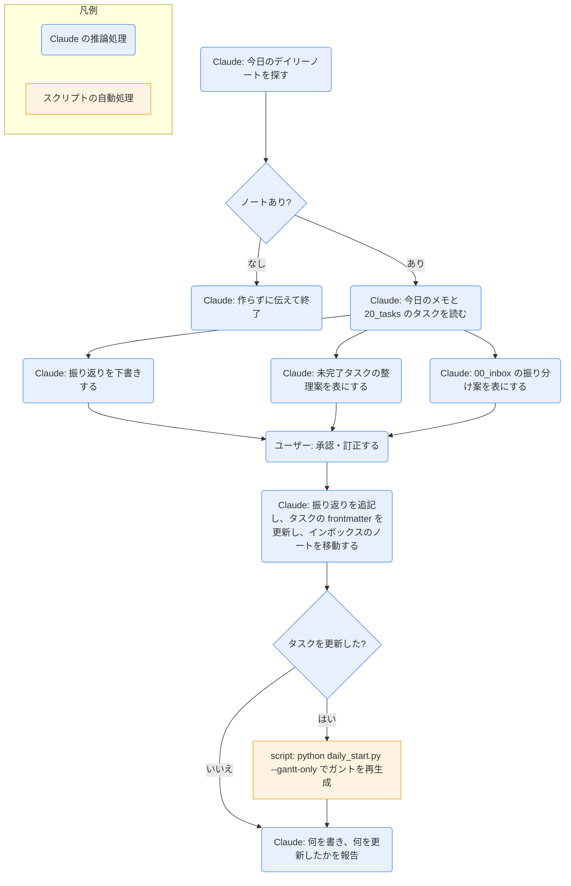

# daily-end

## ひとことで
1日の終わりに、今日のデイリーノートの「振り返り」を下書きし、未完了タスクの整理案を出すスキル。承認されたものだけを書き込み、そのあと変更をコミットして、当日のブランチを `main` にマージし、ブランチを削除する。

## 何ができるか
- 完了したタスクと「今日のメモ」から、振り返り（できたこと・気づき・明日へ）を下書きする。
- 未完了のタスク（`todo` / `doing` / `pending`）ごとに、整理案（翌日へ・保留・削除・現状維持）を表で出す。
- `00_inbox/` に残ったノートがあれば、移動先（プロジェクト・ナレッジ・リサーチ・資料など）の振り分け案を表で出す。
- ユーザーが承認・訂正したあとで、デイリーノートの `## 振り返り` に書き、タスクの frontmatter を更新し、インボックスのノートを移動する。
- タスクを更新したときだけ、ガントを再生成する。
- 承認されたとき、今日のブランチ（`daily/YYYY-MM-DD`）の変更をコミットし（メッセージ `デイリー: YYYY-MM-DD`）、`main` へマージして（まず `--ff-only`、できなければ `--no-ff`）、ブランチを削除する（`git branch -d`。マージ済みのときだけ消える）。

## 使い方
- 呼び出し: 「1日を終える」「振り返りを書いて」「今日を締めて」と言うか、`/daily-end`。
- 起きること:
  1. 現在のブランチが当日のブランチでない、または今日のデイリーノート（`60_daily/YYYY-MM-DD.md`）がなければ、何もせずに伝えて終了する（作成は `daily-start`）。
  2. 振り返りの下書き、タスクの整理案、後処理（コミット・マージ・ブランチ削除）の案が、まとめて提示される。過去の日から引き継いだコミット（`git log main..HEAD`）があれば、一緒に表示される。
  3. 1回の承認・訂正で、ノートとタスクが更新され、続けてコミット・マージ・ブランチ削除が行われる。後処理だけを断ることもできる。
  4. 途中で失敗したら、そこで止まって報告する。マージが衝突したときは、元に戻してブランチは削除しない。
- 根拠がない項目は、書かずに「未記入」とされる。
- 削除は、対象の中身を見せたうえで個別に確認される。中止・不要なタスクは削除する（`cancelled` は使わない）。
- 「今日のメモ」の振り分け（ナレッジ・リサーチ・タスクへの移動）は、このスキルでは行わない（振り分けるのは `00_inbox/` のノートだけ）。

## ロジック
ほぼすべて Claude の推論処理。ガントの再生成だけ、`daily-start` のスクリプト（`daily_start.py --gantt-only`）を使う。Git の操作は、Claude が `git` コマンドを順に実行する（スクリプトは使わない）。

## 保守者向け
- 場所: `.claude/skills/daily-end/SKILL.md`
- 読む: `60_daily/<今日>.md`、`20_tasks/*.md` の frontmatter（`status` `due` `start` `completed` `memo`）
- 読む（追加）: `00_inbox/` のノート
- 書く: `60_daily/<今日>.md` の `## 振り返り`（既存の記述があれば追記。上書きしない）、承認されたタスクの frontmatter、承認されたインボックスのノートの移動とプロパティの補完
- 実行するコマンド（タスク更新時のみ、引数の追加や改変なしで1回）: `python .claude/skills/daily-start/daily_start.py --gantt-only`（`gantt-update` スキルと同じコマンド）
- 実行する Git コマンド（承認後、この順。失敗したら止まる）: `git add -- <承認されたファイル>` → `git commit -m "デイリー: YYYY-MM-DD"` → `git checkout main` → `git merge --ff-only daily/YYYY-MM-DD`（不可なら `--no-ff`。衝突は `git merge --abort`）→ `git branch -d daily/YYYY-MM-DD`（`-D` は使わない）。`git push` はしない（リモートなし）。
- 制約:
  - 承認があるまで、ノートの編集もタスクの更新・削除も、Git の操作もしない。
  - `status: done` にするときは `completed` も必ず入れる（デイリーのダッシュボードが参照するため）。
  - ガントのマーカー（`<!-- gantt:start -->` 〜 `<!-- gantt:end -->`）とその間は編集しない。
- 注意: 作成直後で、実際に実行して動作を確かめてはいない（未検証）。
