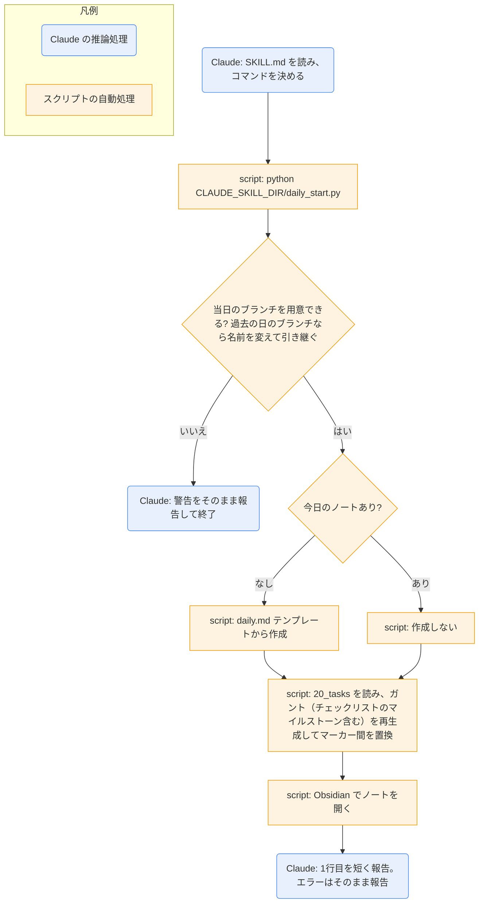

# daily-start

## ひとことで
当日のブランチ（`daily/YYYY-MM-DD`）を作ってから、今日のデイリーノートを作り、ガントチャートを最新にして Obsidian で開くスキル。

## 何ができるか
- ノートを作る前に、当日のブランチ `daily/YYYY-MM-DD` を用意する。
  - すでに当日のブランチにいれば、そのまま使う。
  - 過去の日のブランチ（`daily-end` を実行しなかった日など）にいれば、今日の名前に変えて引き継ぐ。未コミットの変更もそのまま残る。引き継いだ前日分は、`daily-end` の承認画面で一緒に見える。
  - `main` にいれば、`main` から作って切り替える（ブランチがすでにあれば切り替える）。`main` に未コミットの変更（Obsidian での編集など。未追跡のファイルも含む）があれば、止めずに当日のブランチへ持ち込み、`持ち込み: ...` にファイル名を出す。
  - 上記以外で `main` 以外にいる、または過去の日のブランチにいるが今日のブランチもすでにあるときは、警告して何も切り替えず、ノートも作らずに終了する。持ち込む変更が既存の当日ブランチと衝突して切り替えられないときも、エラーで終了する。
  - 他の `daily/` ブランチが `main` に未マージで残っていれば、警告を出す（ノートは作る）。マージは `daily-end` が行う。
- `60_daily/YYYY-MM-DD.md` がなければ、テンプレートから作る。あれば作らない。
- ノート内のガントチャート（`<!-- gantt:start -->` 〜 `<!-- gantt:end -->` の間）を、`20_tasks/` のタスクから再生成する。読めないタスクや、`start` / `due` が空・不正な未完了のタスクは、止まらずに飛ばし、`注意: ...` に名前を出す。
- Obsidian でそのノートを開く。

## 使い方
- 自動: スタートアップの `.claude/skills/daily-start/daily-start.bat` が `claude -p "Run the daily-start skill."` で起動する。終わったあとも画面は閉じず（`pause`）、結果と警告を読める。何かキーを押すと閉じる。
- 手動: 「デイリーノートを作って」「ガントを更新して」と言うか、`/daily-start` を呼ぶ。
- 起きること: Claude がコマンドを1回実行し、結果の1行目（`作成: ...` または `既存: ...`）を短く伝える。エラー時はメッセージをそのまま報告して終了する。
- ガントだけ更新したいときは、`gantt-update` スキルを使う（ブランチの切り替えやノートの作成をしない）。Obsidian を起動したくないときは、指示すれば `--no-launch` を付ける。

## ロジック
作成・ガント再生成・Obsidian 起動は `daily_start.py` が行う。Claude はコマンドの実行と結果の報告だけを行う。

ガントの作り方（`daily_start.py` の `collect_gantt_tasks` / `build_gantt`）:
- 対象は `type: task` で `start` と `due` が日付形式のタスク。
- 表示期間はノート日付〜90日後（`PAST_DAYS=0` / `FUTURE_DAYS=90`）。はみ出す分は `←` `→` で示す。
- 完了済みは、`completed` がその日のものだけ。
- 未完了で `due` が基準日より前のタスクと、`start` が基準日より前の `todo` は出さない。
- 遅れは赤（`crit`）、`pending` は名前の先頭に `⏸`、`doing` は `active`。プロジェクトごとにセクション分けする。
- タスク本文のチェックリスト（`- [ ] 項目名 期限:YYYY-MM-DD`。期限は任意）は、マイルストーン（◇）として、そのタスクの表示開始日の位置に出る。期限は名前の後ろに（期限 YYYY-MM-DD）と付くだけで、位置は変わらない。期限が基準日より前の未完了は赤（`crit`）、完了（`- [x]`）はグレー（`done`）。チェックリストの分解は `task-split` スキルが行う。

## 保守者向け
- スキル本体: `.claude/skills/daily-start/SKILL.md`
- 実処理: `.claude/skills/daily-start/daily_start.py`（引数 `--no-launch` / `--no-branch`（ブランチを作らない。テスト用）/ `--gantt-only`（既存のノートのガントだけを更新。`gantt-update` スキル用。ブランチ・ノート作成・Obsidian 起動はしない。`main` 上では更新しない）/ `--vault` / `--date YYYY-MM-DD`）
- ブランチ処理は `ensure_daily_branch`。`main` の未コミットの変更は `changed_files`（`git status --porcelain --untracked-files=all`。`.gitignore` の対象は除く）で調べて、持ち込んだファイルとして表示する。
- 読めないノート・日付のないタスクの扱いは `read_task` / `task_dates` / `collect_gantt_tasks(..., problems)`。注意の行は、結果の1行目（`更新:` など）のあとに出す。
- 起動: `.claude/skills/daily-start/daily-start.bat`（Vault ルートに移動して `claude -p` を実行し、`pause` で画面を残す。改行は CRLF。`.gitattributes` で固定）
- SKILL.md のコマンドは `${CLAUDE_SKILL_DIR}` で書く（スキルを読み込むときに絶対パスに置き換わる。確認済み）。`allowed-tools` に、置き換え後・相対パスの両方の形を書いている。
- テスト（unittest、追加インストール不要）: `python -m unittest discover -s .claude/skills/daily-start/tests`（「遅れ」の判定、ガントの抽出、ブランチの処理。ブランチは一時フォルダの git リポジトリで確かめる）
- テンプレート: `90_system/templates/daily.md`。なければ最小のノートを作る。
- 読む: `20_tasks/*.md` の frontmatter
- 書く: `60_daily/YYYY-MM-DD.md`（新規作成と、ガントのマーカー間の置換）
- 制約:
  - SKILL.md は、コマンドを引数の追加や改変なしでそのまま1回だけ実行すると定めている。
  - マーカーがないノートは、ガントを更新せず警告を出す。マーカーは消さない。
  - 「遅れ」の定義は `daily-tasks.base` と `daily_start.py` の `is_late` で共通。変えるときは両方を直す（`CLAUDE.md` の記載）。
- 注意: Obsidian の実行パスは `C:\Program Files\Obsidian\Obsidian.exe` に固定。まず `obsidian://` URI で開き、失敗したときだけ使う。
- 共有: `gantt-update` と `daily-end` は、このスクリプトを `--gantt-only` 付きで使う（`daily-end` はタスクの更新後に実行する）。`task-split` は、書き込み後に `gantt-update` を案内する（実行はユーザーの指示があるときだけ）。
- 確認済み: `daily-tasks.base` の区分（1 遅れ〜5 今日完了）は、base 内の formula（`区分`）で定義されている。ガントの `is_late` と同じ定義になっている。
