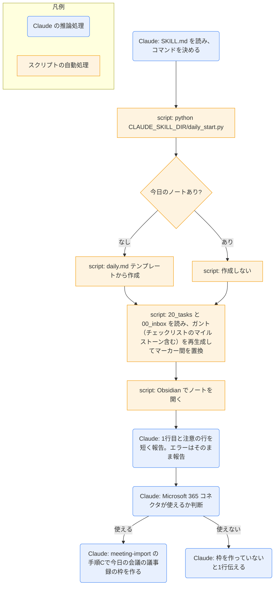

# daily-start

## ひとことで
今日のデイリーノートを作り、ガントチャートを最新にして Obsidian で開くスキル。Microsoft 365 コネクタが使えるときは、続けて今日の会議の議事録の枠も作る。

## 何ができるか
- `60_daily/YYYY-MM-DD.md` がなければ、テンプレート（`90_system/templates/daily.md`）から作る。あれば作らない。
- ノート内のガントチャート（`<!-- gantt:start -->` 〜 `<!-- gantt:end -->` の間）を、`20_tasks/` と `00_inbox/` の直下のタスクから再生成する。読めないタスクや、`start` / `due` が空・不正な未完了のタスクは、止まらずに飛ばし、`注意: ...` に名前を出す。
- Obsidian でそのノートを開く。
- Microsoft 365 コネクタ（Outlook の予定表を読むツール）がこのセッションで使えるときだけ、`meeting-import` の「手順C: 朝の枠作り」で、今日の会議の議事録の枠を `70_meetings/` に作る。使えなければ何もせず、1行だけ伝える。

## 使い方
- 自動: スタートアップの `.claude/skills/daily-start/daily-start.bat` が `claude -p "Run the daily-start skill."` で起動する。終わったあとも画面は閉じず（`pause`）、結果と警告を読める。何かキーを押すと閉じる。
- 手動: 「デイリーノートを作って」と言うか、`/daily-start` を呼ぶ。
- 起きること: Claude がコマンドを1回実行し、結果の1行目（`作成: ...` または `既存: ...`）を短く伝える。2行目以降に `注意: ...` があれば、それも伝える。エラー時はメッセージをそのまま報告して終了する。続けて、コネクタが使えれば議事録の枠を作る。
- ガントだけ更新したいときは、`gantt-update` スキルを使う（ノートの作成をしない）。Obsidian を起動したくないときは、指示すれば `--no-launch` を付ける。

## ロジック
ノートの作成・ガントの再生成・Obsidian の起動は `daily_start.py` が行う。Claude はコマンドの実行と結果の報告、コネクタが使えるかの判断と議事録の枠作り（`meeting-import` の手順C）を行う。

ガントの作り方（`daily_start.py` の `collect_gantt_tasks` / `build_gantt`）:
- 対象は `20_tasks/` と `00_inbox/` の直下の、`type: task` のノート（`TASK_DIRS`）。
- 出すのは、状態が `todo` / `in_progress` / `waiting` / `requested`（`ACTIVE`）と `done` のもの。`idea` / `shelved` / `cancelled` は、日付がなくても注意を出さずに飛ばす。
- 表示期間はノート日付〜90日後（`PAST_DAYS=0` / `FUTURE_DAYS=90`）。はみ出す分は `←` `→` で示す。
- 完了済みは、`completed` がその日のものだけ。
- 未完了で `due` が基準日より前のタスクと、`start` が基準日より前の `todo` は出さない（ダッシュボードの「遅れ」で見る）。
- 遅れは赤（`crit`）、`in_progress` は強調（`active`）、`done` はグレー（`done`）。`waiting` は名前の先頭に `⏸`、`requested` は `✉`（`MARKS`）。プロジェクトごとにセクション分けし、`project` がないものは「プロジェクトなし」に入れる。
- 「遅れ」の判定（`is_late`）: `todo` は `start` が基準日以前、`in_progress` / `waiting` / `requested` は `due` が基準日より前。
- タスク本文のチェックリスト（`- [ ] 項目名 期限:YYYY-MM-DD`。期限は任意）のうち、`<!-- gantt:start -->` 〜 `<!-- gantt:end -->` の間にある項目（`parse_checklist`。マーカーが無いタスクからは拾わない。組は複数でもよい）は、マイルストーン（◇）として、そのタスクの表示開始日の位置に出る。期限は名前の後ろに（期限 YYYY-MM-DD）と付くだけで、位置は変わらない。期限が基準日より前の未完了は赤（`crit`）、完了（`- [x]`）はグレー（`done`）。チェックリストの分解は `task-split` スキルが行う。

## 保守者向け
- スキル本体: `.claude/skills/daily-start/SKILL.md`
- 実処理: `.claude/skills/daily-start/daily_start.py`（引数 `--no-launch` / `--gantt-only`（既存のノートのガントだけを更新。`gantt-update` スキル用。ノート作成・Obsidian 起動はしない）/ `--vault` / `--date YYYY-MM-DD`）。`--vault` を省略すると、スクリプトの3階層上（`parents[3]`）を Vault ルートとする。
- 読めないノート・日付のないタスクの扱いは `read_task` / `task_dates` / `collect_gantt_tasks(..., problems)`。注意の行は、結果の1行目（`作成:` / `既存:` / `更新:`）のあとに出す。
- ダッシュボードと同じ区分を返す関数 `dashboard_group` がある（遅れ / 今日が期限 / 作業中 / 依頼中 / 保留 / 今日完了）。`daily-tasks.base` の区分と同じ定義にしている（スクリプトの docstring による）。
- 起動: `.claude/skills/daily-start/daily-start.bat`（Vault ルートに移動して `claude -p` を実行し、`pause` で画面を残す）
- SKILL.md のコマンドは `${CLAUDE_SKILL_DIR}` で書く。`allowed-tools` に、`${CLAUDE_SKILL_DIR}` の形と相対パス（`.claude/skills/daily-start/daily_start.py`）の形の両方を書いている。
- テスト（unittest、追加インストール不要）: `python -m unittest discover -s .claude/skills/daily-start/tests`（「遅れ」の判定、ダッシュボードの区分、ガントの抽出（インボックスのタスク、`idea` などを出さないこと、印）、チェックリストのマーカー間だけを拾うこと、マーカー間の書き換え）
- テンプレート: `90_system/templates/daily.md`。なければ最小のノートを作る。
- 読む: `20_tasks/*.md` と `00_inbox/*.md`（どちらも直下）
- 書く: `60_daily/YYYY-MM-DD.md`（新規作成と、ガントのマーカー間の置換。内容が変わらなければ書かない）
- 制約:
  - SKILL.md は、コマンドを引数の追加や改変なしでそのまま1回だけ実行すると定めている。
  - マーカーがないノートは、ガントを更新せず警告を出す。マーカーは消さない。
  - 「遅れ」の定義は `daily-tasks.base` と `daily_start.py` の `is_late` で共通。変えるときは両方を直す（`CLAUDE.md` の記載）。
- 注意: Obsidian の実行パスは `C:\Program Files\Obsidian\Obsidian.exe` に固定。まず `obsidian://` URI で開き、失敗したときだけ使う。
- 共有: `gantt-update` と `daily-end` は、このスクリプトを `--gantt-only` 付きで使う。`knowledge-harvest` の `harvest.py` は、このスクリプトを import して読み書きの関数を使う。フック（`.claude/hooks/vault_hooks.py`）も、このスクリプトでガントを更新する。
