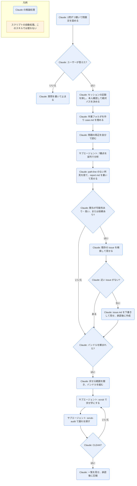

# diagnosing-superpowers

## ひとことで
superpowers を使ったセッションで「何がおかしかったか」を、会話の記録（トランスクリプト）から証拠付きで報告するスキル。原因の判定や修正案は出さない。

## 何ができるか
- 「同じ作業を繰り返した」「計画を無視した」「スキルが動かなかった」「時間がかかった」「高くついた」「何をしているのか」などの不満を、問題文（対象のセッション、期待、実際、気にしている数値）に落とし込む。
- 今のセッションか、ID やパスで指定した過去のセッションの記録をディスク上で探し、本人確認（最初のプロンプトと時刻）をしてから読む。
- 7つの観点の分析を、サブエージェントに並列で任せる。
  - スキルの時系列、計画の順守、繰り返し作業、つまずき、品質の証拠、指示の衝突、コストと時間。
- 報告書を作る。所見には必ず `path:line`（ファイルと行番号）の引用が付く。引用のない所見は捨てる。数値は記録か実行したコマンドの結果からだけ出す。
- 求められたときだけ、次も行う。
  - superpowers の GitHub の issue を検索し、なければ issue の下書きを作る（作成は承認後）。
  - 秘密情報や個人名を伏せた「バンドル」（不具合報告用の資料一式）を作る。
  - 似たセッションを探す。

## 使い方
- 呼び出し: 「このセッションで superpowers の何がおかしかったか調べて」のように頼む（README の「When Something Goes Wrong」）。過去のセッションは「セッション `<id>` で何がおかしかったか」と名前を付けて頼む。
- 起きること:
  1. Claude が1つずつ質問して問題文を固める。答えるまで分析は始まらない（不在なら質問を書いて止まる）。
  2. セッションの記録を特定し、作業フォルダ `~/.superpowers/diagnosing-superpowers/<セッションID>/` を作って場所を伝える。
  3. 7観点の分析をサブエージェントが並列で行う。
  4. 報告書を見せ、パスを伝える。
- 報告書の §7「superpowers の関与」が「可能性あり」「高い」のとき、または頼んだときに、issue の検索に進む。issue の作成とコメントは、文面を承認してから。
- バンドルは頼んだときだけ作る。伏せる範囲（skeleton / evidence / full）を選ぶ。圧縮（zip / tar）は、伏せ字の一覧とファイル一覧を見て承認してから。共有の前に、全ファイルを自分で確認するよう念を押される。
- 修正案を求めても出さない（スキルの決まり）。

## ロジック
スクリプトなし（すべて Claude の推論処理）。記録を読む `wc` `awk` `jq` `sed` や、issue 用の `gh` などのシェルコマンドは、Claude が手順書に沿って状況に合わせて組み立てて実行する。分析・伏せ字・監査・類似検索はサブエージェント（Claude）が行う。

類似セッションの検索（頼まれたときだけ）は、所見から目印（シグネチャ）を作り、候補ごとに `similar-session.md` のサブエージェントを並列で走らせて、報告書の §9 に足す。

## 保守者向け
- 場所: `%USERPROFILE%\.claude\plugins\cache\claude-plugins-official\superpowers\6.4.1\skills\diagnosing-superpowers\`（プラグイン superpowers 6.4.1。マーケットプレイスは claude-plugins-official）
- ファイル（SKILL.md を含め、すべて英語）:
  - `SKILL.md`: 手順（7段階）と厳守ルール。
  - `references/`: `session-discovery.md`（記録の探し方と本人確認）、`context-safety.md`（大きな記録を読むときの安全策）、`github-issues.md`（`gh` での検索と作成、なければ curl や URL）、`redaction-policy.md`（伏せ字の区分）。
  - `prompts/`: 分析担当の共通指示 `analyst-common.md` と、観点ごとの `skill-timeline.md` `plan-adherence.md` `repeated-work.md` `stumbles.md` `quality-evidence.md` `request-conflicts.md` `cost-and-time.md`。ほかに `scrub.md`（伏せ字）、`scrub-audit.md`（漏れの監査）、`similar-session.md`（類似の判定）。
  - `templates/`: `case.md`（調査の記録）、`report.md`（報告書。§1〜§9）、`issue.md`（issue の雛形）、`bundle-README.md`（バンドルの説明と作り方）。
- 書き込み先: `~/.superpowers/diagnosing-superpowers/<セッションID>/`（ホームの下。`case.md`、`report.md`、issue の下書き、バンドル一式、圧縮ファイル）。Windows での実際の展開先は未確認。
- 外部への送信: issue の作成（`gh issue create --repo obra/superpowers`、ラベル `bug` と `automated-issue-report`）。文面の承認が前提。`gh` はファイルを添付できないので、バンドルはユーザーがブラウザで添付する。
- 制約:
  - セッションの記録は読み取りだけ。変更・移動・削除はしない。
  - 1行が1MB を超えることがあるので、読む前に大きさを測り、必要な部分だけ取り出す（`context-safety.md`）。1件で500文字を超える出力は絞る。
  - 人の発言として扱うのは、人が打ったプロンプトだけ。フックの出力・システムの注意書き・ツールの結果は含めない。サブエージェントの記録の「user」は親のエージェント。
  - 報告書の §7 は関与の度合い（not indicated / possible / likely）だけを書く。不具合の特定や変更の提案はしない。
- 伏せ字の区分: メール、人名、組織 ID、秘密情報、ホストと IP、ホームのパス（`~` に置換）、リポジトリ名、指定された固有の用語。セッション ID・ツール名・スキル名・モデル ID・行番号は残す。
- 注意:
  - セッションの記録の保存場所は、スキルに固定の記載がなく、環境から調べる方式。Claude Code での具体的な場所はスキルからは未確認。
  - プラグイン領域にあるので、Vault の Git では追跡されない。
