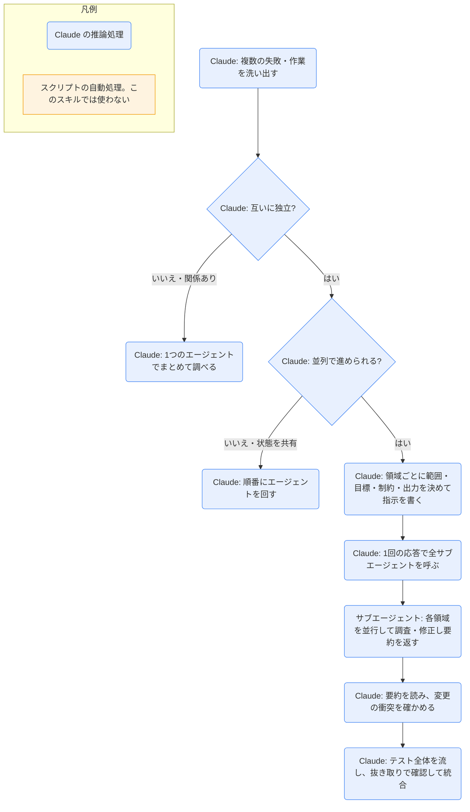

# dispatching-parallel-agents

## ひとことで
互いに独立した2つ以上の作業を、サブエージェントに1つずつ割り当てて並列で進めるための手順（プラグイン superpowers）。

## 何ができるか
- 複数の問題が独立しているか（片方を直すともう片方も直る関係でないか、状態を共有しないか）を見分ける。
- 問題の領域ごとに、サブエージェント1つを割り当てる。
- 各サブエージェントへの指示を、次の形で組み立てる。
  - 範囲: 1つのテストファイルやサブシステム。
  - 目標: 例「このテストを通す」。
  - 制約: 例「ほかのコードは変えない」。
  - 返してほしいもの: 例「原因と変更の要約」。
- サブエージェントには会話の履歴を引き継がせず、必要な文脈だけを渡す。親の文脈も節約できる。
- 1回の応答で複数のサブエージェントを呼び出し、同時に動かす（1応答に1つずつだと順番になる）。
- 戻ってきたら、要約を読み、変更の衝突を確かめ、テスト全体を流し、抜き取りで確認してから統合する。

## 使い方
- 呼び出し: description に「状態の共有や順序の依存なしに進められる、2つ以上の独立した作業があるとき」とあり、その場面で自動で使われる前提のスキル。明示的な呼び出し方は SKILL.md に記載がなく未確認。
- 使う場面の例: 原因の違う3つ以上のテストファイルが落ちている、複数のサブシステムが別々に壊れている。
- 使わない場面: 失敗どうしが関係している、全体の状態を見ないと分からない、何が壊れているかまだ分からない（探索的なデバッグ）、同じファイルや資源を触って干渉する。
- 指示の良い例・悪い例:
  - 広すぎ「全部のテストを直して」→ 具体的に「agent-tool-abort.test.ts を直して」。
  - 文脈なし「競合状態を直して」→ エラーメッセージとテスト名を貼る。
  - 制約なし → 「本番のコードは変えない」などを書く。
  - 出力があいまい「直して」→ 「原因と変更の要約を返して」。

## ロジック
スクリプトなし（すべて Claude の推論処理）。サブエージェントの作業も Claude の処理として図に含める。

## 保守者向け
- 場所: `%USERPROFILE%\.claude\plugins\cache\claude-plugins-official\superpowers\6.4.1\skills\dispatching-parallel-agents\SKILL.md`（プラグイン superpowers 6.4.1。マーケットプレイスは claude-plugins-official）。補助ファイルやスクリプトはない。
- 書き込み先: スキル自体はなし。サブエージェントが何を書くかは、割り当てた作業しだい。
- 制約: 1つのサブエージェントには1つの問題領域だけ。同じファイルを触る作業は並列にしない。
- 注意:
  - SKILL.md は英語で書かれている。例はテストの修正（TypeScript のテストファイル）を題材にしている。
  - 「テスト全体を流す」は、テストのあるコードの作業を前提にした手順。
  - プラグイン領域にあるので、Vault の Git では追跡されない。
