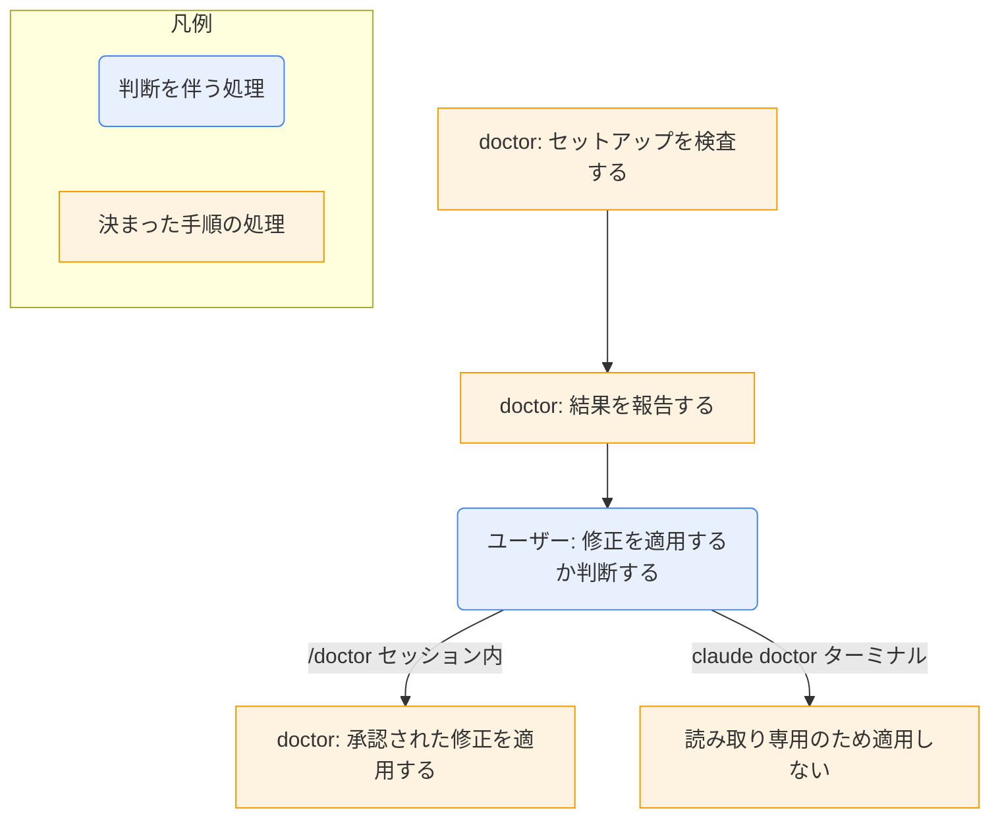

# doctor

Claude Code 組み込みの `/doctor` コマンドの解説。`SKILL.md` がないため、公式ドキュメントを調べたサブエージェントの報告を元に書いている。このマシン上で `/doctor` を実行して確かめた内容ではない。

## ひとことで
Claude Code のセットアップを検査し、問題の診断と修正を手伝う組み込みコマンド。

## 何ができるか
報告された検査項目の例:
- インストールの健全性: 重複や古いインストール、PATH の問題、読み込めない settings ファイル
- 未使用の拡張機能: スキル、MCP サーバー、プラグイン（コンテキストコストとの比較）
- パフォーマンス: 遅い hooks、新しいバージョンの有無
- CLAUDE.md: ローカルとリポジトリ管理分の重複排除、不要内容の削減、スキルへの移行提案
- 権限設定: auto mode の既定化、よく拒否される読み取り専用コマンドの事前承認

## 使い方
```
/doctor                       # セッション内で対話実行
/doctor prompt-audit          # CLAUDE.md・スキルの競合や古い指示を監査
/doctor prompt-audit <path>   # 特定パスを監査
claude doctor                 # ターミナルから実行（セッションを起動しない）
```
- 別名: `/checkup`
- セッション内の `/doctor`: 結果を報告し、変更の前に確認を取る。提案された修正を適用するか選べる。
- ターミナルの `claude doctor`: 読み取り専用の診断のみ。
- バージョン条件: `prompt-audit` は v2.1.283 以降、CLAUDE.md のトリミングは v2.1.206 以降。
- 関連コマンド:
  - `/skill-doctor`: スキルのコストと使用頻度を表示し、未使用のものに印を付ける（v2.1.252 以降）
  - `/mcp`: MCP サーバーの状況確認と管理
  - `/debug`: 実行時の問題の診断
  - `/feedback`: バグ報告

## ロジック
スクリプトの内部処理は未確認（組み込みコマンドで、実装は読めていない）。以下は報告された「報告 → 確認 → 適用」の流れだけを描いた概略。



注: この図は他のノートと違い、Claude の推論処理とスクリプト処理の区別ではない。内部実装を読んでいないため、どこで Claude のモデルが関わるかは未確認。

## 保守者向け
- 実体: Claude Code 本体の組み込みコマンド。Vault・ユーザー・プラグインのどこにも `SKILL.md` はない（前回の検索で確認）。
- 書き込み先: 未確認。セッション内で承認した修正が、設定や CLAUDE.md を書き換える可能性がある。
- 注意:
  - バージョンによって使える項目が違う。
  - 実行時間や出力形式（JSON など）は未確認。
  - 内容が古くなったら、公式ドキュメントで再確認する。
- 参照した公式ドキュメント（サブエージェントの報告による）:
  - https://code.claude.com/docs/en/troubleshooting.md
  - https://code.claude.com/docs/en/commands.md
  - https://code.claude.com/docs/en/plugins/measure.md
