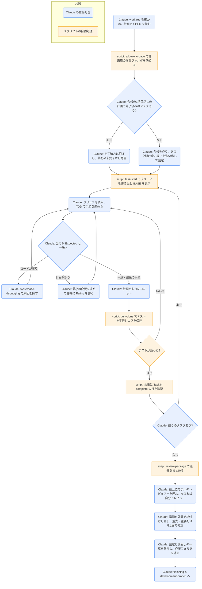

# executing-plans

## ひとことで
実装計画を、今のセッションの Claude 自身が1タスクずつ実行するスキル（プラグイン superpowers）。タスクごとのレビューはせず、最後にブランチ全体を1回レビューする。

## 何ができるか
- 計画（`writing-plans` で作ったもの）を、止まらずに最後まで実行する。タスクの合間に「続けますか」と聞かない。
- 各タスクを TDD（失敗するテストを先に書き、失敗を見てから通す）で進め、計画の `Expected:` 行と実際の出力を比べる。
- 進み具合を「台帳」（`progress.md`）に記録する。会話の圧縮（コンパクション）で記憶が消えても、台帳と `git log` から再開できる。
- 計画の矛盾やあいまいさは、Claude が決めて台帳に「Ruling（裁定）」として残し、先へ進む。
- 止まって聞くのは次の4つだけ。
  - 取り消せない・破壊的な操作。
  - セキュリティに関わる操作。
  - 作業ツリーの外への副作用（マージ、共有ブランチへの push、公開など）。
  - どの道も推測になるほど壊れた計画。
- 最後に、ブランチ全体を新しい文脈のレビュアーに見せ、重大・重要な指摘を1回の修正で直す。軽微な指摘は記録だけして後回しにする。
- 最終メッセージに「自分がした裁定」と「後回しにした軽微な指摘」の全件を並べる。

## 使い方
- 呼び出し: description に「今のセッションで、自分が実装者として計画を実行するとき（ユーザーがインライン実行を選んだか、サブエージェントのツールがないとき）」とあり、計画の引き継ぎのときに使われる前提。明示的な呼び出し方は SKILL.md に記載がなく未確認。
- 前提: `writing-plans` で作った計画ファイル（タスクの見出しが `Task <番号>` の形）。SPEC があればそれも読む。
- 起きること:
  1. 準備: 隔離された作業場所（git の worktree）を確かめ、計画用の作業フォルダと台帳を用意し、計画と SPEC を読み、タスク間のインターフェースの食い違いを先に洗い出す。main / master では、ユーザーの明示的な同意なしに実装を始めない。
  2. タスクごと: `task-start` でタスクの抜き書き（ブリーフ）と起点のコミット（BASE）を得る → ブリーフを読む → 手順どおり TDD → 計画どおりにコミット → `task-done` でテストを流し、通れば台帳に完了の行を書く。
  3. 全タスクのあと: レビュー用の差分をまとめ、最も能力の高いモデルのレビュアーに見せる。重大・重要な指摘はテストを先に書いて直す。
  4. 後始末: 作業フォルダを消し、`finishing-a-development-branch` に進む。
- 向き不向き: 計画が十分に具体的なら中位のモデルでも回る。タスクごとにレビューを挟みたいときや、計画が長くて後半が圧縮後の文脈で走りそうなときは、`subagent-driven-development` の方がよいと書かれている。

## ロジック
判断・実装・レビューは Claude の推論処理。ブリーフの抜き出し、作業フォルダの決定、テストの実行と台帳への追記、差分のまとめはスクリプト（bash）が行う。

## 保守者向け
- 場所: `%USERPROFILE%\.claude\plugins\cache\claude-plugins-official\superpowers\6.4.1\skills\executing-plans\`（プラグイン superpowers 6.4.1。マーケットプレイスは claude-plugins-official）
- ファイル:
  - `SKILL.md`: 本体。英語で書かれている。
  - `scripts/task-start PLAN_FILE N`: `task-brief` を呼んでブリーフを書き出し、`brief:` と `base:`（HEAD の SHA）を表示する。
  - `scripts/task-done PLAN_FILE N BASE -- <テストのコマンド>`: テストを実行し、全出力を `task-<N>-tests.log` に保存して末尾5行を表示する。成功したときだけ台帳に `Task <N>: complete (commits <base7>..<head7>, tests: <コマンド> → <最終行>)` を追記する。失敗なら何も記録せず、テストの終了コードで終わる。
- 別スキルのスクリプトを使う（`skills/subagent-driven-development/scripts/`）:
  - `sdd-workspace`: 計画ごとの作業フォルダ `<リポジトリ直下>/.superpowers/sdd/<計画のファイル名>/` を決めて作る。中に `plan-path`（持ち主の計画）を置き、名前がぶつかれば親フォルダ名や番号で区別する。`.superpowers/sdd/.gitignore`（中身は `*`）も書く。
  - `task-brief`: 計画から `Task <N>` の見出しの範囲を抜き出し、`task-<N>-brief.md` に書く。
  - `review-package`: `git log` `git diff --stat` `git diff -U10` を1つのファイル `review-<base7>..<head7>.diff` にまとめる。
- 書き込み先:
  - 作業フォルダ（git 管理外）: `progress.md`（台帳）、`task-<N>-brief.md`、`task-<N>-tests.log`、`review-*.diff`、`plan-path`。最終レビューが済んだら Claude が消す。
  - リポジトリ: 計画のコミット手順どおりのコミット。
- 台帳の書式:
  - 1行目: `# SDD ledger — plan: <計画ファイルのパス>`
  - 完了: `Task <N>: complete (...)`
  - 裁定: `Task <N>: Ruling: ...`、`Final: Ruling: ...`
  - 修正: `Final: fixed <指摘> — <テスト名> RED→GREEN, suite <N>/<N>`
  - 後回し: `Final: minor (deferred): ...`
  - サブエージェントなしでのレビュー: `Final review: self-review (no subagent tool)`
- 関連スキル（どれも中身は読んでおらず未確認）: `using-git-worktrees`、`test-driven-development`（タスク1の前に必ず読み込む）、`verification-before-completion`、`systematic-debugging`、`requesting-code-review` の `code-reviewer.md`、`subagent-driven-development`、`finishing-a-development-branch`。サブエージェントのツールの有無を見分ける `../using-superpowers/references/` も未確認。
- 注意:
  - スクリプトは bash で、git のリポジトリの中で動く前提。
  - `git clean -fdx` で作業フォルダが消える。そのときは `git log` から立て直す。
  - 台帳と作業フォルダは `subagent-driven-development` と共通。途中で実行方法を切り替えても同じ台帳から再開できる。
  - Vault は git をノートの管理に使っておらず、ブランチも `main` だけ。このスキルが前提とする開発用のリポジトリの流れとは別物。
  - プラグイン領域にあるので、Vault の Git では追跡されない。
