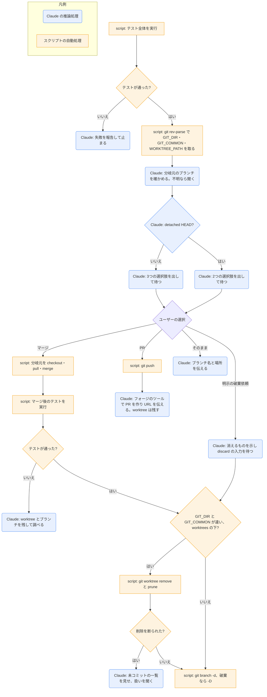

# finishing-a-development-branch

## ひとことで
実装が終わってテストが通ったブランチを、どう取り込むか（マージ・PR・そのまま）をユーザーに選ばせて実行し、後片付けをするスキル（プラグイン superpowers）。

## 何ができるか
- テスト全体を流し、通らなければ失敗を報告して止まる。選択肢は出さない。
- git の状態から、普通のリポジトリか、worktree（作業用の別フォルダ）か、detached HEAD（ブランチ名のない状態）かを見分ける。
- 取り込み先のブランチ（分岐元）を確かめる。分からなければ「分岐元は〇〇で合っていますか」と聞く。
- 決まった選択肢を、書かれたとおりに出して答えを待つ。
  - 普通のリポジトリと名前付きブランチの worktree: 1 ローカルでマージ / 2 push して PR を作る / 3 そのまま残す。
  - detached HEAD: 1 新しいブランチとして push して PR を作る / 2 そのまま残す。
- 選ばれたものを実行する。
  - マージ: 分岐元を最新にしてマージし、マージ後にもテストを流す。通ったら worktree を片付けてブランチを消す。
  - PR: push して PR を作り、URL を伝える。worktree は残す（PR の指摘への対応に使う）。
  - そのまま: ブランチ名と worktree の場所を伝える。
- 作業の破棄は、ユーザーがはっきり頼んだときだけ。消えるもの（ブランチ・コミット・worktree）を示し、`discard` と打たれるまで待つ。

## 使い方
- 呼び出し: description に「実装が終わり、全テストが通り、取り込み方を決めるとき」とあり、その場面で使われる前提。`executing-plans` の最後もこのスキルに進む。明示的な呼び出し方は SKILL.md に記載がなく未確認。
- 開始時に Claude が「I'm using the finishing-a-development-branch skill to complete this work.」と宣言する。
- 例: 選択肢が出たら番号で答える。PR を選ぶと、push と PR の作成が行われる（外部への送信）。
- 片付けで worktree の削除が断られたとき（未コミットのファイルがあるとき）は、ファイルの一覧と3つの選択肢（コミットする / メインのリポジトリへ移す / 消す）が出る。`--force` で勝手に消すことはしない。

## ロジック
スクリプトのファイルはない。SKILL.md に書かれた決まった git コマンドを Claude が実行する部分は、決まった手順なので四角で示す。

- 図の「ユーザーの選択」は、ユーザーの返答で分かれる。
- worktree の片付けは、マージと確定した破棄のときだけ。普通のリポジトリなら片付けるものはない。`.worktrees/` か `worktrees/` の下にない worktree は、ホスト側の持ち物として残す。
- 破棄のブランチ削除は `git branch -D`（強制）。マージのあとは `git branch -d`。

## 保守者向け
- 場所: `%USERPROFILE%\.claude\plugins\cache\claude-plugins-official\superpowers\6.4.1\skills\finishing-a-development-branch\SKILL.md`（プラグイン superpowers 6.4.1。マーケットプレイスは claude-plugins-official）。補助ファイルやスクリプトはない。
- 書き込み先: 対象のリポジトリ（マージのコミット、ブランチの削除、worktree の削除）。PR を選ぶとリモートへ push し、PR を作る。
- 使うコマンド: テストのコマンド（`npm test` / `cargo test` / `pytest` / `go test ./...` などプロジェクトのもの）、`git rev-parse`、`git checkout` / `pull` / `merge`、`git push -u origin <ブランチ>`（detached HEAD なら `git push origin HEAD:refs/heads/<新ブランチ>`）、`git worktree remove` / `prune`、`git branch -d` / `-D`、`git -C <worktree> status --porcelain -uall`。PR の作成に使う CLI は特定されていない（「フォージの CLI か、push 時に出る作成用の URL」）。
- 制約:
  - 選択肢は書かれたとおりに出す。破棄を選択肢として勧めない。
  - 破棄の確認は、`discard` と打たれたときだけ有効。「消していいよ」などは確認として扱わない。
  - `--force` での worktree 削除や force push は、ユーザーが明示的に頼んだときだけ。
  - 分岐元は確かめてからマージする。
- 注意:
  - SKILL.md は英語で書かれている。
  - Vault の CLAUDE.md では、配布用リポジトリのコミットと push はユーザーが手で行い、ブランチは `main` だけと決めている。Vault でこのスキルが起動する場面は想定されていないと読めるが、両者の関係を定めた記載はなく未確認。
  - プラグイン領域にあるので、Vault の Git では追跡されない。
