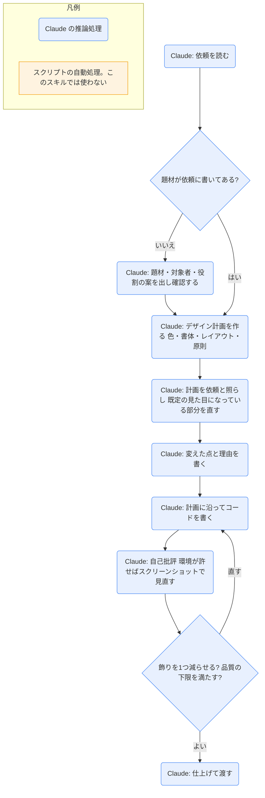

# frontend-design

## ひとことで
UI を作る・作り直すときに、テンプレートのように見えない、題材に合った見た目を Claude が設計するための指針のスキル。

## 何ができるか
- 題材（何の製品か・誰向けか・ページの主な役割）を先に決める。依頼に題材がなければ、Claude が1つ案を出して依頼者に確認する。
- 実装の前に、短いデザイン計画を作る。
  - 色: 基本のパレットを、名前付きの 4〜6 個の16進カラーで書く。
  - 書体: 使う書体と役割。
  - レイアウト: 1文の説明と ASCII のワイヤーフレームで案を出し、比べる。左寄せ・中央寄せなども決める。
  - 原則: そのページを特徴づける方針。
- 計画を依頼内容と照らし、「どのページにも出てくる既定の見た目」になっている部分を直し、何をなぜ変えたかを書く。そのあとでコードを書く。
- AI が作りがちな見た目（SKILL.md が5つ挙げる）を、依頼で指定がない限り避ける。
  - 暖かいクリーム色の背景＋高コントラストのセリフ見出し＋テラコッタ系のアクセント。
  - ほぼ黒の背景＋明るい1色のアクセント。
  - 罫線と角丸なしの新聞風の段組み。
  - 同じ角丸カード・同じ薄い影・グラデーションの装飾。
  - 見出しの上の大文字ラベル、中黒でつないだメタ情報、リンク末尾の矢印など、題材に関係なく出る飾り。
- 書体・余白・動き・文言についての指針を与える。
  - 書体は1〜2ファミリー。行の長さは 80 文字未満を目安。
  - 見出しの1語だけを強調する、ラベルを全部大文字にする、などは避ける。
  - 番号付きの印（01 / 02 / 03）は、内容が本当に順序のあるときだけ使う。
  - 自動で動くアニメーションは控えめにし、1か所にまとめる。操作への反応の動きは歓迎。
  - 文言は利用者の言葉で、能動態で書く。ボタンは何が起きるかを書く（「送信」より「変更を保存」）。エラーは謝らず、何が起きたかと直し方を書く。
- 最低限の品質（スマートフォンまでのレスポンシブ、キーボードのフォーカス表示、動きを減らす設定の尊重、見やすい配色）を、宣伝せずに満たす。
- 作りながら自己批評する。環境が許せばスクリーンショットを撮って見直す。

## 使い方
- 呼び出し: UI を新しく作る・見た目を作り直す依頼をすると、description に合えば Claude が使う。明示するときは `/frontend-design:frontend-design`（プラグインのスキルは `プラグイン名:スキル名` の形。Claude Code の Skill ツールの説明による）。
- 例（プラグインの README より）: 「音楽配信アプリのダッシュボードを作って」「AI セキュリティのスタートアップのランディングページを作って」「ダークモード付きの設定画面をデザインして」
- 起きること:
  - 依頼に題材がなければ、Claude が題材・対象者・役割の案を出して確認を求める。
  - Claude がデザイン計画（色・書体・レイアウト・原則）を作り、見直してからコードを書く。
  - 依頼に見た目の指定があれば、その指定が常に優先される（避けるべき見た目の指定であっても）。

## ロジック
スクリプトなし（すべて Claude の推論処理）。

## 保守者向け
- 場所: `%USERPROFILE%\.claude\plugins\cache\claude-plugins-official\frontend-design\d182ca456ca0\skills\frontend-design\SKILL.md`
  - プラグイン: `frontend-design@claude-plugins-official`（バージョン `d182ca456ca0`。Git のコミットの短縮形）。`installed_plugins.json` に user スコープで登録されている。有効かどうかは未確認。
- 同じスキルフォルダにあるのは `SKILL.md` と `LICENSE.txt` だけ。スクリプト・テンプレート・参照ファイルはない（`LICENSE.txt` の中身は未確認）。
- 書き込み先: スキル自体は決めていない。作るコードの置き場所は依頼による。
- 制約: 依頼の文言が常に優先。避けるべき見た目も、依頼で指定されればそれに従う。
- 注意:
  - SKILL.md は英語で書かれている。
  - プラグイン領域（Vault 外）なので、Vault の Git では追跡されない。プラグインの更新で中身が変わることがある。
  - プラグインの README には「High-impact animations」とあるが、SKILL.md は自動の動きを控えめにする方針。実際に読み込まれるのは SKILL.md。
  - README から外部の資料（Frontend Aesthetics Cookbook）へリンクがある。中身は未確認。
  - 「メモを書ける場所があれば、試したことを書き留めると次に役立つ」とあるが、どこに書くかの指定はない。
