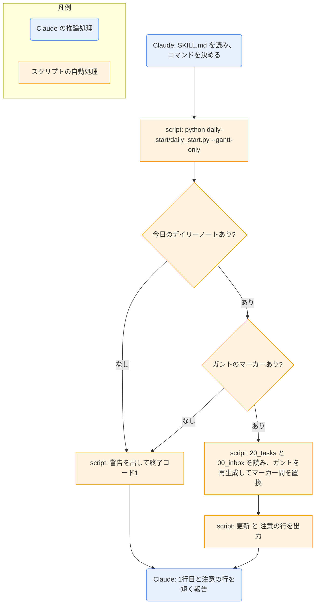

# gantt-update

## ひとことで
今日のデイリーノートのガントチャートだけを、タスクから再生成するスキル。ノートの作成や Obsidian の起動はしない。

## 何ができるか
- `60_daily/<今日>.md` の `<!-- gantt:start -->` 〜 `<!-- gantt:end -->` の間だけを、タスクから作り直す。ほかの部分は変更しない。
- ガントに出せなかったタスク（読めないもの、`start` / `due` が空・不正な未完了のもの）があれば、`注意: ...` で名前を伝える。
- 今日のデイリーノートがない、またはノートにガントのマーカーがないときは、何も更新せず、警告を伝えて終了する。

## 使い方
- 呼び出し: 「ガントを更新して」「ガントチャートを最新にして」と言うか、`/gantt-update`。
- 起きること: Claude がコマンドを1回実行し、結果の1行目（`更新: ...` または `警告: ...`）を短く伝える。2行目以降に `注意: ...` があれば、それも伝える。エラーが出たら、そのメッセージをそのまま報告して終了する。
- 使いどころ: Obsidian でタスクを編集したあと（Claude がタスクを編集したときは、フックで自動で更新される）。
- 今日以外の日付を更新したいとき（ユーザーの指示がある場合のみ）は、`--date YYYY-MM-DD` を付ける。
- ノートの作成や Obsidian の起動をしたいときは、`daily-start` を使う。

## ロジック
処理はすべて `daily-start` のスクリプト（`daily_start.py --gantt-only`）が行う。Claude はコマンドの実行と結果の報告だけを行う。

ガントの作り方（対象のタスク、表示期間、遅れ・印の付け方、チェックリストのマイルストーン）は、`daily-start` の解説ノートを参照。

## 保守者向け
- 場所: `.claude/skills/gantt-update/SKILL.md`（スクリプトは持たない）
- 実処理: `.claude/skills/daily-start/daily_start.py` の `gantt_only` → `update_gantt`
- 実行するコマンド（引数の追加や改変なしで1回）: `python "${CLAUDE_SKILL_DIR}/../daily-start/daily_start.py" --gantt-only`。`allowed-tools` に、`${CLAUDE_SKILL_DIR}` の形と相対パス（`.claude/skills/daily-start/daily_start.py --gantt-only`）の形の両方を書いている。
- 読む: `20_tasks/*.md` と `00_inbox/*.md`（どちらも直下）
- 書く: `60_daily/<今日>.md` のマーカー間だけ（内容が変わらなければ書かない）
- 同じコマンドを `daily-end` も使う（タスクを更新・移動したとき）。
- 終了のしかた（`gantt_only`）: ノートがないときは `警告: デイリーノートがありません: ...（作成は daily-start）`、マーカーがないときは `ガントのマーカーがないため更新しません: <ノート名>`（`警告:` は付かない）を出し、どちらも終了コード1。
