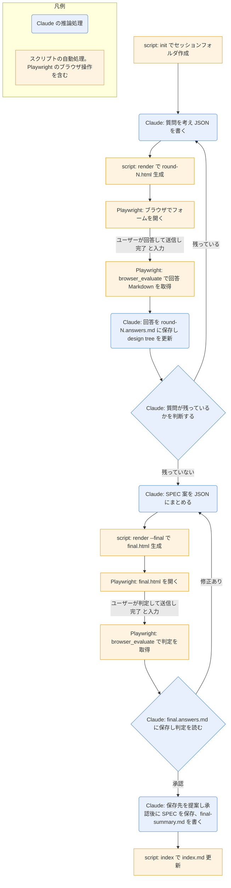

# grilling-html

## ひとことで
質問攻めで合意を作る `grilling` を、HTML のフォーム（選択・自由入力・保留）で進め、最後に SPEC 案を出すスキル。

## 何ができるか
- 決定が必要な質問を、推奨案と理由つきの選択式フォームにして、ブラウザで答えられる。
- 各質問で、選択（単一・複数）、自由入力、補足、「あとで決める（保留）」が使える。単一選択には「選択をクリア」ボタンがある。
- 回答を Markdown で記録し、ラウンドを重ねて、決まっていない点（frontier）がなくなるまで詰める。
- 最後に、概要・流れ・受入条件・非目標・リスク・決定ログを持つ SPEC 案を作り、承認か修正を受け付ける。
- 環境から調べられる事実はサブエージェントが調べ、ユーザーには決定だけを聞く。
- 回答・HTML・要点・索引を、セッションのフォルダ `00_inbox/<日時>_grilling_<テーマ>/` に残す。後で `daily-end` の振り分けで、プロジェクトのフォルダ（属さなければ `50_documents/`）へ移す。
- ほかのスキルからも使われる: `task-run`（完了条件を詰める）、`personal-setup`（個人の設定を聞く。セッションは Vault の外に作る）。

## 使い方
- 起動: 「HTML で grilling」「grilling-html」と明示したときだけ（通常の「grill」は `grilling` スキル）。例: `/grilling-html スキル解説のスキルを作りたい`
- 流れ（利用者側）:
  1. ブラウザにラウンドのフォームが開く。各質問に答え、「送信」を押す（未回答があると警告が出て、もう一度押すとそのまま送信される）。
  2. ターミナルに「完了」と入力する。
  3. 次のラウンドが開く。これを繰り返す。
  4. 最後の確認画面で「承認」か「修正あり」を選んで送信する（どちらかを選ばないと送信できない。「修正あり」は修正コメントが必須）。
  5. 承認すると、SPEC の保存先と形式が提案される。承認なしでは Vault に書かれない。
- 送信できなかったときは、「Markdown をコピー」ボタンで回答を貼ってもらう方法がある。
- 外部には送らない。HTML はローカルだけで動く。

## ロジック

- 推論処理（青）: 質問の作成、事実調査（サブエージェント。調査待ちの質問は後のラウンドに回す）、回答の解釈、design tree の更新、SPEC 案の作成、保存先の提案。
- 自動処理（橙）: `grilling_html.py` の `init`／`render`／`index`、Playwright MCP によるブラウザ操作（`browser_navigate`、`browser_evaluate`）。
- ユーザーの操作（回答・送信・「完了」の入力、承認か修正ありの判定）は、矢印のラベルで示す。
- 質問が残っているかの判断は Claude が行う（スクリプトは判断しない）。
- 送信されていない（`window.__submitted` が false）ときは、回答を書かずに続行方法を聞く（図では省略）。

## 保守者向け
- 本体: `.claude/skills/grilling-html/SKILL.md`
- スクリプト: `.claude/skills/grilling-html/grilling_html.py`
  - `init --theme T [--parent P]`: セッションフォルダ `
/<YYYY-MM-DD_HHMM>_grilling_<テーマ>/` を作り、パスを1行で出す。`--parent` の既定は `<Vault>/00_inbox`。テーマの中の Windows で使えない文字と空白は `-` に置き換える。
  - `render --session-dir D --round N [--final] --input J.json`: 質問 JSON をテンプレートに埋め込み、`round-N.html`（`--final` なら `final.html`）を作る。最終確認は `--round <N+1>` で呼ぶ（SKILL.md の手順7）。
  - `index --session-dir D`: フォルダ内の `round-*.answers.md`・`final.answers.md`・`final-summary.md` を並べた `index.md`（`type: doc`）を作る。
  - `--vault` を省略すると、スクリプトの3階層上（`parents[3]`）を Vault ルートとする。
- 質問 JSON: `title`, `intro`, `questions[]`（`id`, `title`, `body`, `multi`, `options[]`（`key`, `label`, `desc`）, `recommended[]`, `reason`）。最終確認は `title`, `intro`, `summary`。質問 JSON の置き場所はスクラッチパッド。
- HTML テンプレート: `.claude/skills/grilling-html/grilling_html_template.html`（`__DATA__` に JSON を埋め込む。送信時に `window.__submitted` と `window.__answersMd` を設定する。推奨の選択肢には「推奨」バッジ、推奨の理由を表示する）
- 回答 Markdown（ページ側が生成）: frontmatter に `session`・`round`、質問ごとに `## Q1` と `選択`・`自由入力`・`補足`・`状態`（回答 / 保留 / 未回答）。最終確認は `## 承認` に `判定`（承認 / 修正あり）と `コメント`。
- 設計: `10_projects/Claudeのスキル作成/grilling-html SPEC.md`。SPEC の「配置」にあるセッションフォルダ（`90_system/grilling/`、Git で追跡）は古い記述で、今の SKILL.md・スクリプトは `00_inbox/` に作り、Git では追跡しない。
- 書き込み先: セッションのフォルダ（`round-N.html`、`round-N.answers.md`、`final.html`、`final.answers.md`、`final-summary.md`、`index.md`）。生成物はノートと同じ扱いで、Git では追跡しない。
- 注意:
  - `init` のテーマは ASCII の短い名前にする（Git Bash 経由の日本語引数は文字化けする）。
  - 質問 ID（`Q1`, `Q2`…）はセッション通しで一意にする（ラウンドでリセットしない）。
  - `alert/confirm/prompt` は使わない（ブラウザ操作が止まる）。
  - `file://` が開けないときは、Playwright MCP が `--allow-unrestricted-file-access` 付きか確認する。
  - 承認まで、Vault に SPEC を書かない（実装・ファイル作成に移らない）。
  - スクリプトの置き場所を変えると Vault ルートの解決がずれる。`grilling_html.py` の `DEFAULT_VAULT`（`parents[N]`）を直す。
