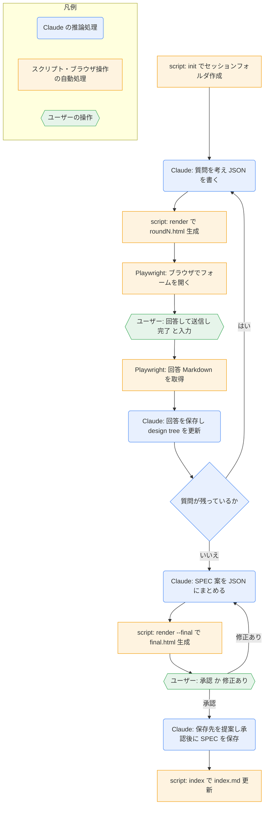

# grilling-html

## ひとことで
質問攻めで合意を作る `grilling` を、HTML のフォーム（選択・自由入力・保留）で進め、最後に SPEC 案を出すスキル。

## 何ができるか
- 決定が必要な質問を、推奨案と理由つきの選択式フォームにして、ブラウザで答えられる。
- 回答を Markdown で記録し、ラウンドを重ねて、決まっていない点（frontier）がなくなるまで詰める。
- 最後に、概要・流れ・受入条件・非目標・リスク・決定ログを持つ SPEC 案を作り、承認か修正を受け付ける。
- 環境から調べられる事実はサブエージェントが調べ、ユーザーには決定だけを聞く。
- 回答・HTML・要点・索引を `90_system/grilling/<日時_テーマ>/` に残す。

## 使い方
- 起動: 「HTML で grilling」「grilling-html」と明示したときだけ（通常の「grill」は `grilling` スキル）。例: `/grilling-html スキル解説のスキルを作りたい`
- 流れ（利用者側）:
  1. ブラウザにラウンドのフォームが開く。各質問に答え、「送信」を押す。
  2. ターミナルに「完了」と入力する。
  3. 次のラウンドが開く。これを繰り返す。
  4. 最後の確認画面で「承認」か「修正あり」（コメント付き）を選んで送信する。
  5. 承認すると、SPEC の保存先と形式が提案される。承認なしでは Vault に書かれない。
- 送信できなかったときは、コピーボタンで Markdown を貼ってもらう方法がある。
- 外部には送らない。HTML はローカルだけで動く。

## ロジック

- 推論処理（青）: 質問の作成、事実調査（サブエージェント。調査待ちの質問は後のラウンドに回す）、回答の解釈、design tree の更新、SPEC 案の作成、保存先の提案。
- 自動処理（橙）: `grilling_html.py` の `init`／`render`／`index`、Playwright MCP によるブラウザ操作（`browser_navigate`、`browser_evaluate`）。
- 質問が残っているかの判断は Claude が行う（スクリプトは判断しない）。

## 保守者向け
- 本体: `.claude/skills/grilling-html/SKILL.md`
- スクリプト: `.claude/skills/grilling-html/grilling_html.py`（サブコマンド `init` / `render` / `index`。`--vault` を省略すると、スクリプトの3階層上＝Vault ルートを使う）
- HTML テンプレート: `.claude/skills/grilling-html/grilling_html_template.html`（`__DATA__` に質問 JSON を埋め込む。送信時に `window.__submitted` と `window.__answersMd` を設定する）
- 設計: `10_projects/grilling-html/grilling-html SPEC.md`
- 書き込み先: `90_system/grilling/<日時_テーマ>/`（`round-N.html`、`round-N.answers.md`、`final.html`、`final.answers.md`、`final-summary.md`、`index.md`）。git で追跡するのは Markdown だけで、HTML は `.gitignore` で除外する。
- 注意:
  - `init` のテーマは ASCII の短い名前にする（Git Bash 経由の日本語引数は文字化けする）。
  - 質問 ID はセッション通しで一意にする。
  - `alert/confirm/prompt` は使わない（ブラウザ操作が止まる）。
  - `file://` が開けないときは、Playwright MCP が `--allow-unrestricted-file-access` 付きか確認する。
  - 承認まで、Vault に SPEC を書かない。
  - スクリプトの置き場所を変えると Vault ルートの解決がずれる。`grilling_html.py` の `DEFAULT_VAULT`（`parents[N]`）を直す。
- 動作確認: 2026-10-04 に現在の場所で `init` と `render` を確認済み（`render --final` と `index` は未確認）。
- 未確認: テンプレート HTML の画面構成の細部（読んだのは `__submitted` 等の関連箇所のみ）。
