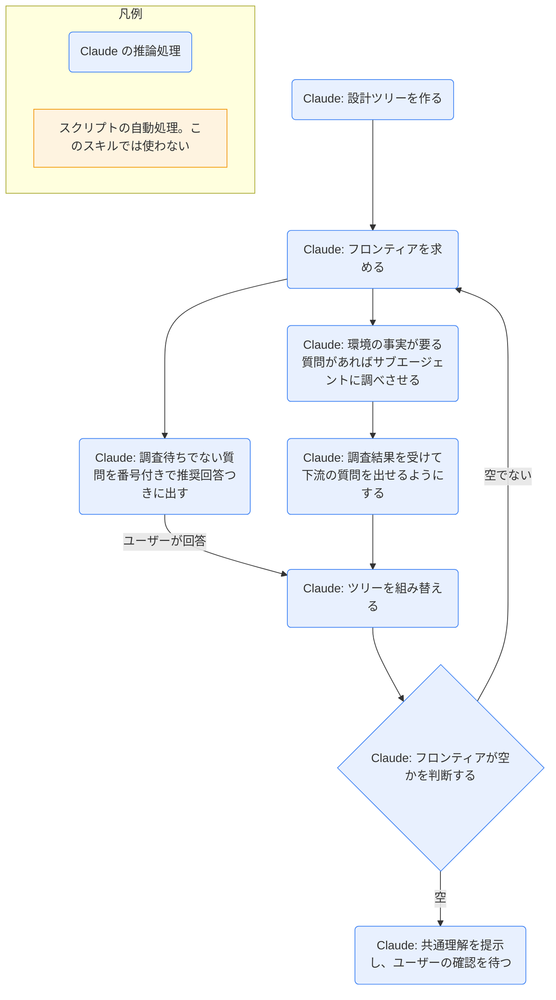

# grilling

## ひとことで
計画・決定・アイデアについて、共通理解ができるまで Claude が質問を重ねるスキル。

## 何ができるか
- 決定事項を「設計ツリー」（決定が枝分かれしていく構造）として整理する。
- 前提が決まっていて今すぐ聞ける質問（フロンティア）を、1ラウンドにまとめて出す。各質問には Claude の推奨回答が付く。
- 回答を受けてツリーを組み替え、次のラウンドを出す。
- 環境の事実（ファイル・ツールなど）は、ユーザーに聞かず、Claude がサブエージェントに調べさせる。決定だけをユーザーに聞く。
- フロンティアが空になり、暗黙の仮定が残っていない状態で終了する。ユーザーが共通理解を確認するまで、結果に基づく作業はしない。

## 使い方
- 呼び出し: `/grilling`。または「grill」系の言い回しでユーザーが質問攻めを求めたとき（description による）。
- 例: 「この計画を grill して」と頼むと、Q1, Q2... の形式で質問が出る。
- 質問の形式:
  - `❓ **Q1** - **質問タイトル**: 本文`
  - `➡️ 推奨回答`
  - 質問どうしは `---` で区切る。
- 利用者は番号ごとに答える。全ラウンドが終わったあと、共通理解に達したと確認する。
- 補足: HTML フォームで行いたいときは別スキルの `grilling-html` を使う（`grilling-html` の description による）。ユーザーの `~\.claude\CLAUDE.md` には「詳細な質問手順が必要なときは `/grilling` を使う」とある。

## ロジック
スクリプトなし（すべて Claude の推論処理）。サブエージェントによる事実調査も Claude の処理として図に含める。

## 保守者向け
- 場所: `%USERPROFILE%\.claude\skills\grilling\SKILL.md`（ユーザー領域。Vault 外なので、このノートの作成では読み取りだけ）
- 同じフォルダに `agents\openai.yaml` がある。内容は `display_name: "Grilling"` と `short_description: "Stress-test thinking a round of questions at a time"`。用途は表示用の情報と読めるが、どこで使われるかは未確認。
- 書き込み先: なし（質問と回答は会話の中だけ）。スクリプト・テンプレートも使わない。
- 制約: 共通理解をユーザーが確認するまで、結論に基づく作業をしない。
- 関連: Vault の `grilling-html` は、このスキルのルールを自分の SKILL.md に取り込んで自己完結している（`grilling-html` の SKILL.md「ルール（grilling から取り込み）」と `10_projects/Claudeのスキル作成/grilling-html SPEC.md` の「配置」）。こちらを変えても `grilling-html` には自動では反映されない。
- 注意:
  - SKILL.md は英語で書かれている。
  - ユーザー領域のスキルなので、Vault の Git では追跡されない（Vault 外にあるため）。
  - 質問は「1ラウンド＝フロンティア全部」。他の未回答質問に依存する質問は次ラウンドへ回す。
  - ユーザーの CLAUDE.md には「質問は1回3〜7個」とあり、grilling の「フロンティア全部を1ラウンドで出す」とは数の上限が異なる。どちらを優先するかは SKILL.md に記載がなく、未確認。
