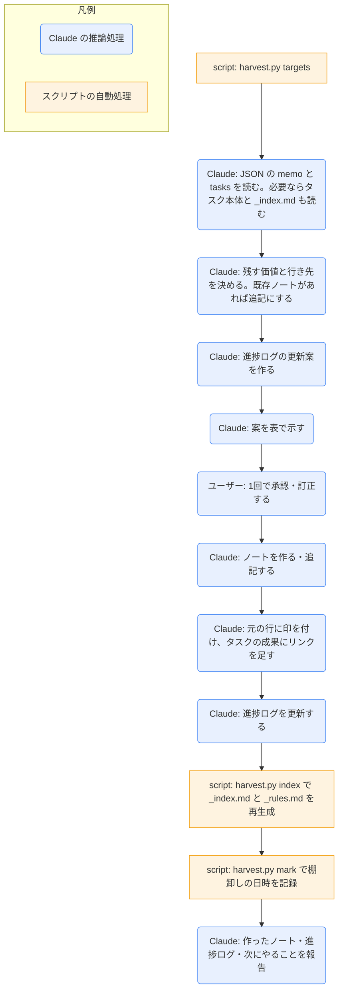

# knowledge-harvest

## ひとことで
今日のメモと、前回の棚卸し以降に更新したタスクの「経緯」から、残す価値のあるものを取り出して、人が読む知識と Claude のインプット（`80_context/`）のノートにするスキル。取り出した元の行には印を付ける。

## 何ができるか
- 棚卸しの対象を集める: 今日のデイリーの「今日のメモ」の、印のない項目と、前回の棚卸し以降に更新したタスク（`20_tasks/`・`00_inbox/` の直下）の「経緯」の、印のない行。
- 各項目・各行の行き先を決めて、ノートを作るか、既存のノートに追記する。

  | 行き先 | 置き場所（テンプレート） | 何を入れるか |
  |---|---|---|
  | 技術知見 | `80_context/技術知見.md` の1件（テンプレートなし。書式は SKILL.md） | Claude の作業に効く、短く指示的な知見 |
  | 判断記録 | `80_context/判断記録.md` の1件（同上） | 背景・選択肢・決定・理由・影響・見直す条件 |
  | 失敗記録 | `80_context/失敗記録.md` の1件（同上） | 何が起きたか・原因・対策・再発防止のルール |
  | knowledge | `30_knowledge/`（`knowledge.md`） | 人が読み返す解説・手順・ノウハウ、外部の出典に基づく調べもの（URL だけのメモも含む。主な URL は `source`） |
  | doc | `10_projects/<名前>/` か `50_documents/`（`document.md`） | まとまった資料 |
  | タスク | `00_inbox/`（`task.md`、`status: idea`） | 今日のメモのうち、やること |

  - 80_context は種類ごとに1ファイルで、プロパティを付けない。1件は `## タイトル` で、項目は `- 項目名: 内容` で書く。新しい件はファイルの先頭に足す。
- 進捗ログ（`80_context/進捗ログ.md`）のプロジェクトの節（`## プロジェクト名`）について、「現在の要約」を書き換え、「ログ」の先頭に日付の記録を足す。
- 取り出した元の行の行末に ` → [[ノート名]]`（80_context は ` → [[判断記録#タイトル]]`）を付け、タスクの「成果」にも同じリンクを足す。
- 索引（`80_context/_index.md`）と再発防止のルール（`80_context/_rules.md`）を作り直し、棚卸しの日時を記録する。

## 使い方
- 呼び出し: `daily-end` から呼ばれる。単独では「棚卸しして」「知識を整理して」と言うか、`/knowledge-harvest`。
- 起きること:
  1. 対象が集められ、行き先・ノート名（新規か追記か）・`project`・理由の案と、進捗ログの更新案が表で示される。
  2. 1回の承認・訂正で、ノートが作られ（追記され）、元の行に印が付き、進捗ログが更新される（`daily-end` から呼ばれたときは、`daily-end` の1回の承認に含まれる）。
  3. 索引とルールが再生成され、棚卸しの日時が記録される（何も残さなかった場合も行う）。
  4. 作ったノート・追記したノート・更新した進捗ログ・次にやることが報告される。
- 会話の途中で判断や失敗が起きたときは、締めを待たずに、承認を得て1件だけ記録してよい（手順2〜6）。
- 本文は、メモと経緯に書かれた内容だけで書かれる。確かめていないことは「未確認」とされる。このスキルの中では Web 検索などの調べものはしない。

## ロジック
対象集め・索引とルールの生成・日時の記録は `harvest.py`、行き先の判断・ノートの作成・印付けは Claude の推論処理。

`harvest.py` の動き:
- `targets [--date YYYY-MM-DD]`: JSON を出す。
  - `since`: 前回の棚卸しの日時（`90_system/harvest-state.json` の `last`）。記録がなければ今日の 0 時。
  - `memo`: 今日のデイリーの `## 今日のメモ` の項目（字下げした子の行も含めて1項目）のうち、1行目に ` → [[` がないもの。
  - `tasks`: `20_tasks/` と `00_inbox/` の直下で、ファイルの更新日時が `since` より後の `type: task` のノート。各タスクは `path`・`status`・`project`・`updated`・`progress`（`## 経緯` の、印のない行。日付の見出しは文脈として残し、中身のない見出しは除く）。
- `index`: `80_context/_index.md` と `_rules.md` を作り直す（内容が同じなら書かない。`更新:` / `変更なし:` を出す）。
  - 4つのファイル（`技術知見.md`・`判断記録.md`・`失敗記録.md`・`進捗ログ.md`）を、`## ` の見出しを1件として解析する（frontmatter は読まない。ファイルがなければ「なし」）。件の中の `- 項目名: 内容` を項目として読み、内容が空なら下の字下げした行を使う。
  - 索引: 進行中のプロジェクト（`10_projects/<名前>/<名前>.md` で `status: active`）ごとに、`進捗ログ.md` の `## <名前>` の節の「### 現在の要約」（先頭の4行まで）。判断記録（「決定」の最初の行）、技術知見（「要約」の最初の行）、失敗記録（「何が起きたか」の最初の行）は、`[[ファイル#タイトル]]`（日付, プロジェクト）の形で1件1行。
  - ルール: 失敗記録の各件の「再発防止のルール」（同じ行と、下の字下げした行の1行1つ）を、件へのリンク付きで集める。
- `mark [--at ISO日時]`: 棚卸しを終えた日時を `90_system/harvest-state.json` に記録する（既定は今）。

## 保守者向け
- 場所: `.claude/skills/knowledge-harvest/`（`SKILL.md`、`harvest.py`、`tests/`）
- `harvest.py` は標準ライブラリだけで動く。`daily-start/daily_start.py` を import して、読み書き・frontmatter・タスクの一覧（`task_files`）の関数を使う。`--vault` を省略すると、スクリプトの3階層上を Vault ルートとする（`--vault` はサブコマンドの前に書く）。
- 実行するコマンド（手順のとおり、そのまま）: `python "${CLAUDE_SKILL_DIR}/harvest.py" targets` → 承認後 `index` → `mark`
- 読む: `60_daily/<今日>.md`、`20_tasks/` と `00_inbox/` の直下のタスク、`80_context/`、`10_projects/`、`90_system/harvest-state.json`
- 書く: 上の表の置き場所のノート、`80_context/進捗ログ.md`、元の行の行末の印、タスクの `## 成果`、`80_context/_index.md`・`_rules.md`、`90_system/harvest-state.json`
- 制約:
  - 承認までは、ノートを作らず、印も付けない。
  - 印（` → [[`）のある行は取り出し済みとして二重に取り出さない。過去のデイリーのメモは対象にしない。
  - `_index.md` と `_rules.md` は自動生成なので、手で編集しない（先頭に自動生成の注記が入る）。
  - 80_context の書式の正本は SKILL.md の「80_context の書式」（テンプレートはない）。`harvest.py index` が解析するので、見出しのレベルと `- 項目名: 内容` の形を崩さない。
  - 外部サービスへ情報を送らない。秘密情報をノートに書かない。
- 注意:
  - 更新の判定はファイルの更新日時なので、Obsidian での編集や、ほかのスキルによる書き込み（印付けを含む）でも「更新した」とみなされる。`mark` は書き込みのあとに実行する。
  - 索引・ルールは CLAUDE.md から `@80_context/_rules.md`・`@80_context/_index.md` で読み込まれる（CLAUDE.md の記載）。
- テスト（unittest、追加インストール不要）: `python -m unittest discover -s .claude/skills/knowledge-harvest/tests`（対象の抽出、記録がないときの既定、索引とルールの生成、ファイルや件がないとき）
