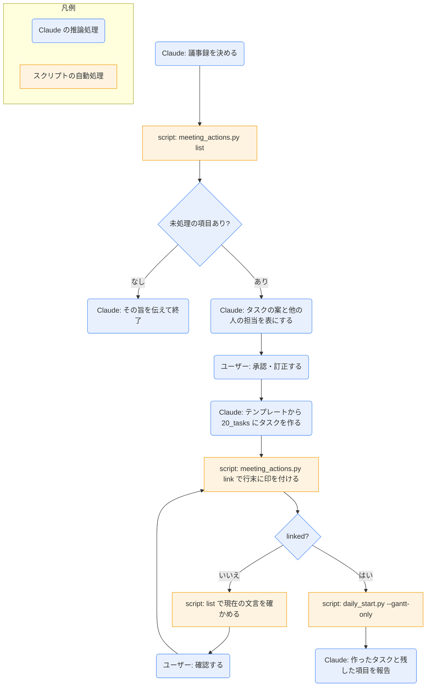

# meeting-followup

## ひとことで
議事録の「アクションアイテム」を、承認を得てタスクのノートにし、議事録側の行末に `→ [[タスク名]]` の印を付けるスキル。旧 Vault の同名スキルを、現行の規約（`20_tasks`・`70_meetings`・`start`/`due`）に合わせて移植したもの。

## 何ができるか
- 議事録（`70_meetings/`）の `## アクションアイテム` から、未処理の項目（未完了で、印のない行）を取り出す。
- 項目の `@担当` と `期限:YYYY-MM-DD` を読み取り、タスク名・開始日・期限・プロジェクトの案を一覧にして、1回でまとめて確認する。
- 担当が自分以外の項目は、案とは別に示し、希望したものだけタスクにする。
- 承認された項目を `20_tasks/` のタスクにし（`meeting: "[[議事録名]]"` 付き）、議事録の該当行の末尾に `→ [[タスク名]]` を足す。
- 確認のあいだに議事録が Obsidian で書き換えられていたら、行を読み直してから印を付け直す（タスクは作り直さない）。

## 使い方
- 呼び出し: 「議事録からタスク化して」「アクションアイテムをタスクにして」「会議のフォローアップ」と言うか、`/meeting-followup`。議事録名を添えると、その議事録が対象になる（省略すると、今日の日付の議事録を探す）。
- 議事録の書き方: `70_meetings` を右クリックして「新規ノート」で `YYYY-MM-DD_会議名` を作り、テンプレート（Ctrl+Shift+N で `meeting`）を挿入する。アクションアイテムは `- [ ] 内容 @担当 期限:YYYY-MM-DD`（担当・期限は省略可。自分の担当は `@自分` か省略）。
- 起きること:
  1. 未処理の項目と、議事録のプロジェクト・開催日が読み取られる。
  2. タスクの案が表で示される。期限が分からない項目は質問される（推測しない）。
  3. 承認後、タスクが作られ、議事録に印が付き、今日のガントが更新される。
- 印の付いた行と、完了（`- [x]`）の行は、次からは対象にならない。

## ロジック
議事録の解析と印付けはスクリプト（`meeting_actions.py`）、案作りとタスクの作成は Claude の推論処理。

## 保守者向け
- 場所: `.claude/skills/meeting-followup/`（`SKILL.md`、`meeting_actions.py`、`vaultkit/`、`tests/`）
- `vaultkit/` は旧 Vault の `vaultkit` から必要な部分だけを移植したもの。
  - `frontmatter.py`・`output.py`: そのまま。
  - `paths.py`: フォルダを `20_tasks` / `70_meetings` に変更。`VAULT_ROOT` でルートを差し替えられる（テスト用）。
  - `meetings.py`: 印の形式を「行ごと置き換え」から「行末に `→ [[タスク名]]`」に変更。`@担当`・`期限:` の読み取り（`parse_item`）を追加。CRLF の行末を保つ。
- `meeting_actions.py` の出力は1行の JSON（`ok` / `linked` / `not_found` / `invalid`）。書き換えるのは該当の1行だけで、ほかはバイト単位でそのまま。
- 読む: `70_meetings/<議事録>.md`、`10_projects/`（候補）、`90_system/templates/task.md`
- 書く: `20_tasks/<タスク名>.md`（新規のみ）、議事録の該当行の末尾
- テスト（unittest、追加インストール不要）: `python -m unittest discover -s .claude/skills/meeting-followup/tests`
- 注意: スクリプトはテストで確認済み。スキル全体の流れは、実際の議事録ではまだ動かしていない（未検証）。
