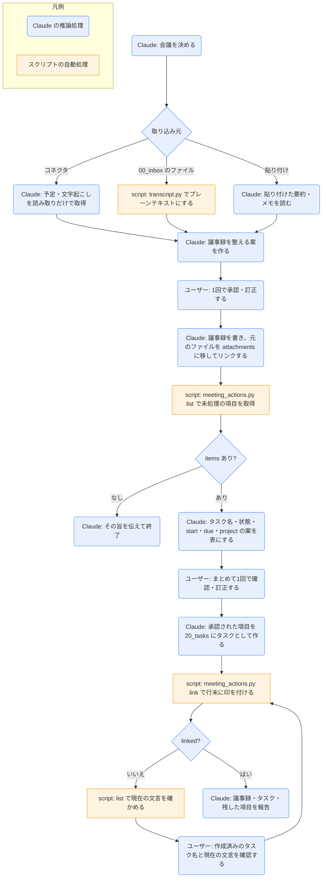

# meeting-import

## ひとことで
会議の情報から議事録ノート（`70_meetings/`）を作って整え、アクションアイテムを承認のうえタスク（`20_tasks/`、`todo` か `requested`）にして、議事録の行末に ` → [[タスク名]]` の印を付けるスキル。アクションアイテムのタスク化は、廃止した旧 `meeting-followup` スキルをこのスキルに統合したもの。

## 何ができるか
- 会議の情報を、次の3つから取り込む。
  1. Microsoft 365 コネクタ（Anthropic 公式。テナントの管理者が同意した後に使える）: Outlook の予定表・Teams の会議の文字起こしなどを、読み取りだけで使う。メールの送信や予定の変更はしない。
  2. `00_inbox/` のファイル: Teams の「要約」からダウンロードした文字起こし（`.vtt` / `.docx`）や会議のメモ（`.txt` / `.md`）。`transcript.py` でプレーンテキストにして読む。
  3. 貼り付け: 議事録ノートや会話に貼り付けた、Teams の要約・ファシリテーターのメモ・手書きのメモ。
- 手順A（議事録を作る・仕上げる）: 議事録がなければ `70_meetings/<開催日 YYYY-MM-DD>_<会議名>.md` をテンプレートから作り、`attendees`・`source`・目的・議題・議事・決定事項（「決定:」で始める）・アクションアイテム・参照ドキュメントを整える案を出す。承認後に書く。
- 手順B（アクションアイテムをタスクにする）: 未処理の項目ごとに、タスク名・状態（`todo` か `requested`）・`start`・`due`・`project` の案を表にし、1回の確認で、承認されたものを `20_tasks/` のタスクにして、議事録に印を付ける。
- 手順C（朝の枠作り。`daily-start` から）: コネクタが使えるときだけ、今日の予定ごとに議事録の枠を作る。枠は確認なしで作る（中身は予定の情報だけのため）。既にあれば触らない。
- アクションアイテムの書式: `- [ ] 内容 期限:YYYY-MM-DD`（期限は省略可）。担当は書かない（他の人に頼んだものは、タスクの状態 `requested` で表す）。

## 使い方
- 呼び出し: 「議事録を作って」「会議を取り込んで」「議事録からタスク化して」「アクションアイテムをタスクにして」と言うか、`/meeting-import`。`daily-start` の朝の枠作りでも使われる。
- 起きること（手順A → B）:
  1. 会議を決める。指定がなければ、`70_meetings/` の今日の日付から始まる議事録と、`00_inbox/` の文字起こしが候補として示される。
  2. 議事録の中身を整える案が示され、1回承認すると書かれる（既存の議事録は、ユーザーの書いた文言を消さず、足りない節に足す）。要約・文字起こしの全文を `## 記録` に残すか、要約だけにするかも案で聞かれる。
  3. `00_inbox/` の元のファイルは、承認を得て `90_system/attachments/` に移され、議事録の `## 参照ドキュメント` から `[[ファイル名]]` でリンクされる。
  4. 続けて、アクションアイテムのタスク案が表で示される（不要と言えば省かれる）。状態はユーザーが1件ずつ選ぶ。`start` の既定は今日、`due` の既定は項目の期限か、無ければ今日（表で「既定」と分かるようにする）。`project` の既定は議事録の `project`。
  5. 承認された項目がタスクになり、議事録の該当行に印が付く。タスクにしない項目は、そのまま残る。
  6. 作った議事録、作ったタスク（名前・状態・プロジェクト・開始日〜期限）、残した項目が報告される。ガントは、タスクの作成後のフックで自動で更新される。
- 印の付いた行と、完了（`- [x]`）の行は、次からは対象にならない。
- 手で議事録を作るときは、`70_meetings/` を右クリックして「新規ノート」で作り、テンプレートを挿入する（CLAUDE.md の記載）。

## ロジック
文字起こしの読み取りは `transcript.py`、アクションアイテムの取り出しと印付けは `meeting_actions.py`。議事録の要約、案作り、タスクの作成は Claude の推論処理。

朝の枠作り（手順C）は、コネクタで今日の予定を取得 → 予定ごとに枠がなければテンプレートから作る（`date`・`attendees`・`source` と、予定の説明欄の議題を `## 目的・議題` に入れる）→ 作った枠の一覧を伝える、の流れで、すべて Claude の推論処理（図では省略）。

## 保守者向け
- 場所: `.claude/skills/meeting-import/`（`SKILL.md`、`meeting_actions.py`、`transcript.py`、`vaultkit/`、`tests/`）
- `transcript.py <ファイル>`: `.vtt` は時刻と番号の行を除き、`<v 話者>本文</v>` を `話者: 本文` にして、同じ話者の連続した発言をまとめる。`.docx` は `word/document.xml` の段落を1行ずつ取り出す（標準ライブラリだけ）。`.txt` / `.md` はそのまま。読めない・未対応の形式は理由を1行出して終了コード1。
- `meeting_actions.py`:
  - `list --meeting <議事録名>`: 議事録の `## アクションアイテム` の未処理の項目（`text`・`content`・`due`）と、議事録の `project`・`date` を返す。
  - `link --meeting <議事録名> --text <本文> --task <タスク名>`: 本文が一致する最初の未処理の項目の行末に ` → [[タスク名]]` を足す。タスクのノートが `20_tasks/` に無ければ拒否する。項目は行番号でなく文言で指定する（確認のあいだに Obsidian で行が増減しても、正しい行を指せるように）。
  - 出力は1行の JSON（`status` は `ok` / `linked` / `not_found` / `invalid`。`ok`・`linked` 以外は終了コード1）。書き換えるのは該当の1行だけで、frontmatter は書き換えない。CRLF の行末を保つ。
  - 本文が1つのリンクだけの行（旧 Vault の印）も処理済みとみなす。
- `vaultkit/`: `frontmatter.py`（frontmatter の読み書き。扱える値は文字列と文字列のリストだけ）、`meetings.py`（節の解析と印付け）、`output.py`（JSON の出力）、`paths.py`（`20_tasks` / `70_meetings` の場所。環境変数 `VAULT_ROOT` でルートを差し替えられる。テスト用）。
- コマンドの値（議事録名・タスク名・項目の文言）は、シングルクォートで囲んで渡す（ダブルクォートの中では `$` やバッククォートが展開され、値が黙って変わるため）。値の中の `'` は `'\''` と書く。コマンドは SKILL.md の形のまま実行し、改変や自己流のコマンドの追加はしない。
- 読む: `70_meetings/`、`00_inbox/` の文字起こし・メモ、`10_projects/`（`project` の候補）、`90_system/templates/meeting.md`・`task.md`
- 書く: `70_meetings/<YYYY-MM-DD>_<会議名>.md`（新規・追記。承認されたものだけ）、`20_tasks/<タスク名>.md`（新規のみ。`meeting: "[[<議事録名>]]"` 付き。`## 経緯` に作成の記録）、議事録の該当行の末尾の印、`90_system/attachments/`（承認された元のファイルの移動）
- 制約:
  - 議事録の内容の書き込み・タスクの作成・印付けは、案を示して承認されたものだけ（朝の枠作りを除く）。
  - `## 議事・決定事項` などからは、承認なしにタスクを作らない。
  - 外部サービスへ情報を送らない（コネクタは読み取りだけ）。
- テスト（unittest、追加インストール不要）: `python -m unittest discover -s .claude/skills/meeting-import/tests`（frontmatter、節の解析と印付け、`list` / `link`、文字起こしの変換）
- 注意: 実際の会議・コネクタでスキル全体を動かしてはいない（未検証）。タスク名の重複確認は `20_tasks/` と `00_inbox/` の両方で行うが、`link` が探すのは `20_tasks/` だけ（このスキルで作るタスクは `20_tasks/` に置くため）。
