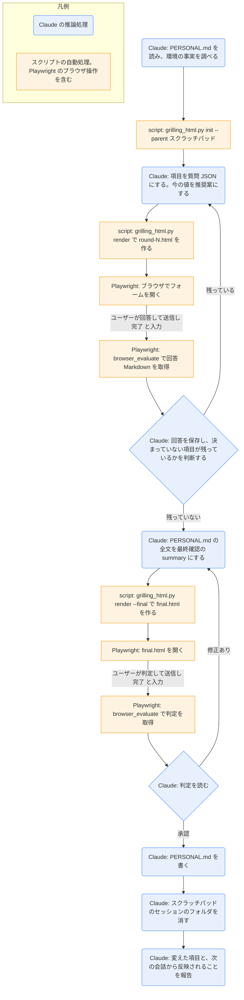

# personal-setup

## ひとことで
個人の設定（Vault 直下の `PERSONAL.md`）を、`grilling-html` の形式でインタビューして作成・更新するスキル。

## 何ができるか
- `PERSONAL.md` に、この PC・この利用者に固有の設定を書く。CLAUDE.md から `@PERSONAL.md` で読み込まれる。Git では追跡しない（配布しない）。
- 聞く項目:
  - 環境: OS、Vault のパス、OneDrive などの同期、`.git` の実体の場所、Obsidian の場所、使っている PC の台数
  - 仕事と役割: 仕事の内容・役割、よく作る資料の種類、よく使う用語（`task-run` や棚卸しの判断に使う）
  - 進め方の好み: 報告の仕方、確認の基準、文体など（すべてのプロジェクトに共通の好みはユーザーレベルの `%USERPROFILE%\.claude\CLAUDE.md` にあるので、Vault に固有のものだけ）
- 環境の値は、調べられる事実（Vault のパス、`.git` ファイルの中身、OS、`C:\Program Files\Obsidian\Obsidian.exe` の有無など）を先に調べ、ユーザーに聞かずに推奨案として示す。
- 更新のときは、今の値を推奨案として示し、変える所だけ答えてもらう。

## 使い方
- 呼び出し: 新しい PC で使い始めるとき、または「個人の設定を更新して」「PERSONAL.md を作って」と言うか、`/personal-setup`。
- 起きること:
  1. 今の値（`PERSONAL.md` と、調べられる環境の事実）が集められる。
  2. ブラウザに質問フォームが開く（1ラウンド3〜7問。決まっていない項目から聞かれる）。選択肢が作りにくい項目は、今の値が1つ目の選択肢になり、自由入力で答える。回答したら「送信」を押し、ターミナルに「完了」と入力する。
  3. 最終確認で、書き込む `PERSONAL.md` の全文が示される。「修正あり」なら直して繰り返す。
  4. 承認すると `PERSONAL.md` が書かれる（既存があれば置き換える。置き換える前に、変わる行が示されている状態にする）。
  5. セッションのフォルダが消され、変えた項目と、次の会話から反映されること（今の会話には反映されない）が報告される。
- 書式:
  ```
  ---
  type: doc
  status: draft
  created: <最初に作った日>
  ---
  # 個人の設定

  （CLAUDE.md から読み込まれる旨の1行）

  ## 環境
  ## 仕事と役割
  ## 進め方の好み
  ```

## ロジック
セッションの作成と HTML の生成は `grilling-html` のスクリプト（`grilling_html.py`）、ブラウザの操作は Playwright MCP、質問の作成と `PERSONAL.md` の組み立ては Claude の推論処理。



ラウンドごとの回答の取得（ブラウザの操作、回答 Markdown の保存、送信されていないときの扱い）は、`grilling-html` の手順2〜6に従う（詳しくは `grilling-html` の解説ノート）。

## 保守者向け
- 場所: `.claude/skills/personal-setup/SKILL.md`（スクリプトは持たない）
- 使うスクリプト: `.claude/skills/grilling-html/grilling_html.py`（`allowed-tools` に登録済み）。セッションは `init --theme "personal-setup" --parent "<スクラッチパッドのパス>"` で、Vault の外（このセッションのスクラッチパッド）に作る。個人の情報なので、Vault の中には残さない。
- 書く: Vault 直下の `PERSONAL.md` だけ（最終確認で承認されたあと）
- 制約:
  - 最終確認で承認されるまで、`PERSONAL.md` を書かない。
  - 秘密情報（パスワード、トークン、キー）は聞かない・書かない。
  - `PERSONAL.md` は `.gitignore` のホワイトリストに入っていないので追跡されない。ホワイトリストに足さない。
  - 配布対象のファイル（スキル・CLAUDE.md など）には個人の情報を書かず、`PERSONAL.md` に書く。
- `grilling-html` との関係: 使うのは `grilling-html` の手順2〜7（インタビューと最終確認）。承認後は、`grilling-html` の手順8（SPEC の保存先の提案など）ではなく、このスキルの手順5・6で `PERSONAL.md` を書き、セッションのフォルダを消す。
- 注意: 実際に実行して動作を確かめてはいない（未検証）。
