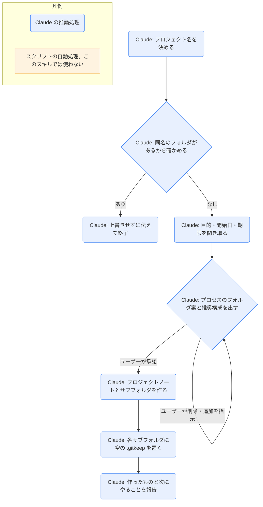

# project-add

## ひとことで
新しいプロジェクトのノートと、プロセス単位のサブフォルダを作るスキル。サブフォルダは、案を出して承認を得てから作る。

## 何ができるか
- `10_projects/<名前>/<名前>.md` を、`90_system/templates/project.md` に従って作る（`status: active`、`start`・`due` は分かれば入れる、`created` は今日、`## 目的` に聞き取った内容を書く）。
- プロセス（システム開発・設備工事のイメージ）のサブフォルダを、初期セットから選んで作る。

## 使い方
- 呼び出し: 「プロジェクトを追加して」「新しいプロジェクトを作って」と言うか、`/project-add`。
- 起きること:
  1. プロジェクト名を決める（ユーザーが指定）。`10_projects/<名前>/` が既にあれば、上書きせずに伝えて終了する。
  2. 目的・開始日（`start`）・期限（`due`）が分かれば聞き取る（無ければ空のまま。聞き返しすぎない）。
  3. プロセスのフォルダ案が提示される。不要なものの削除・追加を指示して確定する。
  4. 承認後に、ノートとフォルダが作られる。
  5. 「作ったノートとフォルダ・次にやること（タスク追加は `task-add`）」が報告される。
- 初期セット（番号付き。上から順に並ぶ）:
  - 横断: `00_管理` / `01_課題・リスク管理` / `02_現行情報` / `03_参考資料・外部情報` / `04_マニュアル` / `05_イベント`
  - 工程（5 刻み。あとから間に差し込める）: `10_見積・稟議` / `15_契約・発注` / `20_要件定義` / `25_設備設計` / `30_工事設計` / `35_構築` / `40_組込作業` / `45_設備検証` / `50_検収・完了報告` / `55_運用引継` / `60_保守・問い合わせ`
- プロジェクトの内容から、推奨する構成（例: 設備工事を伴わない場合に外すもの）が一言添えられる。
- タスクは `20_tasks/` に置く（プロセスのフォルダには入れず、`project` プロパティで紐づける）。

## ロジック
スクリプトなし（すべて Claude の推論処理）。

## 保守者向け
- 場所: `.claude/skills/project-add/SKILL.md`
- 使うテンプレート: `90_system/templates/project.md`（見出しは 目的 / 関連タスク / 関連議事録 / 知識・資料 / メモ。関連タスク・関連議事録・知識・資料は、Bases の埋め込み `project-tasks.base`・`meetings.base#プロジェクト`・`project-materials.base`）
- 書く: `10_projects/<名前>/<名前>.md`、承認されたサブフォルダ（各フォルダに空の `.gitkeep`。空のフォルダは OneDrive の同期や Obsidian の一覧で見落としやすいため）
- 制約: 承認を得てから作る。既存のファイル・フォルダは変更しない。名前には Windows で使えない文字（`\ / : * ? " < > |`）を使わない。
- 注意: 作成直後で、実際に実行して動作を確かめてはいない（未検証）。初期セットの名前や順序を変えるときは、SKILL.md を直す。
