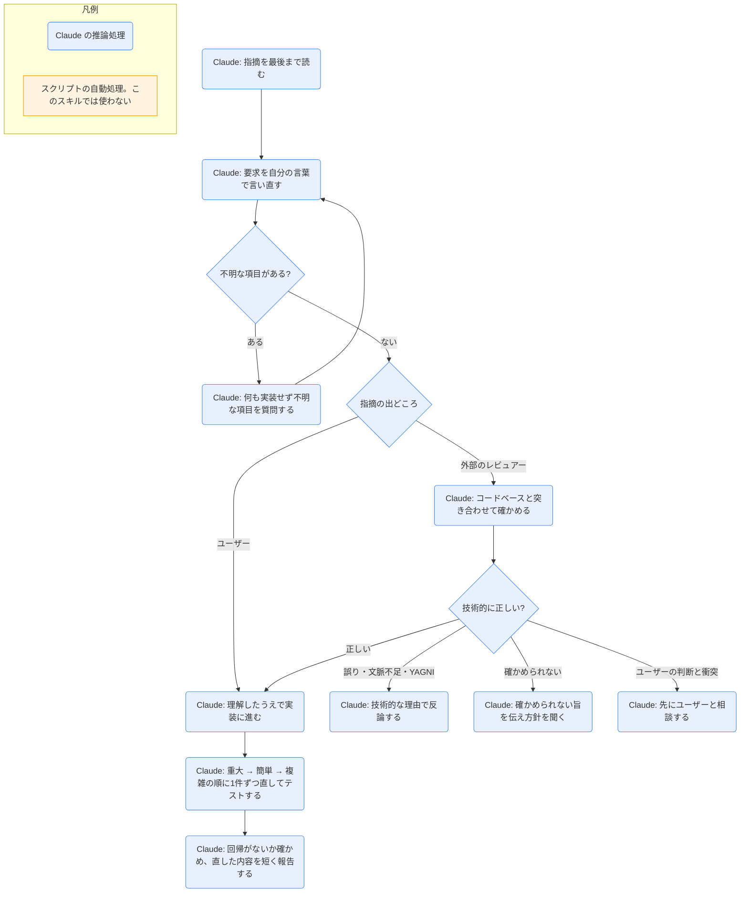

# receiving-code-review

## ひとことで
コードレビューの指摘を受けたとき、すぐ従わず、コードで確かめてから対応・反論させるスキル。

## 何ができるか
- 指摘を最後まで読み、要求を自分の言葉で言い直す（分からなければ聞く）。
- 指摘をコードベースの実態と突き合わせ、「このコードベースで技術的に正しいか」を判断する。
- 不明な項目が1つでもあれば、どれも実装せずに先に質問する（項目どうしが関係していることがあるため）。
- 誤った指摘には、技術的な理由で反論する。確かめられないときは「X がないと確かめられない」と伝え、方針を聞く。
- 「ちゃんと作るべき」系の指摘は、まずコードを grep して使われているかを確かめる。使われていなければ削除（YAGNI）を提案する。
- 正しい指摘は、1件ずつ直してテストする。
- 迎合的な返答（「おっしゃるとおりです！」「素晴らしい指摘です！」、お礼の言葉など）を禁じる。直した内容を短く述べるだけにする。

## 使い方
- 呼び出し: レビューの指摘を受けたとき、description に従って自動で使われる。明示するなら Skill ツールで `superpowers:receiving-code-review`（SKILL.md の参照表記による）。
- 例: 「レビューで指摘 1〜6 が来た。対応して」と頼む。
  - 1, 2, 3, 6 は分かり、4, 5 が不明なら、Claude は何も実装せず「4 と 5 を確認させてください」と返す。
  - 全部分かったら、次の順で1件ずつ直し、そのたびにテストする: 動作を壊すもの・セキュリティ → 簡単な修正（誤字、import）→ 複雑な修正（リファクタ、ロジック）。最後に回帰がないことを確かめる。
- 指摘の出どころで扱いが変わる。
  - ユーザー（SKILL.md の「your human partner」）からの指摘: 信頼してよい。理解してから実装する。範囲が不明なら聞く。
  - 外部のレビュアーからの指摘: 疑ってかかり、注意深く確かめる。既存の機能を壊さないか、今の実装に理由がないか、全プラットフォームで動くか、レビュアーが全体の文脈を知っているかを確かめる。ユーザーの過去の判断と食い違うときは、先にユーザーと相談する。
- 反論が間違っていたと分かったら、長い謝罪や言い訳をせず、「確かめたら正しかった。直す」と事実だけ述べる。
- GitHub のインラインコメントへの返信は、PR 全体へのコメントではなく、そのコメントのスレッドに返す（`gh api repos/{owner}/{repo}/pulls/{pr}/comments/{id}/replies`）。

## ロジック
スクリプトなし（すべて Claude の推論処理）。

## 保守者向け
- 場所: `%USERPROFILE%\.claude\plugins\cache\claude-plugins-official\superpowers\6.4.1\skills\receiving-code-review\SKILL.md`（プラグイン superpowers 6.4.1。Vault 外なので、このノートの作成では読み取りだけ）
- フォルダの中身は SKILL.md だけ。スクリプト・テンプレートは持たない。
- 書き込み先: スキル自体はない。修正は、対象のプロジェクトのコードに対して行う。
- 注意:
  - SKILL.md は英語で書かれている。
  - プラグイン領域のスキルなので、Vault の Git では追跡されない（Vault 外にあるため）。プラグインの更新でバージョンのフォルダが変わると、上の場所も変わる。
  - 「お礼を含む感謝の表現をすべて禁止」「You're absolutely right! は禁止」など、返答の言い回しまで指定している。
  - GitHub のスレッドへの返信は外部への送信にあたる。Vault の CLAUDE.md の「外部送信は実行前に確認する」との関係は、SKILL.md に記載がない。
  - 関連: レビューを依頼する側は `requesting-code-review`。
