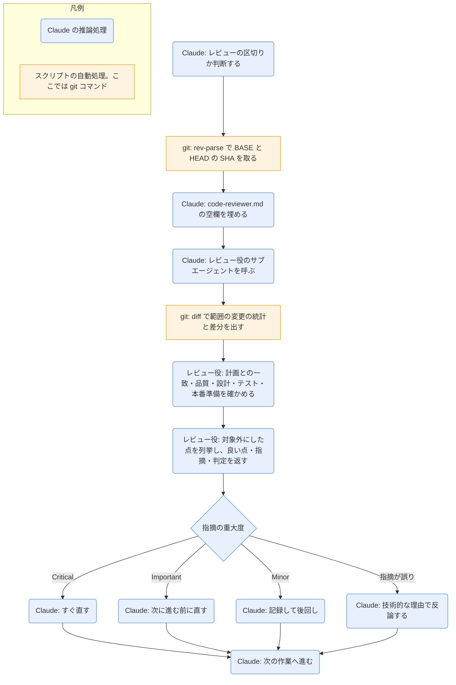

# requesting-code-review

## ひとことで
作業の区切りで、コードレビュー役のサブエージェントを呼び、問題が広がる前に見つけさせるスキル。

## 何ができるか
- レビューの範囲を git のコミット（BASE と HEAD の SHA）で決め、レビュー役のサブエージェント（`general-purpose`）に渡す。
- レビュー役には、会話の履歴ではなく、必要な文脈（何を作ったか・要件や計画・コミットの範囲）だけを渡す。
- レビュー役は、計画との一致・コード品質・設計・テスト・本番投入の準備を確かめ、次の形で返す。
  - Strengths（良い点）
  - Issues（Critical: 必ず直す / Important: 直すべき / Minor: できれば。各項目に ファイル:行・何が悪いか・なぜ問題か・直し方）
  - Recommendations（提案）
  - Assessment（マージしてよいか: Yes / No / With fixes と、1〜2文の理由）
- 受け取った指摘は、Critical はすぐ直す、Important は次に進む前に直す、Minor は記録して後回し、間違いなら理由を付けて反論する。

## 使い方
- 呼び出し: タスクの完了時、大きな機能の完成時、マージの前に、description に従って自動で使われる。明示するなら Skill ツールで `superpowers:requesting-code-review`。
- 必ず使う場面: `subagent-driven-development` の各タスクのあと、大きな機能の完成後、main へのマージ前。
- あると良い場面: 行き詰まったとき、リファクタの前（基準の確認）、複雑なバグを直したあと。
- 起きること:
  1. Claude が `git rev-parse` で BASE（例: `HEAD~1` や `git merge-base origin/main HEAD`）と HEAD の SHA を取る。
  2. テンプレート `code-reviewer.md` の空欄（何を作ったか、要件・計画、BASE、HEAD）を埋めて、レビュー役を呼ぶ。
  3. レビュー役が `git diff` で差分を読み、上の形式で返す。
  4. Claude が重大度に応じて直すか、反論する。
- 例: 「Task 2 が終わったのでレビューして」→ レビュー役が「Important: 進捗表示がない / Minor: マジックナンバー 100」と返す → Claude が進捗表示を直して Task 3 へ進む。

## ロジック
スキル付属のスクリプトはない。四角は、Claude やレビュー役が実行する決まった git コマンド。

## 保守者向け
- 場所: `%USERPROFILE%\.claude\plugins\cache\claude-plugins-official\superpowers\6.4.1\skills\requesting-code-review\`（プラグイン superpowers 6.4.1。Vault 外なので、このノートの作成では読み取りだけ）
  - `SKILL.md`: 手順と使う場面
  - `code-reviewer.md`: レビュー役に渡すプロンプトのテンプレート（確認項目、出力形式、例）
- 書き込み先: なし。レビュー役は作業ツリー・インデックス・HEAD・ブランチを変更しない（読み取り専用）。別のリビジョンが要るときは、一時フォルダに `git worktree add` で取り出す（テンプレートによる）。
- 制約（テンプレートによる）:
  - レビュー役は、さらにサブエージェントを呼ばない。差分が大きければ、自分で何回かに分けて見る。
  - 仕様に書いていない挙動は「利用者が当然期待すること」を要件として判断する。
  - 判定の前に、計画や仕様の対象外として扱わなかった点を1行ずつ理由付きで列挙する（Declined to judge）。
- 注意:
  - SKILL.md とテンプレートは英語で書かれている。
  - プラグイン領域のスキルなので、Vault の Git では追跡されない（Vault 外にあるため）。プラグインの更新でバージョンのフォルダが変わると、上の場所も変わる。
  - 空欄の書き方が、SKILL.md では `{DESCRIPTION}` のような波かっこ、テンプレートでは `[DESCRIPTION]` のような角かっこになっている。
  - SKILL.md の BASE の例は `HEAD~1`。一方 `subagent-driven-development` は、複数コミットのタスクで差分が欠けるので `HEAD~1` を使わず、実装前に記録した BASE を使うとしている。
  - `subagent-driven-development` の最終レビューも、このテンプレート `code-reviewer.md` を使う。
  - 関連: 指摘を受ける側は `receiving-code-review`。
