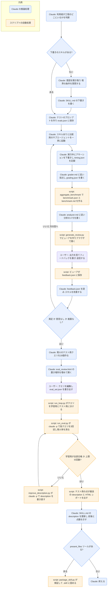

# skill-creator

## ひとことで
スキルを新しく作る・直すときに、下書き → テスト実行 → 評価 → 改善を繰り返し、最後に description の発火の精度まで調整するスキル。

## 何ができるか
- 利用者が工程のどこにいるかを見て、途中から手伝う（作りたいものが決まっていない／下書きがある／評価だけしたい、など）。「評価はいらない」と言われれば、気軽な共同作業にも切り替える。
- スキルの作成:
  - 意図を聞き取る（何をさせたいか、いつ発火させたいか、出力の形、テストを用意するか）。今の会話にすでに手順があれば、そこから取り出す。
  - 境界の条件・入出力・成功の基準などを質問し、必要なら MCP やサブエージェントで調べる。
  - `name` と `description` を含む SKILL.md を書く。description は「少し押しの強い」書き方を勧める（発火しにくい傾向への対策）。
  - 書き方の指針を持つ: SKILL.md は500行以内、補助ファイルは `scripts/`・`references/`・`assets/` に分ける、命令形で書く、MUST を並べるより理由を説明する、悪意のあるスキルは作らない。
- テストと評価:
  - 現実的なテストのプロンプトを2〜3個作り、`evals/evals.json` に保存する。
  - テストごとに「スキルあり」と「比較用（新規ならスキルなし、改善なら直す前の版）」のサブエージェントを、同じターンで一斉に起動する。
  - 実行中にアサーション（客観的に確かめられる合否の条件）を下書きして説明する。
  - 終わった実行ごとに、通知にあるトークン数と所要時間を `timing.json` に記録する（ここでしか取れない）。
  - 採点（`agents/grader.md`）→ 集計（`aggregate_benchmark`）→ 分析（`agents/analyzer.md`）→ ビューア（`generate_review.py`）の順で、結果を利用者に見せる。
- 改善:
  - 利用者のフィードバック（`feedback.json`）を読み、テストの例に寄せすぎず一般化して直す。プロンプトは引き締め、理由を説明し、複数のテストで同じ補助スクリプトを書いていたらスキルに同梱する。
  - `iteration-<N>/` を増やしながら、利用者が満足する／フィードバックが空になる／進展がなくなるまで繰り返す。
- 任意: 2つの版の出力を、どちらの版か伏せて別のエージェントに比べさせる（`agents/comparator.md`）。勝った理由は `agents/analyzer.md` で分析する。
- description の最適化:
  - 発火すべき8〜10個・発火すべきでない8〜10個の、現実的なクエリ（計20個）を作る。発火すべきでない側は「惜しいが違う」ものを選ぶ。
  - HTML のテンプレートで利用者に確認・編集してもらう。
  - スクリプトがクエリを学習用6割・テスト用4割に分け、`claude -p` で各クエリを3回ずつ試して発火率を測り、description を書き直す、を最大5回繰り返す。テスト用の点が最も良い description を選ぶ。
- 任意: `present_files` ツールがあるときだけ、スキルを `.skill` ファイル（zip）に固めて渡す。
- Claude.ai や Cowork で使うときの読み替え（サブエージェントがない、ブラウザがない、など）も SKILL.md に書かれている。

## 使い方
- 呼び出し: 「〇〇のスキルを作りたい」「このスキルを改善して」「スキルの評価をして」「description を最適化して」などと頼むと、description に合えば Claude が使う。明示するときは `/skill-creator:skill-creator`（プラグインのスキルは `プラグイン名:スキル名` の形。Claude Code の Skill ツールの説明による）。
- 起きること（作成から通すとき）:
  1. Claude が意図を聞き取り、SKILL.md の下書きを書く。
  2. テストのプロンプトを見せ、よければ実行する。
  3. ブラウザでビューアが開く。「Outputs」タブで各テストの出力を見てコメントを書き、「Benchmark」タブで合格率・時間・トークンの比較を見る。最後に「Submit All Reviews」を押す。
  4. 会話に戻って終わったと伝えると、Claude がフィードバックを読んでスキルを直し、次の回を実行する。
  5. 仕上がったら、description の最適化を提案される。クエリの一覧が HTML で開くので、編集して「Export Eval Set」を押す（ダウンロードフォルダに `eval_set.json` が保存される）。
  6. 最適化は時間がかかるので、バックグラウンドで実行される。終わると、変更前後の description と点数が示される。
- 専門用語（JSON、アサーションなど）は、利用者の慣れ具合を見て、必要なら短く説明するよう SKILL.md に書かれている。

## ロジック
スクリプトを多く使う。テストの実行・採点・分析・改善の判断は Claude（とサブエージェント）が行い、集計・ビューア・発火率の測定・梱包はスクリプトが行う。`run_eval.py` と `improve_description.py` は、内部で `claude -p` を呼び出す（スクリプトの中で別の Claude が動く）。

- 図には入れていないが、任意で「伏せた比較」（`agents/comparator.md` → `agents/analyzer.md`）を行える。
- 利用者が「評価はいらない」と言えば、テストと評価の部分は飛ばす。

## 保守者向け
- 場所: `%USERPROFILE%\.claude\plugins\cache\claude-plugins-official\skill-creator\d182ca456ca0\skills\skill-creator\SKILL.md`
  - プラグイン: `skill-creator@claude-plugins-official`（バージョン `d182ca456ca0`。Git のコミットの短縮形）。`installed_plugins.json` に user スコープで登録されている。有効かどうかは未確認。
  - このセッションのスキル一覧には、別に `anthropic-skills:skill-creator` という同じ説明のスキルが出ている。プラグイン版との関係は未確認。
- 補助ファイル（スキルフォルダ内）:
  - `agents\grader.md`: 採点役の指示。アサーションごとに合否と根拠を出し、出力の中の主張も検証し、弱いアサーションを指摘する。結果は `grading.json`（項目名は `text`・`passed`・`evidence`。ビューアがこの名前に依存）。
  - `agents\comparator.md`: 伏せた比較の指示。内容と構成の評価表で A と B を採点し、勝者を決めて `comparison.json` に書く。
  - `agents\analyzer.md`: 2つの役割。比較の後に勝因と改善案を `analysis.json` に書く役と、ベンチマークの傾向（常に合格するアサーション、ばらつきの大きいテストなど）をメモに書く役。
  - `references\schemas.md`: `evals.json`・`history.json`・`grading.json`・`metrics.json`・`timing.json`・`benchmark.json`・`comparison.json`・`analysis.json` の形式。
  - `assets\eval_review.html`: 発火のテスト用クエリを確認・編集する HTML のひな形。Claude が3つの置き場所（`__EVAL_DATA_PLACEHOLDER__` など）を埋める。
  - `eval-viewer\viewer.html`: ビューアのひな形。`generate_review.py` がデータを埋め込む。
- スクリプト（読んだ範囲で何をするか。実行はしていない）:
  - `eval-viewer\generate_review.py`: 作業フォルダから `outputs/` を持つ実行を集め、1つの HTML に埋め込む。既定ではポート 3117 で小さな HTTP サーバーを立ててブラウザを開き、フィードバックを `feedback.json` に保存する。`--static` で HTML ファイルだけを書き出す。標準ライブラリだけで動く。
  - `scripts\aggregate_benchmark.py`: 各実行の `grading.json` から、合格率・時間・トークンの平均・標準偏差・最小・最大と、スキルあり／なしの差を出す。
  - `scripts\run_loop.py`: 発火のテストと description の書き直しを繰り返す本体。既定は6割・4割の分割、各クエリ3回、最大5回、並列10、1クエリ30秒。学習用が全部合格すると早めに終わる。経過の HTML レポートを一時フォルダに書いてブラウザで開く。
  - `scripts\run_eval.py`: 1クエリごとに、プロジェクトの `.claude\commands\` に一時のコマンドファイルを作り、`claude -p` を実行して、そのスキルを読みに行ったかで発火を判定する。終わればファイルを消す。
  - `scripts\improve_description.py`: 失敗したクエリと過去の試行を添えて `claude -p` に新しい description を書かせる。1024文字を超えたら1回だけ短くさせる。
  - `scripts\generate_report.py`: `run_loop.py` の結果から、試行ごとの合否の HTML レポートを作る。
  - `scripts\quick_validate.py`: SKILL.md の frontmatter を検査する（`name` と `description` が必須、使える項目の制限、名前はケバブケースで64文字以内、description は1024文字以内で `<` `>` を含まない、など）。
  - `scripts\package_skill.py`: 検証してから、スキルフォルダを `<スキル名>.skill`（zip）に固める。直下の `evals/`、`__pycache__`、`node_modules`、`*.pyc` などは除く。
  - `scripts\utils.py`: SKILL.md から `name` と `description` を取り出す共通の処理。
- 書き込み先:
  - 作業結果: スキルのフォルダの隣の `<スキル名>-workspace\iteration-<N>\...`（`eval_metadata.json`・`outputs\`・`timing.json`・`grading.json`・`benchmark.json`・`feedback.json` など）。
  - テストの定義: スキルフォルダ内の `evals\evals.json`。
  - 発火のテスト中: 実行した場所から上にたどって最初に `.claude\` があるフォルダの `.claude\commands\` に、一時のファイルを作っては消す。Vault の中で実行すると、Vault の `.claude\commands\` が使われる。
  - 最適化のレポート: 一時フォルダの `skill_description_report_<スキル名>_<日時>.html`（`--results-dir` を付ければそこにも保存）。
  - 梱包: 実行した場所（または指定のフォルダ）に `<スキル名>.skill`。
  - 新しいスキル自体をどこに置くかは、SKILL.md に指定がない。
- 制約・前提:
  - スクリプトは `python -m scripts.<名前>` の形で、skill-creator のフォルダから実行する前提（`scripts.` から import している）。
  - description の最適化は `claude` コマンド（`claude -p`）が必要。Claude.ai では使えないと SKILL.md にある。
  - `quick_validate.py` と、それを使う `package_skill.py` は PyYAML（`import yaml`）が必要。この PC に入っているかは未確認。
  - テストは `/skill-test` などの別のテスト用スキルを使わない、と SKILL.md にある。
- 注意:
  - SKILL.md と補助ファイルはすべて英語で書かれている。
  - プラグイン領域（Vault 外）なので、Vault の Git では追跡されない。プラグインの更新で中身が変わることがある。
  - SKILL.md の例のコマンドは Unix 向け（`nohup`・`&`・`kill`・`open`・`/tmp`）。Windows での動き方は未確認。
  - `generate_review.py` は、ポートを使っているプロセスを `lsof` で探して止める。`lsof` がなければ注意を出して先へ進む。
  - `run_eval.py` は、`claude -p` の出力を `select.select` で待つ。Windows の Python ではこれが動くかは未確認（未実行）。
  - `generate_review.py` の冒頭の使い方の説明には `--previous-feedback` とあるが、実際の引数は `--previous-workspace`。
  - LICENSE.txt の中身は未確認。
