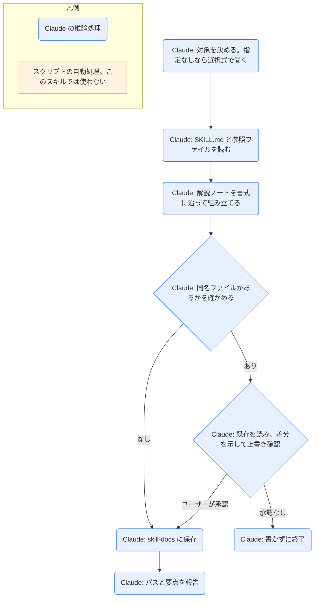

# skill-explain

## ひとことで
スキルの SKILL.md と関連ファイルを読み、解説ノートを Vault に作るスキル。

## 何ができるか
- Vault・ユーザー・プラグインのスキルを探して読む。
- 次の項目を持つ解説ノートを `90_system/skill-docs/<スキル名>.md` に作る: ひとこと / できること / 使い方 / Mermaid のロジック図 / 保守者向け。
- ロジック図では、Claude の推論処理とスクリプトの自動処理を形と色で区別し、凡例を付ける。
- 読めないものは「未確認」と書き、推測で補わない。
- 同名ノートがあるときは、新旧の差分を示して確認してから上書きする。

## 使い方
- 呼び出し: `/skill-explain <スキル名>`。「スキルを解説して」「〇〇スキルの解説ノートを作って」と明示した場合も起動する。明示されたときだけ使う。
- 例: `/skill-explain grilling-html` で、grilling-html の解説ノートができる。
- 引数なしで呼ぶと、見つかったスキルを選択式で聞く（1回4件まで。多いときは置き場所別）。
- 保存後、パスと要点が1〜2行で報告される。
- 同名ファイルがあるときは、差分の説明のあと上書きの可否を聞かれ、承認があるまで書かれない。

## ロジック
スクリプトなし（すべて Claude の推論処理）。ファイルの検索・読み取り・書き込みは Claude がツールで行う。

## 保守者向け
- 本体: `.claude/skills/skill-explain/SKILL.md`
- 設計: `10_projects/Claudeのスキル作成/skill-explain SPEC.md`（受入条件・非目標・決定ログ）
- 読む場所:
  - Vault: `.claude/skills/*/SKILL.md`
  - ユーザー: `%USERPROFILE%\.claude\skills\*\SKILL.md`
  - プラグイン: `%USERPROFILE%\.claude\plugins\installed_plugins.json` の各 `installPath` 配下の `skills\*\SKILL.md`
- 対象の選択は `AskUserQuestion` の選択式（1回4件まで。多いときは置き場所別に分けて聞く）。
- 書き込み先: `90_system/skill-docs/<スキル名>.md` のみ（フォルダがなければ作る）。Vault 外は読み取りだけ。
- 書式とロジック図のルール（SKILL.md に記載）: frontmatter は `type: doc`・`status: draft`・`created`・`tags: [skill]`。推論処理は丸角 `(...)`、スクリプト処理は四角 `[...]`、`classDef` で色を分け、凡例を必ず付ける。スクリプトを使わないスキルは「スクリプトなし（すべて Claude の推論処理）」と明記する。
- 制約: 自動同期・改善提案・スキルの修正はしない。秘密情報はノートに書かない。
- 注意: SKILL.md が更新されると解説は古くなる。手動で再実行する。プラグインのスキルは、更新でパスが変わると見つからず「未確認」になる。
- 補足: SPEC が挙げる「使うスクリプトを読む」は、この解説では対象スキルを読む手順を指す。skill-explain 自身はスクリプトを持たない。
