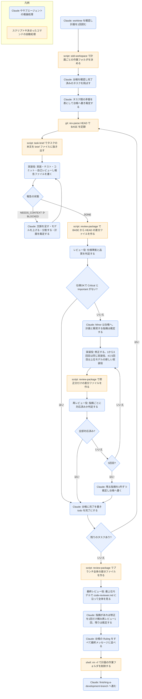

# subagent-driven-development

## ひとことで
実装計画のタスクを1つずつ新しいサブエージェントに実装させ、タスクごとのレビューと最後の全体レビューで品質を保ちながら、止まらずに計画を最後まで実行するスキル。

## 何ができるか
- タスクごとに新しい実装役のサブエージェントを呼ぶ。実装役には会話の履歴を渡さず、タスクの要件ファイル（brief）と必要な文脈だけを渡す。
- 実装役が実装・テスト・コミット・自己レビューをして、報告ファイルに詳しく書き、短い状態（DONE / DONE_WITH_CONCERNS / NEEDS_CONTEXT / BLOCKED）を返す。
- タスクごとにレビュー役を呼び、「仕様に合っているか」と「コード品質」の2つを判定させる。
- 指摘があれば修正ラウンドを回す（1タスク最大5回）。1〜3回目は同じ実装役に直させ、4〜5回目はより上位のモデルの新しい実装役に任せる。毎回、修正部分だけを再レビューする。
- 5回で片付かない指摘は、Claude が1件ずつ裁定し、台帳（ledger）に記録して先へ進む。
- 全タスクのあと、最上位のモデルでブランチ全体をレビューし、指摘があれば修正を1回だけまとめて行う。
- 進み具合を台帳ファイル `progress.md` に残し、会話の圧縮（compaction）で記憶を失っても、完了済みのタスクを二重に実行しない。
- 役割ごとにモデルを選ぶ（機械的な実装は安いモデル、統合や判断は標準、設計と最終レビューは最上位）。

## 使い方
- 呼び出し: 実装計画があり、タスクがほぼ独立していて、サブエージェントが使えるとき、description に従って自動で使われる。明示するなら Skill ツールで `superpowers:subagent-driven-development`。
- 使い分け: 計画がない、またはタスクが強く結びついているときは、先に手作業か brainstorming。ユーザーがインラインを選んだか、サブエージェントが使えないときは `executing-plans`（どちらも SKILL.md の図による。`executing-plans` の中身は未確認）。
- 前提: 作業は分離した作業場所（git の worktree）で行う。main / master で始めるには、ユーザーの明示の同意が要る。
- 起きること:
  1. 計画ごとの作業フォルダを決め、台帳を確認する。途中まで進んだ計画なら、未完了のタスクから再開する。
  2. 計画を1回だけ読み、タスクどうしの矛盾を表にして台帳に書き、裁定してから Task 1 を始める。
  3. タスクごとに「実装 → レビュー →（必要なら修正ラウンド）→ 完了を台帳に記録」を繰り返す。タスクの間で止まって確認を取らない。
  4. 全体レビューと修正のあと、台帳の `Ruling:`（Claude が代わりに決めたこと）をすべて最終メッセージに「Rulings I made」として並べる。
  5. 作業フォルダを削除し、`finishing-a-development-branch` に進む（中身は未確認）。
- 止まって聞くのは次の4つだけ: 元に戻せない・破壊的な操作、セキュリティに関わる操作、作業場所の外への副作用（マージ、共有ブランチへの push、公開）、どの道も推測になるほど壊れた計画。それ以外の迷いは Claude が裁定して進む。

## ロジック
3つの bash スクリプト（`scripts/` の中）が、作業フォルダの決定・タスクの抜き出し・差分パッケージの作成を行う。判断・実装・レビューは Claude とサブエージェントの推論処理。

## 保守者向け
- 場所: `%USERPROFILE%\.claude\plugins\cache\claude-plugins-official\superpowers\6.4.1\skills\subagent-driven-development\`（プラグイン superpowers 6.4.1。Vault 外なので、このノートの作成では読み取りだけ）
  - `SKILL.md`: 手順の本体
  - `implementer-prompt.md`: 実装役のプロンプトのテンプレート（状態の返し方、TDD の証拠、自己レビュー、報告ファイルの書き方）
  - `task-reviewer-prompt.md`: タスクのレビュー役のテンプレート（仕様準拠と品質の2つの判定、「Cannot verify from diff」の扱い）
  - `re-review-prompt.md`: 修正ラウンドの再レビュー役のテンプレート（指摘ごとに ADDRESSED / NOT ADDRESSED）
  - `scripts/sdd-workspace`: 計画ごとの作業フォルダを決めて、そのパスを出力する
  - `scripts/task-brief`: 計画ファイルから `Task N` の見出しの部分を抜き出して brief ファイルに書く（コードブロックの中の見出しは無視）
  - `scripts/review-package`: コミット一覧・変更の統計・前後10行付きの差分を1つのファイルにまとめる。BASE が HEAD の祖先でない、または範囲が空なら終了コード3で止まる
  - 最終レビューは別スキル `requesting-code-review` の `code-reviewer.md` を使う。
- 書き込み先（対象のプロジェクトのリポジトリの中）:
  - `<リポジトリ>/.superpowers/sdd/<計画ファイル名>/`: 台帳 `progress.md`、`plan-path`（どの計画の作業フォルダかの目印）、`task-N-brief.md`、`task-N-report.md`（実装役が書く）、`review-<base7>..<head7>.diff`
  - `<リポジトリ>/.superpowers/sdd/.gitignore`（中身は `*`。作業フォルダを git の対象外にする）
  - コミットは実装役が作る。完了後、作業フォルダは `rm -rf` で削除する。
- 台帳の書式（SKILL.md による）:
  - 1行目: `# SDD ledger — plan: <計画ファイルのパス>`
  - `Task <N>: complete (commits ..., review clean)` / `Task <N>: fix round <R>/5 (...)` / `Task <N>: minor (deferred): ...` / `Task <N>: parked — ... — Ruling: ...`
  - 裁定は `Ruling: <決めたこと> — <理由> — <間違っていたときの代償>`
- 制約:
  - 実装役を並列に動かさない（衝突するため）。
  - 実装役・レビュー役は、さらにサブエージェントを呼ばない。
  - Claude（コントローラー）は自分で修正しない（レビューを飛ばすことになるため）。
  - サブエージェントを呼ぶときは、必ずモデルを明示する（省くとセッションの高価なモデルを引き継ぐため）。
  - タスクの間で「続けますか」と確認を取らない。
- 注意:
  - SKILL.md とテンプレートは英語で書かれている。
  - プラグイン領域のスキルなので、Vault の Git では追跡されない（Vault 外にあるため）。プラグインの更新でバージョンのフォルダが変わると、上の場所も変わる。
  - スクリプトは bash で動く（Windows では Git Bash などが要る）。
  - `git clean -fdx` を実行すると作業フォルダ（台帳を含む）が消える。そのときは `git log` から復元する（SKILL.md による）。
  - 「タスクの間で確認を取らない」「迷いは Claude が裁定して進む」という方針は、ユーザーの CLAUDE.md の「推測で埋めるしかない場合は質問して合意してから進める」と異なる。どちらを優先するかは SKILL.md に記載がなく、未確認。
  - 参照先の別スキル `using-git-worktrees`・`executing-plans`・`finishing-a-development-branch` の中身は未確認。
