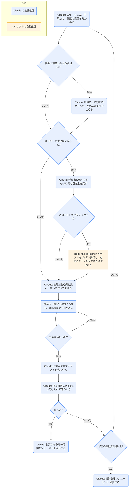

# systematic-debugging

## ひとことで
バグやテストの失敗に出会ったとき、修正を試す前に、4つの段階で根本原因を突き止めさせるスキル。

## 何ができるか
- 鉄則は「根本原因の調査より先に修正しない」。症状だけを直すことを失敗とみなす。
- 4つの段階を順に進める。
  1. 根本原因の調査: エラーメッセージとスタックトレースを最後まで読む、確実に再現させる、最近の変更（git diff、依存、設定）を確かめる。複数の部品からなる仕組みでは、境界ごとに診断ログを入れて、どこで壊れるかを1回の実行で突き止める。呼び出しの深い所で起きるなら、呼び出し元へさかのぼる。
  2. パターンの分析: 同じコードベースで動いている似た例を探し、参考実装を全部読み、違いを1つ残らず挙げる。
  3. 仮説と検証: 「X が原因、なぜなら Y」と仮説を1つだけ立て、最小の変更で1つずつ確かめる。外れたら修正を重ねず、新しい仮説を立てる。
  4. 実装: 失敗するテストを先に作り、根本原因に対して修正を1つだけ入れ、確かめる。
- 修正が3回失敗したら、それ以上直さず、設計（アーキテクチャ）そのものを疑い、ユーザーと相談する。
- 補助の技法を同じフォルダに持つ。
  - 根本原因の追跡（`root-cause-tracing.md`）: 呼び出しをさかのぼり、元の引き金で直す。手で追えないときはスタックトレースを出力する。
  - 多層の防御（`defense-in-depth.md`）: 原因を直したあと、入口・業務ロジック・環境ガード・デバッグログの4層で検証を足し、バグを構造的に起こらなくする。
  - 条件に基づく待機（`condition-based-waiting.md`）: テストの当て推量の待ち時間（sleep など）を、条件が満たされるまでのポーリングに置き換える。
  - 汚染の犯人探し（`find-polluter.sh`）: テストの途中で不要なファイルなどができるとき、どのテストが作ったかを探す。

## 使い方
- 呼び出し: バグ、テストの失敗、想定外の挙動に出会ったとき、修正を提案する前に、description に従って自動で使われる。明示するなら Skill ツールで `superpowers:systematic-debugging`。
- 特に使う場面: 時間に追われているとき、「すぐ直せそう」に見えるとき、すでに何度か修正を試したとき、問題を十分に理解していないとき。
- 例: 「テストが落ちる。直して」と頼むと、Claude はすぐには直さず、エラーを読み、再現させ、最近の変更を確かめてから、仮説を1つ立てて確かめる。
- 汚染の犯人探しの例（`root-cause-tracing.md` による）: `bash ./find-polluter.sh '.git' 'src/**/*.test.ts'` を実行すると、テストファイルを1件ずつ `npm test` で走らせ、`.git` ができた時点で、そのテストの名前を出して止まる。
- ユーザーの「本当にそうなっている？」「推測はやめて」「行き詰まった？」といった言葉は、やり方が間違っている合図として扱い、段階1に戻る。
- 調べ尽くしても環境やタイミングなど外部が原因だと分かったときは、調べた内容を記録し、再試行・タイムアウト・エラーメッセージなどの対処と、今後のためのログを入れる。

## ロジック
処理の大半は Claude の推論処理。スクリプトは、汚染の犯人探しの `find-polluter.sh` だけ（必要なときだけ使う）。

## 保守者向け
- 場所: `%USERPROFILE%\.claude\plugins\cache\claude-plugins-official\superpowers\6.4.1\skills\systematic-debugging\`（プラグイン superpowers 6.4.1。Vault 外なので、このノートの作成では読み取りだけ）
  - `SKILL.md`: 4つの段階の本体
  - `root-cause-tracing.md`・`defense-in-depth.md`・`condition-based-waiting.md`: 補助の技法（SKILL.md から参照される）
  - `condition-based-waiting-example.ts`: 条件待ちの関数（`waitForEvent`・`waitForEventCount`・`waitForEventMatch`）の実例。10ms ごとにポーリングし、既定5000ms でタイムアウトする。特定のプロジェクト（Lace）の型を import しているので、そのままでは動かない参考コード。
  - `find-polluter.sh`: 汚染の犯人探しの bash スクリプト
  - `CREATION-LOG.md`: このスキルを作ったときの記録（抽出の方針、圧力に強い書き方、検証の結果）
  - `test-academic.md`・`test-pressure-1.md`〜`test-pressure-3.md`: スキルの検証用のシナリオ（知識を問う問題と、時間・サンクコスト・権威の圧力の下で A/B/C を選ばせる問題）。SKILL.md からは参照されない。
- 書き込み先: スキル自体はない。診断ログ・テスト・修正は、対象のプロジェクトのコードに対して行う。
- `find-polluter.sh` の仕様:
  - 引数は2つ（調べるファイルかフォルダ、テストファイルのパターン）。数が違えば使い方を出して終了コード1。
  - テストの実行は `npm test <ファイル>` 固定（npm のプロジェクト向け）。
  - 犯人が見つかれば終了コード1、見つからなければ0。実行前から対象が存在するときは、そのテストを飛ばす。
  - 冒頭のコメントでは「Bisection（二分探索）」とあるが、処理はテストファイルを先頭から1件ずつ順に実行する。
- 関連する別スキル: 段階4で `superpowers:test-driven-development` と `superpowers:verification-before-completion` を使うよう指示している（後者の中身は未確認）。
- 注意:
  - SKILL.md と補助ファイルは英語で書かれている。
  - プラグイン領域のスキルなので、Vault の Git では追跡されない（Vault 外にあるため）。プラグインの更新でバージョンのフォルダが変わると、上の場所も変わる。
  - `find-polluter.sh` は bash で動く（Windows では Git Bash などが要る）。
