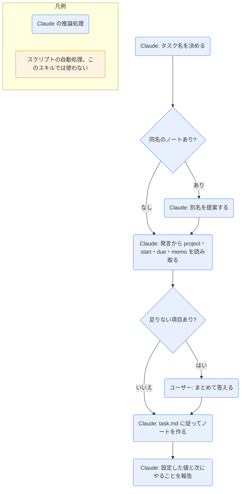

# task-add

## ひとことで
タスクのノートを `20_tasks/` に作るスキル。プロパティはテンプレートから埋める。

## 何ができるか
- `20_tasks/<タスク名>.md`（1タスク1ノート、フラット）を、`templates/task.md` に従って作る。
- 発言から `project`・`start`・`due`・`memo` を読み取り、足りないものだけまとめて聞く。

## 使い方
- 呼び出し: 「タスクを追加して」「〇〇をタスクにして」と言うか、`/task-add`。
- 起きること:
  1. タスク名を決める（日本語・簡潔）。同名のノートが既にあれば、上書きせず、別名を提案する。
  2. 項目を読み取る。
     - `project`: `10_projects/` のプロジェクト名から該当を推奨として示す（`"[[プロジェクト名]]"` の形式）。属さなければ空。
     - `start` / `due`: `YYYY-MM-DD`。「明日」「来週金曜」などは日付に直して確認する。無ければ空。
     - `memo`: 任意。
  3. `status` は `todo`（すでに着手中なら `doing`）。`completed` は空。`created` は今日。
  4. ファイルを作り、設定した値と次にやること（分解したいなら `task-split`）を報告する。
- 完了済みとして作る場合は、`status: done` と `completed` の両方を入れる。
- 既存のタスクは変更しない。

## ロジック
スクリプトなし（すべて Claude の推論処理）。

## 保守者向け
- 場所: `.claude/skills/task-add/SKILL.md`
- 使うテンプレート: `90_system/templates/task.md`
- 読む: `10_projects/` のプロジェクト名（`project` の候補のため）
- 書く: `20_tasks/<タスク名>.md`
- 制約: 既存のタスクは変更しない。名前には Windows で使えない文字（`\ / : * ? " < > |`）を使わない。完了にするときは `status: done` と `completed` を必ず両方入れる（デイリーのダッシュボードが参照する）。
- 注意: 作成直後で、実際に実行して動作を確かめてはいない（未検証）。
