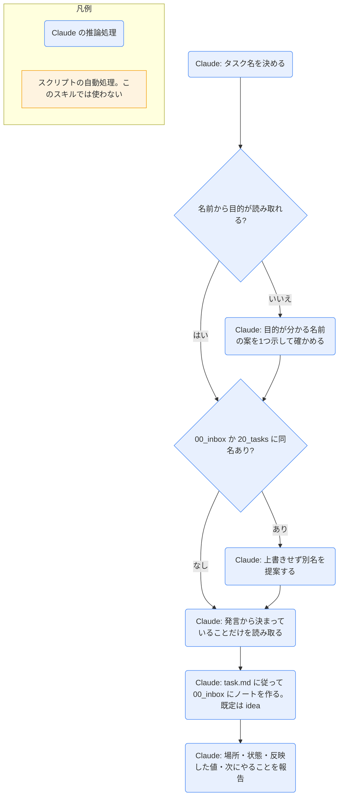

# task-add

## ひとことで
思いつきをすぐタスクにする入口。タスクのノートを `00_inbox/` に、状態 `idea`・名前だけで素早く作るスキル（振り分けは `daily-end`）。

## 何ができるか
- `00_inbox/<タスク名>.md` を、`90_system/templates/task.md` に従って作る。確認は取らずに作る。
- 既定は `status: idea` で、`start` / `due` / `completed` / `project` は空、`created` は今日。本文はテンプレートの見出し（完了条件 / チェックリスト / 経緯 / 成果）のまま。
- 発言にすでに決まっていることがあれば、それだけを反映する。
  - やると決めていて日付があれば `status: todo` と `start` / `due`（片方だけなら、もう片方は当日）。
  - 背景は「経緯」に `### YYYY-MM-DD` の見出しを付けて書く。
  - 書かれていないことは足さない。
- 完了済みとして作る場合は `status: done` と `completed` の両方を入れる。

## 使い方
- 呼び出し: 「タスクを追加して」「〇〇をタスクにして」と言うか、`/task-add`。
- 起きること:
  1. タスク名を決める（目的を表す日本語で簡潔に）。名前から目的が読み取れない（「資料」「確認」だけなど）ときは、作る前に、目的が分かる名前の案を1つ示して一言だけ確かめる。
  2. `00_inbox/` と `20_tasks/` に同名のノートがあれば、上書きせず、別名を提案する。
  3. ノートを作り、「作ったタスク（場所と状態）・反映した値・次にやること」が報告される。次にやることの例: 振り分けは `daily-end`、分解は `task-split`、任せるなら `task-run`。
- Obsidian で作るときは、`Ctrl+N` → `Ctrl+Shift+N` でタスクのテンプレートを挿入する（CLAUDE.md の記載）。

## ロジック
スクリプトなし（すべて Claude の推論処理）。

## 保守者向け
- 場所: `.claude/skills/task-add/SKILL.md`
- 使うテンプレート: `90_system/templates/task.md`
- 読む: `00_inbox/` と `20_tasks/`（同名の確認）
- 書く: `00_inbox/<タスク名>.md`（新規のみ）
- 制約:
  - 振り分け（`project` を決めて `20_tasks/` へ移す、状態と日付を決める）は `daily-end` が行う。このスキルでは移動しない。
  - 既存のタスクは変更しない。
  - 名前には Windows で使えない文字（`\ / : * ? " < > |`）を使わない。
  - 完了にするときは `status: done` と `completed` を必ず両方入れる（デイリーのダッシュボードが参照する）。
- 補足: `00_inbox/` の直下のタスクも、ダッシュボードとガントの対象になる（`idea` は「アイデア・インボックス」に出て、ガントには出ない）。Claude がタスクを作ると、フックでガントが更新される。
- 注意: 実際に実行して動作を確かめてはいない（未検証）。
