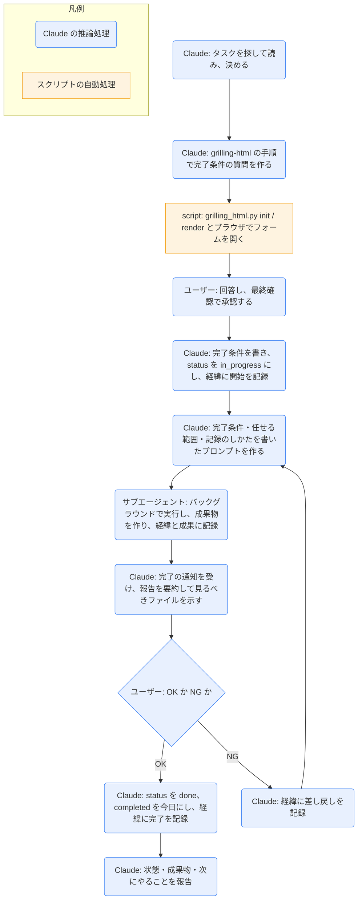

# task-run

## ひとことで
タスクを `grilling-html` で具体化して「完了条件」を決め、承認後にサブエージェントがバックグラウンドで実行し、結果をタスクの「経緯」と「成果」に記録するスキル。ユーザーが確認して OK なら完了、NG なら差し戻して再実行する。

## 何ができるか
- タスクの完了条件を、`grilling-html` の質問フォームで詰める。少なくとも次を決める。
  - 成果物: 形（ノートか、既存ノートへの追記か）・置き場所（調べものは `40_research/`、資料は `10_projects/<名前>/` か `50_documents/`、知識は `30_knowledge/`）・名前
  - 範囲と、やらないこと
  - 使ってよい情報源（Vault のノート、Web など）
  - 完了の判定（何がそろえば OK か）
  - 期限（`due`）
- 承認された完了条件をタスクの `## 完了条件` に書き、`status: in_progress` にして、サブエージェントに実行させる。
- サブエージェントは、成果物を作り、タスクの `## 経緯` に行ったこと・分かったこと・判断したこと・うまくいかなかったことを、`## 成果` に成果物へのリンクを足す。
- 結果をユーザーが確認し、OK なら `done`、NG なら差し戻しの内容を加えて再実行する。
- 任せる範囲は、Vault の中で完結する作業だけ（調べもの（Web の検索・閲覧による読み取り）、資料・文章の下書き、ノートの整理・要約）。外部への送信・公開（メール、投稿、push、フォームの送信など）、Vault の外のファイルの変更、ノートの削除、ほかのタスクの状態の変更はしない。

## 使い方
- 呼び出し: 「タスクを進めて」「〇〇を任せる」と言うか、`/task-run`。
- 起きること:
  1. タスクを決める（`20_tasks/` と `00_inbox/` から探す。曖昧なら候補から選ぶ）。タイトルから目的が読み取れないときは、名前の変更案が出る。
  2. ブラウザに `grilling-html` の質問フォームが開くので、答えて完了条件を詰める。すでに「完了条件」が十分なら、確認の1ラウンドだけになる。
  3. 最終確認で承認すると、完了条件がタスクに書かれ、`status: in_progress`・`start`（空なら今日）・`due` が入り、実行が始まる。
  4. 実行はバックグラウンドで進むので、その間はほかの作業をしてよい。完了すると Windows の通知が出る。
  5. 報告の要約と、見るべきファイル（タスクのノートと成果物）が示されるので、OK か NG かを答える。
  6. OK なら完了（`status: done`・`completed`）。NG なら差し戻しの内容を伝えると、再実行される。完了条件を変えるときは、具体化からやり直す。
- 完了したあとは、必要なら `knowledge-harvest` で知識を取り出す（次にやることとして案内される）。

## ロジック
スクリプトを直接は使わない。具体化は `grilling-html` の手順（`grilling_html.py` とブラウザ操作）に従う。実行はサブエージェント（Agent ツール）が行う。

- サブエージェントの処理も、Claude の推論処理として図に含める。
- 完了条件を変えるときは、`G` の NG から `B`（具体化）に戻る（図では省略）。

## 保守者向け
- 場所: `.claude/skills/task-run/SKILL.md`（スクリプトは持たない）
- 使うスキル: `grilling-html`（`.claude/skills/grilling-html/`。セッションは `00_inbox/` にできる）
- サブエージェントの呼び方: Agent ツールを `subagent_type: general-purpose`、`run_in_background: true` で呼ぶ。サブエージェントは会話を見られないので、プロンプトに次をすべて書く。
  - タスクのノートのパスと、完了条件の全文
  - 任せる範囲（SKILL.md の「任せる範囲」をそのまま）と、CLAUDE.md・`80_context/_rules.md` に従うこと
  - 成果物の書き方（テンプレートに従う、`created` は今日、`project` はタスクと同じ、出典を残す、確かめていないことは「未確認」、既存のノートは上書きしない）
  - 記録のしかた（`## 経緯` の `### <今日>` の下に箇条書きで足す、`## 成果` に `- [[ノート名]]` を足す、タスクの frontmatter は変えない）
  - 最後の報告（作成・変更したファイルの一覧、完了条件の各項目の達成状況、未解決の点）
  - 取り消せない操作や外部への送信が必要になったら、そこで止めて報告すること
- 書く（Claude）: タスクの `## 完了条件`、frontmatter（`status`・`start`・`due`・`completed`）、`## 経緯` の開始・完了・差し戻しの記録
- 書く（サブエージェント）: 成果物のノート、タスクの `## 経緯` と `## 成果`
- 制約:
  - 完了条件の承認までは、タスクの frontmatter を変えず、実行もしない。
  - サブエージェントの報告は作業者の報告であって、ユーザーの承認ではない。完了の判断は、必ずユーザーの確認で行う。
- 補足: 完了の通知は、フック（`.claude/hooks/vault_hooks.py` から `notify.py`）による Windows の通知（CLAUDE.md の「フックと通知」による）。サブエージェントの完了でこの通知が出ることは、未確認。
- 注意: 実際に実行して動作を確かめてはいない（未検証）。SKILL.md に `allowed-tools` はなく、`grilling-html` のスクリプトを実行するときに許可を求められるかは未確認。
