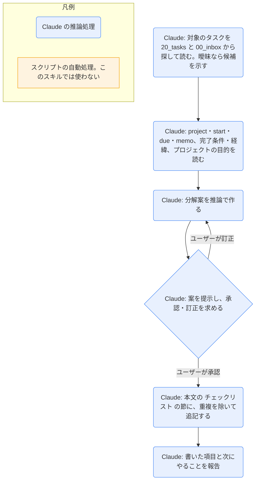

# task-split

## ひとことで
タスクを、Claude の推論でチェックリスト（マイルストーン）に分解し、承認・訂正を経て、タスク本文の「チェックリスト」に書き込むスキル。

## 何ができるか
- 対象のタスク（`20_tasks/` か `00_inbox/`）と、紐づくプロジェクトの目的を読み、完了を判定できる粒度の項目（目安は3〜8個）に分解した案を出す。
- 案を提示して、ユーザーの承認・訂正を求める。承認後に、タスク本文の `## チェックリスト` に書く。
- 子タスクのノートは作らない。親タスクの本文にだけ書く。frontmatter は変更しない。

## 使い方
- 呼び出し: 「タスクを分解して」「〇〇を細かくして」と言うか、`/task-split`。
- 案の書式（期限は任意。無ければ `期限:` ごと省く）:
  ```
  - [ ] 項目名 期限:YYYY-MM-DD
  ```
- 起きること: 対象を決める（曖昧なら候補から選ぶ）→ 分解案を提示 → 承認・訂正 → 本文に書き込み → 「書き込んだ項目・次にやること」を報告。
- 書き込む場所: `## チェックリスト` の節の `<!-- gantt:start -->` 〜 `<!-- gantt:end -->` の間（ガントに出るのはこの間の項目だけ）。マーカーがなければ見出しの直後に作り、見出しもなければ `## 経緯` の前（それもなければ本文の末尾）に見出しとマーカーを作る。マーカーの外の既存の項目は動かさない。既存の項目は置き換えず、重複を除いて追記する。
- 根拠のない項目や期限は作らない。期限は、`start` / `due` などから妥当と言える場合だけ案として付く。
- ガントでの見え方: マイルストーン（◇）として、タスクの表示開始日の位置に出る。期限は名前の後ろに付くだけで位置は変わらない。期限が基準日より前の未完了項目は赤、完了項目（`- [x]`）はグレー。ガントへは、タスクの編集後のフックで自動で反映される（Obsidian で編集したときは `gantt-update`）。
- 項目は、完了したら `- [x]` にする（ユーザーが行う。タスク自体の `status: done` / `completed` とは別）。

## ロジック
スクリプトなし（すべて Claude の推論処理）。ガントへの表示は、`daily-start` のスクリプトが本文のマーカーの間のチェックリストを読んで行う（このスキルの処理ではない）。



## 保守者向け
- 場所: `.claude/skills/task-split/SKILL.md`
- 読む: 対象のタスク（`project` `start` `due` `memo` と本文。タイトル＝目的、「完了条件」「経緯」）、`10_projects/<名前>/<名前>.md`（目的）
- 書く: 対象タスクの本文の `## チェックリスト` の節だけ。frontmatter は変更しない。
- 制約: 承認・訂正があるまで、ファイルを編集しない。外部サービスへ情報を送らない。
- 関連: ガントのマイルストーン表示は `.claude/skills/daily-start/daily_start.py` の `parse_checklist` / `milestone_line`。チェックリストの書式を変えるときは、スキルとスクリプトの両方を直す。`parse_checklist` は、本文の `<!-- gantt:start -->` 〜 `<!-- gantt:end -->` の間（組は複数でもよい）の `- [ ]` / `- [x]` の行だけをマイルストーンにする。マーカーが無いタスクや、閉じていない `start` からは何も拾わない。デイリーノートのガントのマーカーと同じ文字列だが、置き換えるのはデイリーノートの中だけなので、タスクノートのマーカーが書き換えられることはない。
- ガントに出る条件（`daily_start.py` の `collect_gantt_tasks`）:
  - マイルストーンは、親タスクがガントに出るときだけ出る。`idea`・`shelved`・`cancelled` のタスクや、`start` / `due` が空のタスクは、ガントに出ないので、分解した項目も出ない（`00_inbox/` の `idea` を分解しても、`todo` にして日付を入れるまではガントに出ない）。
  - 「表示開始日」は、タスクの `start` がガントの左端（ノートの日付）より前なら左端になる。
- 注意: 実際に実行して動作を確かめてはいない（未検証）。
