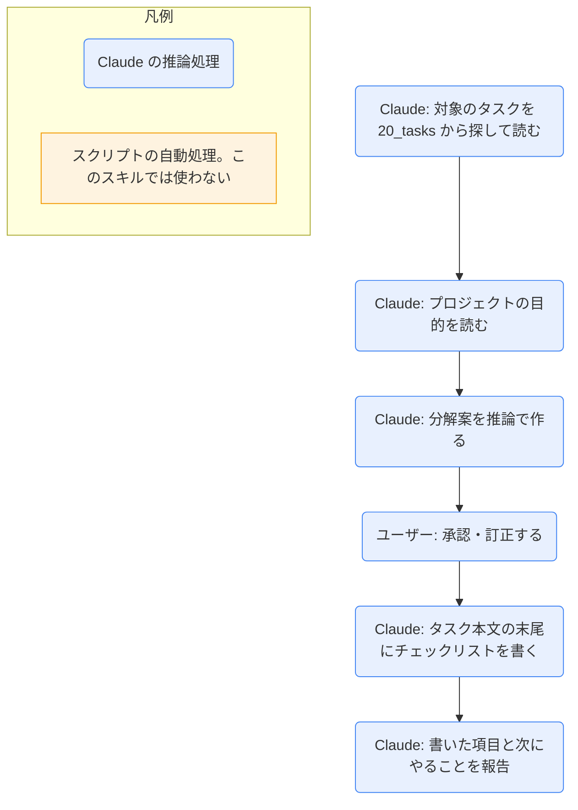

# task-split

## ひとことで
タスクを、Claude の推論でチェックリスト（マイルストーン）に分解し、承認・訂正を経て、タスク本文に書き込むスキル。

## 何ができるか
- 対象のタスクと、紐づくプロジェクトの目的を読み、完了を判定できる粒度の項目（目安は3〜8個）に分解した案を出す。
- 案を提示して、ユーザーの承認・訂正を求める。承認後に、タスク本文の末尾へチェックリストとして書く。
- 子タスクのノートは作らない。親タスクの本文にだけ書く。

## 使い方
- 呼び出し: 「タスクを分解して」「〇〇を細かくして」と言うか、`/task-split`。
- 案の書式（期限は任意。無ければ `期限:` ごと省く）:
  ```
  - [ ] 項目名 期限:YYYY-MM-DD
  ```
- 起きること: 対象を決める → 分解案を提示 → 承認・訂正 → 本文に書き込み → 結果を報告。
- 既存のチェックリストがあれば、置き換えず、重複を除いて追記する。
- 根拠のない項目や期限は作らない。期限は、`start` / `due` などから妥当と言える場合だけ案として付く。
- ガントでの見え方: マイルストーン（◇）として、タスクの開始日の位置に出る。期限は名前の後ろに付くだけで位置は変わらない。期限が基準日より前の未完了項目は赤、完了項目（`- [x]`）はグレー。ガントへの反映は、`gantt-update` スキルで行える（実行はユーザーの指示があるときだけ）。
- 項目は、完了したら `- [x]` にする（ユーザーが行う。タスク自体の `status: done` / `completed` とは別）。

## ロジック
スクリプトなし（すべて Claude の推論処理）。ガントへの表示は、`daily-start` のスクリプトが本文のチェックリストを読んで行う（このスキルの処理ではない）。



## 保守者向け
- 場所: `.claude/skills/task-split/SKILL.md`
- 読む: `20_tasks/<タスク>.md`（`project` `start` `due` `memo` と本文）、`10_projects/<名前>/<名前>.md`（目的）
- 書く: 対象タスクの本文の末尾のみ。frontmatter は変更しない。
- 制約: 承認・訂正があるまで、ファイルを編集しない。外部サービスへ情報を送らない。
- 関連: ガントのマイルストーン表示は `.claude/skills/daily-start/daily_start.py` の `parse_checklist` / `milestone_line`。チェックリストの書式を変えるときは、スキルとスクリプトの両方を直す。
- 注意: 作成直後で、実際に実行して動作を確かめてはいない（未検証）。ガントの赤・グレーの見え方も、Obsidian では未確認。
