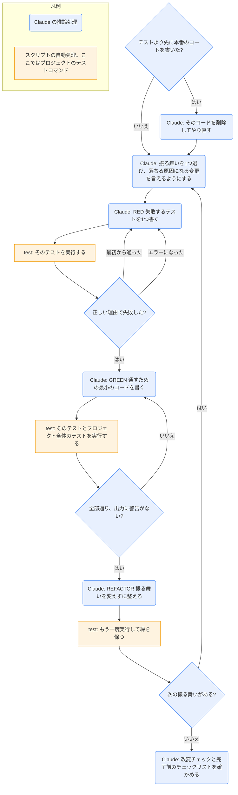

# test-driven-development

## ひとことで
機能やバグ修正を実装する前に、まず失敗するテストを書き、失敗を見てから最小のコードで通す（RED → GREEN → REFACTOR）ことを守らせるスキル。

## 何ができるか
- 鉄則は「失敗するテストなしに本番のコードを書かない」。テストより先に書いたコードは、参考に取っておかず削除してやり直す。
- 1つの振る舞いごとに次の順で進める。
  - RED: 振る舞いを1つだけ示す、名前の明確なテストを書く（モックは避けられないときだけ）。
  - RED の確認（必須）: テストを実行し、エラーではなく「失敗」すること、失敗の理由が「機能がないから」であることを確かめる。最初から通るなら、既存の挙動を試しているのでテストを直す。
  - GREEN: テストを通すための最も単純なコードを書く。機能を足したり、ほかを直したりしない。
  - GREEN の確認（必須）: そのテストに加え、プロジェクト全体のテストを実行し、すべて通って出力に警告がないことを確かめる。テストが落ちたら、テストではなくコードを直す。
  - REFACTOR: 緑のまま、重複の除去・命名の改善・ヘルパーの抽出だけをする。振る舞いは足さない。
- テストの書き方の規則を `writing-good-tests.md` に持つ。
  - テストを書く前に「どんな本番の変更でこのテストが落ちるか」を言えるようにする。
  - 期待値はコードを使わず、手で求めたリテラルにする。
  - 定数の値や文言など、意図的な決定だけで落ちるテスト（変更検知器）を書かない。
  - モックの存在を確かめる assert を書かない。モックは遅い・外部の部分だけにし、本物の構造をすべて写す。
  - テストだけが使う後片付けのメソッドは、本番のクラスではなくテスト用のユーティリティに置く。
  - 仕上げに、本番のコードを頭の中で改変し（定数の誤り、分岐の誤り、戻り値が空など）、どれかのテストが落ちるかを確かめる。
- 完了前のチェックリスト（新しい関数にテストがある、各テストの失敗を見た、最小のコードで通した、全テストが通る、出力がきれい、など）を全部満たせなければ、TDD を飛ばしたとみなしてやり直す。

## 使い方
- 呼び出し: 機能やバグ修正を実装するとき、実装のコードを書く前に、description に従って自動で使われる。明示するなら Skill ツールで `superpowers:test-driven-development`。
- 対象: 新機能、バグ修正、リファクタ、挙動の変更。
- 例外（ユーザーに確認する）: 使い捨ての試作、生成されたコード、設定ファイル。
- 例（バグ「空のメールアドレスが通ってしまう」）:
  1. RED: 「空のメールアドレスは `Email required` のエラーになる」テストを書く。
  2. 実行して、`expected 'Email required', got undefined` で失敗するのを確かめる。
  3. GREEN: 空なら `{ error: 'Email required' }` を返すコードを足す。
  4. 実行して通るのを確かめ、必要ならリファクタする。
- 行き詰まったとき: テストの書き方が分からなければ、使いたい API の形と assert から書く。テストが複雑すぎる・モックだらけになるのは、設計が複雑すぎる・結合が強すぎる合図として扱う。
- バグを見つけたら、まずそれを再現する失敗テストを書き、このサイクルで直す（テストのないバグ修正はしない）。

## ロジック
スキル付属のスクリプトはない。四角は、Claude が実行するプロジェクトのテストコマンド（`npm test`・`pytest`・`cargo test` など、リポジトリで使っているもの）。

## 保守者向け
- 場所: `%USERPROFILE%\.claude\plugins\cache\claude-plugins-official\superpowers\6.4.1\skills\test-driven-development\`（プラグイン superpowers 6.4.1。Vault 外なので、このノートの作成では読み取りだけ）
  - `SKILL.md`: RED-GREEN-REFACTOR の手順、よくある言い訳と反論、危険信号、チェックリスト
  - `writing-good-tests.md`: テストの書き方の規則（「壊れ方を名指しする」「本物を動かす」の2原則と、それぞれの関門の手順）
- 書き込み先: スキル自体はない。テストと実装は、対象のプロジェクトのコードに対して行う。
- 制約:
  - テストの失敗と成功を、必ず実行して自分の目で確かめる（RED と GREEN の確認は省略できない）。
  - 「全体のテスト」はプロジェクトのテスト一式を指す。自分の書いたファイルだけの成功では足りない。自分が原因でない失敗も、名前を挙げて報告する。
  - 例外は、ユーザーの許可があるときだけ。
- 注意:
  - SKILL.md と補助ファイルは英語で書かれている。
  - プラグイン領域のスキルなので、Vault の Git では追跡されない（Vault 外にあるため）。プラグインの更新でバージョンのフォルダが変わると、上の場所も変わる。
  - ほかのスキルから使われる: `systematic-debugging` の段階4（失敗するテストを作る）、`subagent-driven-development` の実装役（タスクが TDD を求めるとき、RED と GREEN の証拠を報告ファイルに書く）。
  - `writing-good-tests.md` は、スキルや文書の検証は `superpowers:writing-skills` で行うとしている（その中身は未確認）。
