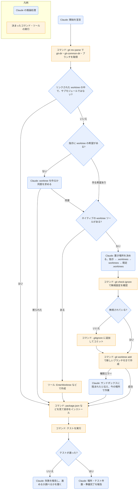

# using-git-worktrees

## ひとことで
機能の作業を始める前に、今のブランチから切り離した作業場所（git worktree）を用意するスキル。superpowers プラグインのスキル。

## 何ができるか
- 今いる場所が、すでに切り離された worktree の中かを先に調べる。中なら新しく作らない。
- サブモジュールの中を worktree と取り違えないよう、確認のコマンドを挟む。
- 作業場所の作り方は、次の順で選ぶ。
  - ハーネスのネイティブのツール（`EnterWorktree`、`/worktree` コマンド、`--worktree` フラグなど）があれば、それを使う。
  - なければ、`git worktree add` で手作業で作る。
- 手作業で作るときの置き場所は、指示にある希望 → 既存の `.worktrees/` → 既存の `worktrees/` → 既定の `.worktrees/` の順で決める。
- 置き場所が `.gitignore` で無視されているかを確かめ、無視されていなければ `.gitignore` に足してコミットする。
- 作ったあと、プロジェクトの種類に応じて依存をインストールし（Node.js・Rust・Python・Go）、テストを流して、きれいな出発点かを確かめる。

## 使い方
- 呼び出し: `/superpowers:using-git-worktrees`。または description にある場面（作業場所を分けたい機能の作業を始めるとき、実装計画を実行する前）で Claude が使う。
- 起きること:
  - 開始時に Claude が「I'm using the using-git-worktrees skill to set up an isolated workspace.」と宣言する。
  - 通常のチェックアウトの中にいて、指示に worktree の希望が書かれていなければ、「worktree を作りますか」と同意を求める。断れば、その場で作業する。
  - 作り終えると、場所・テスト結果・準備完了を報告する。
- テストが失敗したら、Claude が失敗を報告し、進めるか調べるかを聞く。
- サンドボックスに作成を阻まれたら、その旨を伝え、今のディレクトリで作業する。
- 関係するスキル: `writing-plans`（計画の実行時に worktree が要るなら、このスキルで作る前提）。`executing-plans` と `subagent-driven-development` もこのスキルを参照する（SKILL.md の grep で確認）。

## ロジック
同梱のスクリプトはない。SKILL.md に書かれた決まったコマンド（git、依存のインストール、テスト）を Claude が実行する。図では、決まったコマンドやツールの実行を四角、判断と報告を丸角で示す。分岐はコマンドの出力を Claude が読んで判断するので、すべて ai クラスにする。

## 保守者向け
- 場所: `%USERPROFILE%\.claude\plugins\cache\claude-plugins-official\superpowers\6.4.1\skills\using-git-worktrees\SKILL.md`（プラグイン superpowers 6.4.1。Vault 外なので、このノートの作成では読み取りだけ）
- 同じフォルダのファイル: `SKILL.md` だけ。スクリプト・テンプレートは持たない。
- 書き込み先（作業するプロジェクトの中）:
  - worktree のフォルダ（手作業で作るときは `<置き場所>/<ブランチ名>`）と新しいブランチ
  - `.gitignore`（置き場所が無視されていないときに追記し、コミットする）
  - 依存のインストールの結果（`npm install` など）
- 使うコマンド: `git rev-parse --git-dir` / `--git-common-dir` / `--show-superproject-working-tree`、`git branch --show-current`、`git check-ignore`、`git worktree add`、各言語の依存のインストールとテスト。
- 注意:
  - SKILL.md は英語で書かれている。
  - プラグイン領域のファイルなので、Vault の Git では追跡されない（Vault 外にあるため）。プラグインの更新で中身が変わる可能性がある。
  - ネイティブのツールを使わずに `git worktree add` を使うと、ハーネスが管理できない状態ができると SKILL.md は警告している。
  - このスキルは、置き場所が無視されていなければ `.gitignore` の変更をコミットする。一方、Vault の `CLAUDE.md` では「Claude はコミット・push をしない」「ブランチは `main` だけで、作業用のブランチは切らない」と決めている。`using-superpowers` には「ユーザーの指示（CLAUDE.md など）がスキルより優先」とある。
  - プラグインが Vault で有効かどうかは未確認。`installed_plugins.json` には登録があるが、このノートを作ったセッションのスキル一覧には superpowers のスキルが出ていなかった。
