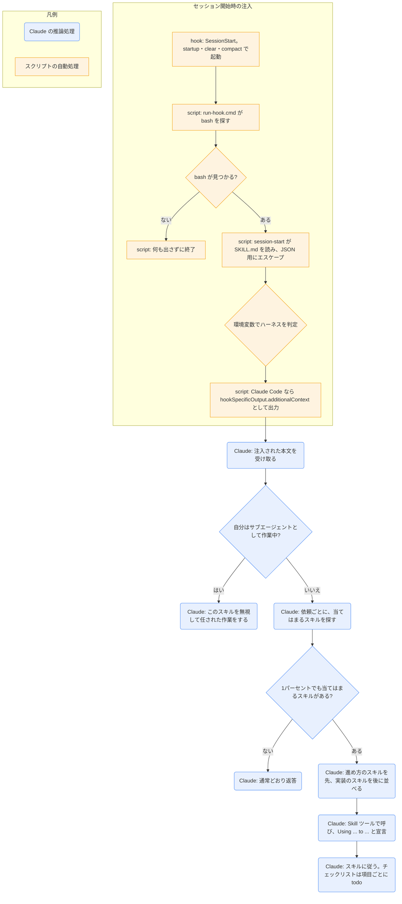

# using-superpowers

## ひとことで
superpowers プラグインの入口のスキル。「少しでも当てはまるスキルがあれば、返答や行動の前に必ず使う」というルールを Claude に課す。セッション開始時のフックで、本文がそのまま Claude に注入される。

## 何ができるか
- 返答・行動の前（確認の質問、コードの調査、ファイルの確認の前も含む）に、当てはまるスキルを Skill ツールで呼ぶよう求める。1% でも当てはまりそうなら呼ぶ。外れていたら使わなくてよい。
- スキルを使うときは「Using [skill] to [purpose]」と宣言し、スキルに忠実に従う。チェックリストがあれば項目ごとに todo を作る。
- プランモードに入る前に、まだなら `brainstorming` を先に呼ぶ。
- 複数のスキルが当てはまるときは、進め方を決めるスキル（`brainstorming`、`systematic-debugging` など）を先に、実装のスキルを後に使う。
  - 例: 「X を作ろう」→ `brainstorming` が先。「このバグを直して」→ `systematic-debugging` が先。
- スキルを避けようとする言い訳（「簡単な質問だから」「先に文脈を集めたい」など）を「Red Flags」の表で打ち消す。
- ハーネスごとの補足（Claude Code・Codex・Pi・Antigravity・Hermes Agent・Muse）を `references/` に分けて持つ。
- 優先順位: ユーザーの指示（CLAUDE.md・AGENTS.md・GEMINI.md・直接の依頼）＞ スキル ＞ 既定の動き。

## 使い方
- 利用者が呼ぶ必要は基本的にない。プラグインが有効なら、セッション開始時（`startup` / `clear` / `compact`）にフックが本文を Claude に渡す。
- 手で呼ぶときは `/superpowers:using-superpowers`。description は「会話を始めるとき」。
- 起きること: 以後の各依頼で、Claude がまず当てはまるスキルを探して呼び、「Using ... to ...」と宣言してから作業する。
- サブエージェントとして特定の作業を任された Claude は、このスキルを無視する（本文冒頭の `SUBAGENT-STOP`）。
- スキルの手順を飛ばすのは、利用者が明示的にそう指示したときだけ。

## ロジック
2つの部分に分かれる。セッション開始時の注入はフックのスクリプト、注入後のスキル選びは Claude の推論。

- フックの出力形式は環境変数で切り替わる。`CURSOR_PLUGIN_ROOT` があれば Cursor 用（`additional_context`）、`CLAUDE_PLUGIN_ROOT` があり `COPILOT_CLI` と `MUSE_PLUGIN_ROOT` がなければ Claude Code 用、`MUSE_PLUGIN_ROOT` があれば Muse 用、それ以外は `additionalContext`（トップレベル）。
- 注入される文は `<EXTREMELY_IMPORTANT>` で囲まれ、「You have superpowers.」と、SKILL.md の全文が入る。

## 保守者向け
- 場所: `%USERPROFILE%\.claude\plugins\cache\claude-plugins-official\superpowers\6.4.1\skills\using-superpowers\SKILL.md`（プラグイン superpowers 6.4.1。Vault 外なので、このノートの作成では読み取りだけ）
- 同じフォルダのファイル: `references\` にハーネスごとの補足（`claude-code-tools.md`・`codex-tools.md`・`gemini-tools.md`・`pi-tools.md`・`antigravity-tools.md`・`hermes-tools.md`・`muse-tools.md`）。
  - 読んだのは `claude-code-tools.md` だけ。内容は、利用者が頼んだときに、計画全体の `subagent-driven-development` を中位のモデルのオーケストレーター用サブエージェント1つに任せて費用を抑える方法。ほかのファイルの内容は未確認。
  - `gemini-tools.md` は SKILL.md の「Platform Adaptation」の一覧には載っていない（`writing-skills` の SKILL.md から参照される）。
- フック（プラグイン直下の `hooks\`）:
  - `hooks.json`: `SessionStart`（matcher `startup|clear|compact`）で `"${CLAUDE_PLUGIN_ROOT}/hooks/run-hook.cmd" session-start` を bash で同期実行する。
  - `run-hook.cmd`: Windows では cmd として動き、`C:\Program Files\Git\bin\bash.exe` → `C:\Program Files (x86)\Git\bin\bash.exe` → PATH 上の bash の順に探して `session-start` を実行する。bash がなければ何もせず終了する（注入されないだけで、プラグインは動く）。Unix ではシェルスクリプトとして動く。
  - `session-start`: SKILL.md を読み、JSON 用にエスケープして、ハーネスに合う形式で出力する。
  - `hooks-cursor.json` もある（Cursor 用と読めるが、内容は未確認）。
- 書き込み先: なし（フックは標準出力に JSON を出すだけ）。
- 注意:
  - SKILL.md は英語で書かれている。
  - プラグイン領域のファイルなので、Vault の Git では追跡されない（Vault 外にあるため）。プラグインの更新で中身が変わる可能性がある。
  - 本文の全文が毎セッション注入されるので、SKILL.md の長さがそのままコンテキストを使う。
  - Vault 独自のスキル（`daily-start` など）も「当てはまるスキル」の対象になるかは、SKILL.md に区別の記載がない。
  - プラグインが Vault で有効かどうかは未確認。`installed_plugins.json` には登録があるが、このノートを作ったセッションのスキル一覧には superpowers のスキルが出ていなかった。
