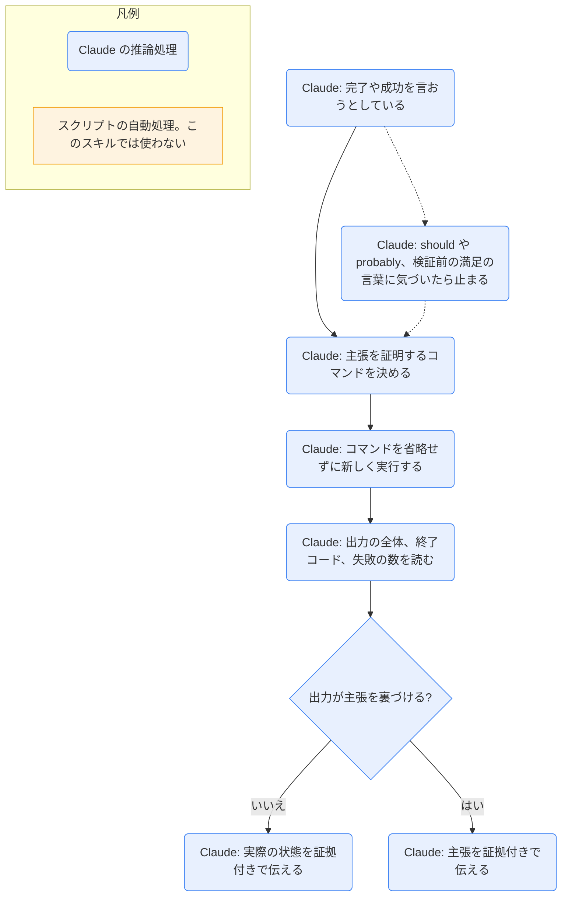

# verification-before-completion

## ひとことで
「完了した」「直った」「テストが通る」と言う前に、検証のコマンドをその場で実行し、出力を確かめることを Claude に課すスキル。superpowers プラグインのスキル。

## 何ができるか
- 鉄則: 新しい検証の証拠なしに、完了を主張しない。このメッセージの中で検証のコマンドを実行していなければ、「通る」とは言えない。
- 主張の前に、5段階の関門（Gate Function）を通す。
  1. どのコマンドがその主張を証明するかを決める。
  2. そのコマンドを、省略せずに新しく実行する。
  3. 出力の全体を読み、終了コードと失敗の数を確かめる。
  4. 出力が主張を裏づけるかを確かめる。裏づけなければ、実際の状態を証拠付きで伝える。
  5. 裏づけたときだけ、証拠付きで主張する。
- 主張ごとに、十分な証拠と不十分な証拠を表で示す。例:
  - テストが通る → テストのコマンドの出力で失敗 0。前回の実行や「通るはず」は不十分。
  - バグが直った → 元の症状を再現して通ることを確認。コードを変えただけは不十分。
  - エージェントが完了した → VCS の差分で変更を確認。エージェントの「成功」の報告は不十分。
  - 要件を満たした → 項目ごとのチェックリスト。テストが通るだけは不十分。
- 危険な兆候（「should」「probably」「seems to」、検証前の「Great!」「Done!」、エージェントの報告をうのみにする、など）を挙げ、見つけたら止まるよう求める。
- 回帰テストは、書いて通す → 修正を戻して必ず失敗させる → 戻して通す、の赤緑の確認まで求める。

## 使い方
- 呼び出し: `/superpowers:verification-before-completion`。または description にある場面（完了・修正・成功を言おうとするとき、コミットや PR の作成の前）で Claude が使う。
- 適用する場面: 完了・成功の主張とその言い換え、満足の表明、作業の状態についての肯定的な発言、コミット・PR・タスクの完了、次のタスクへ進むとき、エージェントに任せるとき。
- 起きること: Claude が検証のコマンド（テスト・ビルド・リンターなど）を実行し、その出力（例: 34/34 pass、exit 0）を添えて結果を伝える。証拠がなければ「通った」とは言わず、実際の状態を伝える。
- 関係するスキル: `executing-plans` と `systematic-debugging` がこのスキルを参照する（SKILL.md の grep で確認）。`writing-skills` は、規律を守らせるスキルの例としてこのスキルを挙げている。

## ロジック
スクリプトなし（すべて Claude の推論処理）。検証のコマンドは SKILL.md で決まっておらず、Claude が主張に合わせて選んで実行するので、図では推論処理として扱う。

## 保守者向け
- 場所: `%USERPROFILE%\.claude\plugins\cache\claude-plugins-official\superpowers\6.4.1\skills\verification-before-completion\SKILL.md`（プラグイン superpowers 6.4.1。Vault 外なので、このノートの作成では読み取りだけ）
- 同じフォルダのファイル: `SKILL.md` だけ。スクリプト・テンプレートは持たない。
- 書き込み先: なし（検証のコマンドの実行と、会話での報告だけ）。
- 制約: 検証を飛ばす例外を認めない（「Violating the letter of this rule is violating the spirit of this rule.」）。
- 注意:
  - SKILL.md は英語で書かれている。
  - プラグイン領域のファイルなので、Vault の Git では追跡されない（Vault 外にあるため）。プラグインの更新で中身が変わる可能性がある。
  - 例はテスト・ビルド・リンター・VCS の差分など、コードの作業が前提。Vault のノートの作業（調べもの・下書き）で何を証拠とするかは、SKILL.md に記載がない。
  - プラグインが Vault で有効かどうかは未確認。`installed_plugins.json` には登録があるが、このノートを作ったセッションのスキル一覧には superpowers のスキルが出ていなかった。
