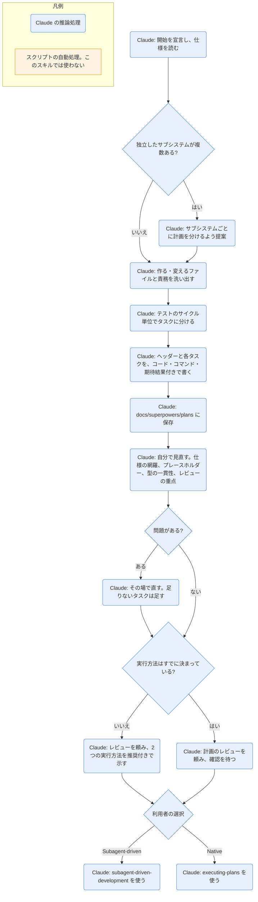

# writing-plans

## ひとことで
仕様（spec）や要件をもとに、コードに触る前に、細かいタスクに分けた実装計画の文書を書くスキル。superpowers プラグインのスキル。

## 何ができるか
- 読み手を「腕はあるが、このコードベースと問題の分野を知らず、テストの設計に弱いエンジニア」と想定し、必要な情報をすべて計画に書く。方針は DRY・YAGNI・TDD・こまめなコミット。
- 範囲の確認: 仕様が独立した複数のサブシステムにまたがるなら、サブシステムごとに計画を分けるよう提案する。
- ファイルの構成: タスクを決める前に、作る・変えるファイルとその責務を洗い出す。1ファイル1責務、一緒に変わるファイルは一緒に置く、既存の流儀に従う。
- タスクの大きさ: 1タスクは、それ自体のテストのサイクルを持ち、レビューで単独に却下できる最小の単位。1ステップは2〜5分の1動作（失敗するテストを書く → 失敗を確かめる → 最小の実装 → 通るのを確かめる → コミット）。
- 決まった見出し（ヘッダー）で書き始める: 目的（Goal）・設計（Architecture）・技術（Tech Stack）・仕様のパス（Spec）・全体の制約（Global Constraints）・レビューの重点（Review Focus。仕様が暗に求めるが、どのテストも確かめない入力や失敗の5つ）。
- 各タスクに、ファイル（作成・変更・テスト）、インターフェース（前のタスクから使うもの・後のタスクに渡すもの）、チェックボックス付きのステップ（実際のコード・コマンド・期待する結果）を書く。
- プレースホルダーを禁止する（「TBD」「TODO」「適切なエラー処理を追加」「Task N と同様」、定義のない型や関数の参照など）。
- 書き終えたら自分で見直す（サブエージェントには出さない）: 仕様の網羅、プレースホルダーの検出、型や名前の一貫性、レビューの重点。問題はその場で直す。

## 使い方
- 呼び出し: `/superpowers:writing-plans`。または description にある場面（複数ステップの作業の仕様・要件があり、コードに触る前）で Claude が使う。`brainstorming` で仕様が承認されたあとの次の一歩として呼ばれる（`brainstorming` の SKILL.md による）。
- 起きること:
  - 開始時に Claude が「I'm using the writing-plans skill to create the implementation plan.」と宣言する。
  - 計画を `docs/superpowers/plans/YYYY-MM-DD-<機能名>.md` に保存する（利用者が場所を指定していれば、そちらが優先）。
  - 保存と見直しのあと、計画へのリンクを示して、レビューを頼む。
- 実行方法の選択（まだ決まっていないとき）: Claude が2つを示し、1つを理由付きで推奨する。
  - Subagent-driven: タスクごとに新しいサブエージェントが実装し、別のレビュー役が確認する。最後にブランチ全体をレビュー。最も丁寧だが、タスクごとにコンテキストを使う。
  - Native: Claude がこのセッションで全タスクを実装し、最後に最上位のモデルのレビュー役が1回だけブランチ全体を確認する。最も安く速い。
- 実行方法がすでに決まっているときは、計画が意図どおりかの確認だけを頼む。
- 選ばれたら、Subagent-driven なら `subagent-driven-development`、Native なら `executing-plans` を使う。

## ロジック
スクリプトなし（すべて Claude の推論処理）。

## 保守者向け
- 場所: `%USERPROFILE%\.claude\plugins\cache\claude-plugins-official\superpowers\6.4.1\skills\writing-plans\SKILL.md`（プラグイン superpowers 6.4.1。Vault 外なので、このノートの作成では読み取りだけ）
- 同じフォルダのファイル: `plan-document-reviewer-prompt.md`
  - 計画の文書をレビューするサブエージェントに渡すプロンプトのひな形。確認の観点は完全さ・仕様との一致・タスクの分け方・作れるか。重大な欠けがなければ承認する方針で、Status / Issues / Recommendations の形で返す。
  - ただし SKILL.md の本文からは参照されていない（本文の見直しは「サブエージェントには出さない」と書かれている）。superpowers の `skills\` 全体を grep しても参照は見つからなかった。どこで使われるかは未確認。
- 書き込み先: 作業するプロジェクトの `docs/superpowers/plans/YYYY-MM-DD-<機能名>.md`（利用者の指定があればそちら）。
- 関係するスキル（同じプラグイン）: `brainstorming`（前段）、`using-git-worktrees`（実行時の作業場所）、`subagent-driven-development` / `executing-plans`（実行）。
- 注意:
  - SKILL.md は英語で書かれている。
  - プラグイン領域のファイルなので、Vault の Git では追跡されない（Vault 外にあるため）。プラグインの更新で中身が変わる可能性がある。
  - 計画のステップには「Commit」が含まれる。Vault の `CLAUDE.md` では、コミットと push はユーザーが手で行う（Claude は頼まれたときだけ）。`using-superpowers` には「ユーザーの指示がスキルより優先」とある。
  - 既定の保存先 `docs/superpowers/plans/` は Vault のフォルダ構成（番号付き）にはない。Vault で使うときの置き場所は未確認。
  - プラグインが Vault で有効かどうかは未確認。`installed_plugins.json` には登録があるが、このノートを作ったセッションのスキル一覧には superpowers のスキルが出ていなかった。
