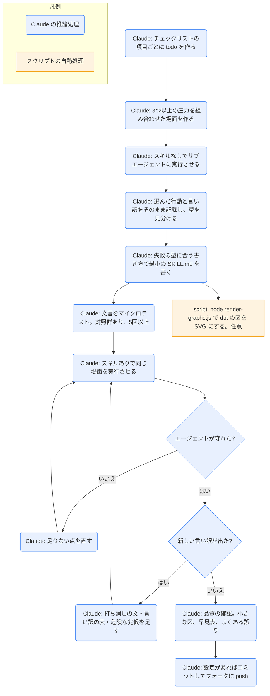

# writing-skills

## ひとことで
スキルを作る・直すときに、テスト駆動開発（TDD）の考え方をスキルの文書に当てはめて進めるスキル。superpowers プラグインのスキル。

## 何ができるか
- スキル作りを TDD に対応づける。
  - RED: スキルなしでサブエージェントに圧力のかかった場面（プレッシャーシナリオ）をやらせ、ルールを破る様子と言い訳をそのまま記録する。
  - GREEN: その失敗だけに対処する最小のスキルを書き、同じ場面で守れるかを確かめる。
  - REFACTOR: 新しい言い訳が出たら、明示的に打ち消す文を足して再テストする。
- 鉄則: 失敗するテストなしにスキルを書かない。新しいスキルにも、既存のスキルの修正にも当てはまる。テスト前に書いたら消してやり直す。
- SKILL.md の書き方を示す。
  - フロントマターは `name` と `description` の2つが必須（合計1024文字まで）。`name` は英数字とハイフンだけ。
  - `description` は三人称で「Use when...」から始め、使う場面だけを書く。手順の要約は書かない（要約を書くと、エージェントが本文を読まずに要約に従ってしまうとテストで分かった、と SKILL.md にある）。
  - 推奨の構成: Overview / When to Use / Core Pattern / Quick Reference / Implementation / Common Mistakes。
- 見つけてもらう工夫（SDO）: エラーメッセージや症状などの検索語、動詞で始まる名前、語数の目安（よく読み込まれるスキルは200語未満など）、他のスキルは名前で参照し `@` リンクで強制読み込みしない。
- 失敗の型に合う書き方を選ぶ（Match the Form to the Failure）。
  - 圧力でルールを破る → 禁止＋言い訳の表＋危険な兆候の一覧。
  - 守るが出力の形が違う → 出力の形を示すレシピ（禁止の列挙は逆効果）。
  - 必要な要素が抜ける → テンプレートに必須の欄を作る。
  - 条件で振る舞いを変える → 観察できる条件で分岐させる。
- スキルの種類（規律・技法・パターン・参照）ごとのテストの仕方と成功の基準を示す。
- 文言の小さなテスト（マイクロテスト）: 指示なしの対照群を必ず置き、1案につき5回以上、引っかかった箇所は手で読む。
- フローチャートは、分かりにくい判断・早く止まりがちなループ・使い分けにだけ使う。graphviz の dot で書く。

## 使い方
- 呼び出し: `/superpowers:writing-skills`。または description にある場面（スキルを作る・直す・配備前に動くかを確かめるとき）で Claude が使う。
- 起きること: Claude が、本文末尾のチェックリスト（RED / GREEN / REFACTOR / 品質の確認 / 配備）の項目ごとに todo を作り、順に進める。
- 前提: `superpowers:test-driven-development` を理解していることが必須（REQUIRED BACKGROUND）。
- 1つのスキルを書いたら、テストと配備の手順を終えるまで次のスキルに移らない。まとめて作るのは禁止。
- 図を見たいとき: スキルの SKILL.md にある dot の図を SVG にできる。
  - `node ./render-graphs.js ../<スキルのフォルダ>`（図ごとに SVG）
  - `node ./render-graphs.js ../<スキルのフォルダ> --combine`（全部を1枚に）
  - graphviz（`dot` コマンド）が入っている必要がある。

## ロジック
主な流れは Claude の推論処理。スクリプトは、図を SVG にする補助の `render-graphs.js` だけ（任意）。

`render-graphs.js` の動き:
- 指定したフォルダの `SKILL.md` から、言語が `dot` のコードブロックを取り出す。
- `dot -Tsvg` で SVG にし、そのスキルのフォルダの中の `diagrams\` に保存する（`--combine` のときは、まとめた `.dot` も保存する）。
- `SKILL.md` がない、または `dot` が見つからないときは、エラーで終了する。

## 保守者向け
- 場所: `%USERPROFILE%\.claude\plugins\cache\claude-plugins-official\superpowers\6.4.1\skills\writing-skills\SKILL.md`（プラグイン superpowers 6.4.1。Vault 外なので、このノートの作成では読み取りだけ）
- 同じフォルダのファイル:
  - `testing-skills-with-subagents.md`: テストの方法の詳細。圧力の種類（時間・埋没費用・権威・経済・疲労・社会・実利）、良い場面の条件（A/B/C の選択を迫る、実際のパス、逃げ道なし）、メタテスト、TDD のスキル自体を強くした例。
  - `persuasion-principles.md`: 説得の7原則（権威・コミットメント・希少性・社会的証明・一体感・返報性・好意）と、スキルの種類ごとの使い分け、倫理的な使い方。Cialdini（2021）と Meincke ほか（2025）を出典に挙げる。
  - `graphviz-conventions.dot`: 図の書き方の決まり（判断はひし形、動作は四角、コマンドは plaintext、状態は楕円、警告は赤の八角形、開始と終了は二重丸）。
  - `render-graphs.js`: 上記のとおり。Node.js の ES モジュール。
  - `examples\CLAUDE_MD_TESTING.md`: CLAUDE.md のスキルの案内文を4案（弱い提案・指示・強調・手順型）と対照群で比べるテスト計画の例。
  - `anthropic-best-practices.md`（1150行）: Anthropic の公式のスキル作成のベストプラクティス。見出しだけ確認し、本文の詳細は未確認。
- 本文が参照する別フォルダのファイル: `..\using-superpowers\references\codex-tools.md` と `gemini-tools.md`（他のハーネスでの個人スキルの置き場所）。内容は未確認。
- 書き込み先:
  - スキルの本体: Claude Code では `~/.claude/skills/`（個人のスキル）。作るスキルの場所による。
  - `render-graphs.js` を使ったとき: 対象のスキルのフォルダの中の `diagrams\`。
- 注意:
  - SKILL.md と同梱のファイルは英語で書かれている。
  - プラグイン領域のファイルなので、Vault の Git では追跡されない（Vault 外にあるため）。プラグインの更新で中身が変わる可能性がある。
  - 図は graphviz の dot で書く前提。Vault の解説ノート（このノート）は Mermaid で書いており、形式が違う。
  - 同梱のスクリプトは、実行ビットが落ちても動くよう、`node scripts/tool.js` のようにインタープリター経由で呼ぶよう SKILL.md が求めている。
  - 配備の手順に「コミットしてフォークに push」がある。Vault の `CLAUDE.md` では、コミットと push はユーザーが手で行う（Claude は頼まれたときだけ）。`using-superpowers` には「ユーザーの指示がスキルより優先」とある。
  - プラグインが Vault で有効かどうかは未確認。`installed_plugins.json` には登録があるが、このノートを作ったセッションのスキル一覧には superpowers のスキルが出ていなかった。
